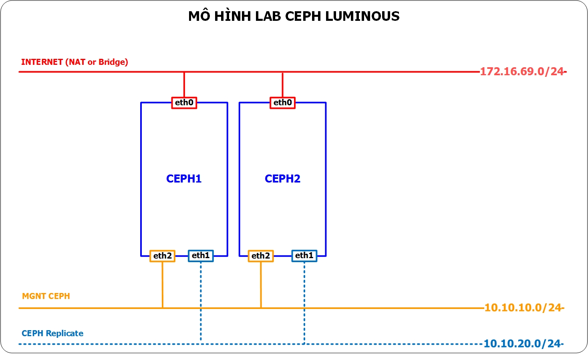
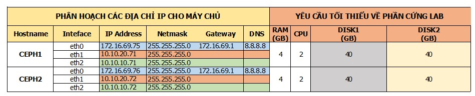

## Hướng dẫn cài đặt CEPH sử dụng `ceph-deploy`

### Mục tiêu LAB
- Mô hình này sử dụng 2 server, trong đó:
  - Host Ceph1 cài đặt ceph-deploy, ceph-mon, ceph-osd, ceph-mgr
  - Host Ceph2 cài đặt ceph-osd, ceph-mgr
- LAB này chỉ phù hợp với việc nghiên cứu các tính năng và demo thử nghiệm, không áp dụng được trong thực tế.

## Mô hình 
- Sử dụng mô hình dưới để cài đặt


## IP Planning
- Phân hoạch IP cho các máy chủ trong mô hình trên


## Chuẩn bị và môi trường LAB
 
- OS
  - Ubuntu Server 16.04 - 64 bit
  - 05: HDD, trong đó:
    - `vda`: sử dụng để cài OS
    - `vdb`: sử dụng làm OSD (nơi chứa dữ liệu của client)
  - 02 NICs: 
    - `eth0`: dùng để ssh và tải gói cài đặt, sử dụng dải 172.16.69.0/24
    - `eth1`: dùng để replicate cho CEPH sử dụng, dải 10.10.20.0/24
    - `eth2`: dùng để client (các máy chủ trong OpenStack) sử dụng, dải 10.10.10.0/24
  
- CEPH Luminous

## Thực hiện trên từng host 

- Thực hiện bằng quyền root
  ```sh
  su -
  ```
  
- Đặt hostname
  ```sh
  echo "ceph1" > /etc/hostname
  hostname -F /etc/hostname
  ```

- Sửa file host 
  ```sh
  echo "10.10.10.70 ceph1" >> /etc/hosts
  echo "10.10.10.71 ceph2" >> /etc/hosts
  ```

- Tạo repo
  ```sh
  wget -q -O- 'https://download.ceph.com/keys/release.asc' | sudo apt-key add -
  echo deb https://download.ceph.com/debian-luminous/ $(lsb_release -sc) main | sudo tee /etc/apt/sources.list.d/ceph.list
  ```

- Update OS 
  ```sh
  sudo apt-get update 
  ```

- Cài đặt gói python-minimal
  ```sh
  apt-get install python-minimal -y
  ```

- Tạo user `ceph-deploy` để sử dụng cho việc cài đặt cho CEPH.
  ```sh
  sudo useradd -m -s /bin/bash ceph-deploy
  ```

- Đặt mật mẩu cho user `ceph-deploy`  
  ```sh
  sudo passwd ceph-deploy
  ```

- Phân quyền cho user `ceph-deploy`
  ```sh
  echo "ceph-deploy ALL = (root) NOPASSWD:ALL" | sudo tee /etc/sudoers.d/ceph-deploy
  sudo chmod 0440 /etc/sudoers.d/ceph-deploy
  ```

- Cài gói chrony

```sh
apt-get -y install chrony
```

- Mở file /etc/chrony/chrony.conf và tìm các dòng dưới

```sh
pool 2.debian.pool.ntp.org offline iburst
```
Thay bằng các dòng sau

```sh
server 1.vn.pool.ntp.org iburst
server 0.asia.pool.ntp.org iburst
server 3.asia.pool.ntp.org iburst
```


Khởi động lại dịch vụ Chrony

```sh
service chrony restart
```

Kiểm tra lại hoạt động của Chrony bằng lệnh dưới

```sh
root@ceph1:~# chronyc sources
```

Kết quả như sau

```sh
 210 Number of sources = 3
 MS Name/IP address         Stratum Poll Reach LastRx Last sample
 ===============================================================================
 ^+ 220.231.122.105               3   6    17    16    +12ms[+4642us] +/-  139ms
 ^** 103.245.79.2                  2   6    17    17    -10ms[  -12ms] +/-  176ms
 ^? routerida1.soprano-asm.ne     0   6     0   10y     +0ns[   +0ns] +/-    0ns
```
  
## Cài đặt CEPH
### Thực hiện trên host ceph1 

- Cài đặt công cụ `ceph-deploy`
  ```sh
  sudo apt-get -y install ceph-deploy
  ```
- Chuyển sang tài khoản `ceph-deploy` để thực hiện cài đặt
  ```sh
  sudo su - ceph-deploy
  ```
- Tạo ssh key cho user ceph-deploy`. Nhấn enter đối với các bước được hỏi trên màn hình.
  ```sh
  ssh-keygen
  ```

- Copy ssh key sang các máy ceph
  ```sh
  ssh-copy-id ceph-deploy@ceph1
  ssh-copy-id ceph-deploy@ceph2
  ```

  - Nhập `Yes` và mật khẩu của user `ceph-deploy` đã tạo ở trước, kết quả như bên dưới
    ```sh
    ceph-deploy@ceph1:~$ ssh-copy-id ceph-deploy@ceph1
    The authenticity of host 'ceph1 (172.16.69.70)' can't be established.
    ECDSA key fingerprint is f2:38:1e:50:44:94:6f:0a:32:a3:23:63:90:7b:53:27.
    Are you sure you want to continue connecting (yes/no)? yes
    /usr/bin/ssh-copy-id: INFO: attempting to log in with the new key(s), to filter out any that are already installed
    /usr/bin/ssh-copy-id: INFO: 1 key(s) remain to be installed -- if you are prompted now it is to install the new keys
    ceph-deploy@ceph1's password:

    Number of key(s) added: 1

    Now try logging into the machine, with:   "ssh 'ceph-deploy@ceph1'"
    and check to make sure that only the key(s) you wanted were added.
    ```
  
- Tạo các thư mục để công cụ `ceph-deploy` sử dụng để cài đặt CEPH
  ```sh
  cd ~
  mkdir my-cluster
  cd my-cluster
  ```

- Thiết lập các file cấu hình cho CEPH.
  ```sh
  ceph-deploy new ceph1
  ```

- Sau khi thực hiện lệnh trên xong, sẽ thu được 03 file ở dưới (sử dụng lệnh `ll -alh` để xem). Trong đó cần cập nhật file `ceph.conf` để cài đặt CEPH được hoàn chỉnh.
  ```sh
  [ceph-deploy@ceph1 cluster-ceph]$ ls -al
  total 20
  drwxrwxr-x. 2 ceph-deploy ceph-deploy 4096 Sep 15 15:35 .
  drwx------. 4 ceph-deploy ceph-deploy 4096 Sep 15 15:35 ..
  -rw-rw-r--. 1 ceph-deploy ceph-deploy  194 Sep 15 15:35 ceph.conf
  -rw-rw-r--. 1 ceph-deploy ceph-deploy 3028 Sep 15 15:35 ceph-deploy-ceph.log
  -rw-------. 1 ceph-deploy ceph-deploy   73 Sep 15 15:35 ceph.mon.keyring
  ```

- Sửa file ceph.conf như sau:
  ```sh
  [global]
  fsid = 36bb6bc0-5f0d-4418-b403-2d4ca22779a2
  mon_initial_members = ceph1
  mon host = 10.10.10.70
  auth_cluster_required = cephx
  auth_service_required = cephx
  auth_client_required = cephx

  osd pool default size = 2
  osd pool default min size = 1
  osd crush chooseleaf type = 0
  public network = 10.10.10.0/24
  cluster network = 10.10.20.0/24
  bluestore block db size = 5737418240
  bluestore block wal size = 2737418240
  osd objectstore = bluestore
  mon_allow_pool_delete = true
  rbd_cache = false
  osd pool default pg num = 128
  osd pool default pgp num = 128

  [mon.ceph1]
  host = ceph1
  mon addr = 10.10.10.70

  [mon.ceph2]
  host = ceph2
  mon addr = 10.10.10.71

 
  [osd]
  osd crush update on start = false
  bluestore = true
  ```
  
- Cài đặt CEPH, thay `ceph1` bằng tên hostname của máy bạn nếu có thay đổi.
  ```sh
  ceph-deploy install --release luminous ceph1 ceph2
  ```

- Cấu hình `MON` (một thành phần của CEPH)
  ```sh
  ceph-deploy mon create-initial
  ```

- Sau khi thực hiện lệnh để cấu hình `MON` xong, sẽ sinh thêm ra 04 file : `ceph.bootstrap-mds.keyring`, `ceph.bootstrap-osd.keyring`, `ceph.client.admin.keyring` và `ceph.bootstrap-rgw.keyring`. Quan sát bằng lệnh `ll -alh`

  ```sh
  ceph-deploy@ceph1:~/my-cluster$ ls -alh
  total 576K
  drwxrwxr-x 2 ceph-deploy ceph-deploy 4.0K Sep 11 21:12 .
  drwxr-xr-x 6 ceph-deploy ceph-deploy 4.0K Sep 11 21:12 ..
  -rw------- 1 ceph-deploy ceph-deploy   71 Sep  7 18:40 ceph.bootstrap-mds.keyring
  -rw------- 1 ceph-deploy ceph-deploy   71 Sep  7 18:40 ceph.bootstrap-mgr.keyring
  -rw------- 1 ceph-deploy ceph-deploy   71 Sep  7 18:40 ceph.bootstrap-osd.keyring
  -rw------- 1 ceph-deploy ceph-deploy   71 Sep  7 18:40 ceph.bootstrap-rgw.keyring
  -rw------- 1 ceph-deploy ceph-deploy  71 Sep  12 17:20 ceph.client.admin.keyring
  -rw-rw-r-- 1 ceph-deploy ceph-deploy  849 Sep 11 20:58 ceph.conf
  -rw-rw-r-- 1 ceph-deploy ceph-deploy 530K Sep 11 20:58 ceph-deploy-ceph.log
  -rw------- 1 ceph-deploy ceph-deploy   73 Sep  7 18:34 ceph.mon.keyring
  -rw-r--r-- 1 root        root        1.7K Oct 15  2015 release.asc
  ```

- Tạo user admin để quản trị ceph cluster
  ```sh  
  ceph-deploy admin ceph1
  sudo chmod +r /etc/ceph/ceph.client.admin.keyring
  ```

### Tạo OSD, có 2 cách, các bạn có thể lựa chọn 1 trong cách để thực hiện:
  - Tạo OSD trên từng host Ceph
  - Tạo OSD thông qua ceph-deploy tại host ceph1

#### Cách 1: Tạo OSD qua ceph-deploy
- Trên ceph1, dùng ceph-deploy để partition ổ cứng OSD, thay `ceph1` bằng hostname của host chứa OSD
  ```sh
  ceph-deploy disk zap ceph1:/dev/vdb
  ```

- Tạo OSD với ceph-deploy
  ```SH
  ceph-deploy osd create --data /dev/vdb ceph1
  ``` 

- Kiểm tra osd vừa tạo bằng lệnh
  ```sh
  ceph osd tree
  ``` 

Kết quả:
  ```sh
  ID CLASS WEIGHT   TYPE NAME      STATUS REWEIGHT PRI-AFF 
-1       46.37151 root default                           
-3       15.45753     host ceph1                         
11   hdd  3.63689         osd.0     up  1.00000 1.00000 
  ```

#### Cách 2: Tạo OSD trên từng host
- Trên ceph1, dùng ceph-deploy để partition ổ cứng OSD, thay `ceph1` bằng hostname của host chứa OSD
  ```sh
  ceph-deploy disk zap ceph1:/dev/vdb
  ```

- Trên host chứa OSD, thực hiện lệnh prepare OSD, thay `ceph1` bằng tên hostname của máy bạn 
  ```sh 
  ceph-volume lvm prepare --bluestore --data /dev/vdb
  ```
- Sau khi prepare, OSD tạo ra sẽ có ID volume và FSID
- Kiểm tra FSID của OSD bằng lệnh
  ```sh
  lvs
  ```

Kết quả:
  ```sh
    LV                                             VG                                        Attr       LSize   Pool Origin Data%  Meta%  Move Log Cpy%Sync Convert
  swap                                           ubuntu_storage01                          -wi-ao----  1g                                                    
  osd-data-e6346e12-c312-4ccf-9b5f-0efeb61d0144  ceph-42804049-4734-4a87-b776-bfad5d382114 -wi-ao----  <39.80g                                               
  ```
FSID của OSD là **e6346e12-c312-4ccf-9b5f-0efeb61d0144**

- Kiểm tra ID của OSD bằng lệnh
  ```sh
  lsblk
  ```

Kết quả:
  ```sh
  vdb                                                                                                     8:112  0   39G  0 disk  
└─ceph--42804049--4734--4a87--b776--bfad5d382114-osd--data--e6346e12--c312--4ccf--9b5f--0efeb61d0144  253:5    0   39G  0 lvm   /var/lib/ceph/osd/ceph-0

  ```
ID của OSD là **0**

- Thực hiện activate OSD với các thông tin và ID và FSID ở trên
  ```sh
  ceph-volume lvm activate --bluestore 0 e6346e12-c312-4ccf-9b5f-0efeb61d0144
  ```

  
- Kiểm tra các phân vùng được tạo ra bằng lệnh `sudo lsblk` (nhớ phải có lệnh sudo vì đang dùng user `ceph-deploy`)
```sh
ceph-deploy@ceph1:~/my-cluster$ sudo lsblk
NAME   MAJ:MIN RM  SIZE RO TYPE MOUNTPOINT
sr0     11:0    1 1024M  0 rom  
vda    253:0    0   10G  0 disk 
└─vda1 253:1    0   10G  0 part /
vdb    253:16   0   40G  0 disk 
└─ceph--42804049--4734--4a87--b776--bfad5d382114-osd--data--e6346e12--c312--4ccf--9b5f--0efeb61d0144 253:17   0  40G  0 lvm   /var/lib/ceph/osd/ceph-0
```

Kết quả:
  ```sh
  ID CLASS WEIGHT   TYPE NAME      STATUS REWEIGHT PRI-AFF 
-1       46.37151 root default                           
-3       15.45753     host ceph1                         
11   hdd  3.63689         osd.0     up  1.00000 1.00000 
  ```

### Kiểm tra
Thực hiện trên ceph1
- Kiểm tra trạng thái của CEPH sau khi cài
  ```sh
  ceph -s
  ```

- Kết quả của lệnh trên như sau: 
  ```sh
  ceph-deploy@ceph1:~/my-cluster$ ceph -s
  cluster:
    id:     36bb6bc0-5f0d-4418-b403-2d4ca22779a2
    health: HEALTH_OK
 
  services:
    mon: 1 daemons, quorum ceph1
    mgr: ceph1(active), standbys: ceph2
    osd: 2 osds: 2 up, 2 in
 
  data:
    pools:   0 pools, 0 pgs
    objects: 0 objects, 0 bytes
    usage:   3180 MB used, 116 GB / 119 GB avail
    pgs:     
  ```

- Nếu có dòng `health HEALTH_OK` thì việc cài đặt đã ok.

Ceph-mgr là một thành phần mới của Ceph (xuất hiện từ bản Luminous), chịu trách nhiệm cho việc mirror dữ liệu giữa các ceph cluster và quản lý tài nguyên của Ceph Cluster. Có thể cài đặt Ceph-mgr daemon trên nhiều host, hoạt động theo cơ chế active-passive.

- Cài đặt ceph-mgr trên ceph1
```sh
ceph-deploy mgr create ceph1
```
- Kiểm tra trạng thái của ceph-mgr bằng `ceph -s`
```sh
ceph-deploy@ceph1:~$ ceph -s
  cluster:
    id:     36bb6bc0-5f0d-4418-b403-2d4ca22779a2
    health: HEALTH_OK
 
  services:
    mon: 3 daemons, quorum ceph1,ceph2,ceph3
    mgr: ceph1(active)
    osd: 3 osds: 2 up, 2 in
 
  data:
    pools:   0 pools, 0 pgs
    objects: 0 objects, 0 bytes
    usage:   2132 MB used, 79585 MB / 81717 MB avail
    pgs:     
```
Chú ý dòng `mgr: ceph1(active)`, ceph-mgr daemon trên host ceph1 đã active

- Ceph-mgr hỗ trợ dashboard để quan sát trạng thái của cluster, Enable mgr dashboard trên host ceph1
```sh
ceph mgr module enable dashboard
```

- Truy cập vào mgr dashboard để kiểm tra

