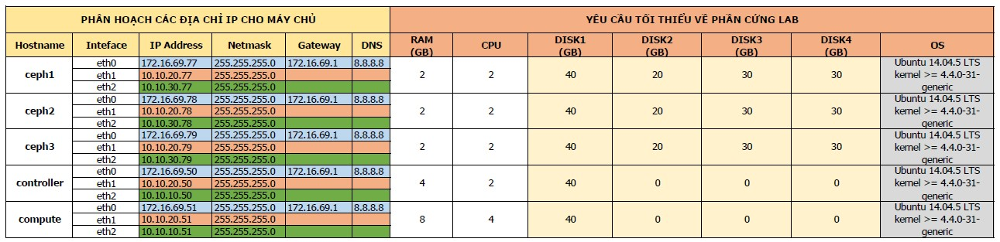

# Hướng dẫn tích hợp OpenStack Mitaka và Ceph Jewel
******

<a name="I."> </a> 
# I. Cài đặt cơ bản
******
<a name="1"> </a> 
## 1. Chuẩn bị môi trường
<a name="1.1"> </a> 
### 1.1 Mô hình mạng
- Mô hình đầy đủ


<a name="1.2"> </a> 
### 1.2 Các tham số phần cứng đối với các node



### Chú ý khi lựa chọn OS và lựa chọn dải mạng

```
- OS: Ubuntu Server 14.04.5 64 bit, kernel >= 4.4.0-31-generic
- Phiên bản OpenStack sử dụng là Mitaka
- Đối với Ubuntu 16.04 đã chuyển sang sử dụng systemd, do vậy các lệnh có chút thay đổi, tên của các NICs sẽ thay đổi
- Các dải mạng: 
	- Management + Provider Network: sử dụng để các máy ảo ra Internet, và quản lý (ssh) các máy chủ.
	- API Network: sử dụng cho giao tiếp API giữa controller và compute node.
	- Data Network: sử dụng để các máy client có thể truy cập và sử dụng tài nguyên lưu trữ trên Ceph.
	- Replication Network: Sử dụng để nhân bản dữ liệu giữa các node Ceph.
- Ổ cứng:
	- Label của các ổ cứng trong hướng dẫn này là sda, sdb,sdc,sdd. Tùy từng môi trường thực hiện label này có thể thay đổi (vda, vdb)
```

<a name="2"> </a> 
## 2. Trên Ceph 1
### 2.1. Tạo ra các pool cho các dịch vụ của OpenStack
	```
	root@ceph1:~# ceph osd pool create volumes 128 128
	root@ceph1:~# ceph osd pool create images 128 128
	root@ceph1:~# ceph osd pool create backups 128 128
	root@ceph1:~# ceph osd pool create vms 128 128
	```

### 2.2. Chuyển file `ceph.conf`  sang các node Controller và Compute, đặt tại `etc/ceph` (nếu chưa có thì tạo thư mục bằng lệnh `mkdir /etc/ceph`)
	```
	root@ceph1:~# ssh 172.16.69.50 sudo tee /etc/ceph/ceph.conf < /etc/ceph/ceph.conf
	root@ceph1:~# ssh 172.16.69.51 sudo tee /etc/ceph/ceph.conf < /etc/ceph/ceph.conf
	```
### 2.3. Tạo các ceph user cho dịch vụ OpenStack
	```
	root@ceph1:~# ceph auth get-or-create client.glance mon 'allow r' osd 'allow class-read object_prefix rbd_children, allow rwx pool=images'
	root@ceph1:~# ceph auth get-or-create client.cinder-backup mon 'allow r' osd 'allow class-read object_prefix rbd_children, allow rwx pool=backups'
	root@ceph1:~# ceph auth get-or-create client.cinder mon 'allow r' osd 'allow class-read object_prefix rbd_children, allow rwx pool=volumes, allow rwx pool=vms, allow rwx pool=images'
	```
### 2.4. Chuyển các key `client.cinder`, `client.glance`, `client.cinder-backup` sang node Controller
	```
	root@ceph1:~# ceph auth get-or-create client.glance | ssh 172.16.69.50 sudo tee /etc/ceph/ceph.client.glance.keyring
	root@ceph1:~# ssh 172.16.69.50 sudo chown glance:glance /etc/ceph/ceph.client.glance.keyring
	root@ceph1:~# ceph auth get-or-create client.cinder | ssh 172.16.69.50 sudo tee /etc/ceph/ceph.client.cinder.keyring
	root@ceph1:~# ssh 172.16.69.50 sudo chown cinder:cinder /etc/ceph/ceph.client.cinder.keyring
	root@ceph1:~# ceph auth get-or-create client.cinder-backup | ssh 172.16.69.50 sudo tee /etc/ceph/ceph.client.cinder-backup.keyring
	root@ceph1:~# ssh 172.16.69.50 sudo chown cinder:cinder /etc/ceph/ceph.client.cinder-backup.keyring
	```
### 2.5. Chuyển key `client.cinder` sang node Compute
	```
	root@ceph1:~# ceph auth get-or-create client.cinder | ssh 172.16.69.51 sudo tee /etc/ceph/ceph.client.cinder.keyring
	root@ceph1:~# ceph auth get-key client.cinder | ssh 172.16.69.51 tee client.cinder.key
	```

## 3. Trên 2 node Controller và Copute
### 3.1. Cài đặt package cho Ceph Jewel
- Cài đặt repo

	```sh
	root@controller1:~# wget -q -O- 'https://ceph.com/git/?p=ceph.git;a=blob_plain;f=keys/release.asc' | sudo apt-key add -
	```
	Kết quả: `OK`

	```sh
	root@controller1:~# echo deb http://download.ceph.com/debian-jewel/ trusty main | sudo tee /etc/apt/sources.list.d/ceph.list
	```
- Cập nhật các gói phần mềm

	```sh
	root@controller1:~# apt-get -y update
	```
- Nếu node Controller có service `glance-api`, cài đặt `python-rbd package

	```sh
	root@controller1:~# apt-get install python-rbd -y
	```
- Nếu node Controller có service `cinder-backup` và `cinder-volume`, cài đặt `ceph-common` package

    ```sh
    root@controller1:~# apt-get install ceph-common -y
    ```

- Kiểm tra các gói sau khi cài

	```sh
	root@controller1:~# dpkg -l | egrep -i "ceph|rados|rbd"
	```
	Kết quả:

	```sh
	ii  ceph-common                          10.2.6-1trusty                        amd64        common utilities to mount and interact with a ceph storage cluster
	ii  libcephfs1                           10.2.6-1trusty                        amd64        Ceph distributed file system client library
	ii  librados2                            10.2.6-1trusty                        amd64        RADOS distributed object store client library
	ii  libradosstriper1                     10.2.6-1trusty                        amd64        RADOS striping interface
	ii  librbd1                              10.2.6-1trusty                        amd64        RADOS block device client library
	ii  librgw2                              10.2.6-1trusty                        amd64        RADOS Gateway client library
	ii  python-cephfs                        10.2.6-1trusty                        amd64        Python libraries for the Ceph libcephfs library
	ii  python-rados                         10.2.6-1trusty                        amd64        Python libraries for the Ceph librados library
	ii  python-rbd                           10.2.6-1trusty                        amd64        Python libraries for the Ceph librbd library
	```
- Tạo secret key (để VM có thể sử dụng Volume)
	```
	root@controller1:~# uuidgen
	```
	Kết quả:
	```
	fc6a2ccd-eb9f-4e6e-9bd5-4a0c5feb4d50
	```


## 4. Trên node Controller

### 4.1. Cấu hình `glance-api.conf` để lưu image xuống Ceph
	```
	root@controller1:~# vim /etc/glance/glance-api.conf
	```

	```
	[DEFAULT]
	show_multiple_locations = True
	enable_v2_api = true
	enable_v2_registry = true
	enable_v1_api = true
	enable_v1_registry = true

	...

	[glance_store]
	#Option để enable COW cho image
	show_image_direct_url = True
	default_store = rbd
	#Khai báo các store để lưu trữ image (mặc định là rbd)
	stores = file,rbd,http
	filesystem_store_datadir = /var/lib/glance/images/
	#Khai báo ceph pool và user để lưu trữ image vào ceph
	rbd_store_pool = images
	rbd_store_user = glance
	rbd_store_ceph_conf = /etc/ceph/ceph.conf
	rbd_store_chunk_size = 8
	```

### 4.2. Cấu hình `cinder.conf` để lưu volume và volume backup xuống Ceph
	```
	root@controller1:~# vim /etc/cinder/cinder.conf
	```

	```
	[DEFAULT]
	notification_driver = messagingv2
	#Khai báo kết nối tới Glance để lấy image (sử dụng Glance API v2)
	glance_api_servers = http://171.16.69.50:9292
	glance_api_version = 2
	#khai báo backend cho Cinder là ceph_hdd, nếu có nhiều backend thì ngăn cách bằng dấu ','
	enabled_backends = ceph_hdd
	#Bỏ dòng khai báo `volume_group = cinder-volumes`
	#volume_group = cinder-volumes


	#Khai báo ceph pool và user để lưu các bản volume backup xuống ceph
	backup_driver = cinder.backup.drivers.ceph
	backup_ceph_conf = /etc/ceph/ceph.conf
	backup_ceph_user = cinder-backup
	backup_ceph_chunk_size = 134217728
	#Khai báo ceph pool chứa volume backup
	backup_ceph_pool = backups
	backup_ceph_stripe_unit = 0
	backup_ceph_stripe_count = 0
	restore_discard_excess_bytes = true

	...
	#Khai báo backend ceph_ssd
	[ceph_hdd]
	volume_driver = cinder.volume.drivers.rbd.RBDDriver
	volume_backend_name = ceph_hdd
	#Khai báo ceph pool chứa volume
	rbd_pool = volumes
	rbd_ceph_conf = /etc/ceph/ceph.conf
	rbd_flatten_volume_from_snapshot = true
	rbd_max_clone_depth = 5
	rbd_store_chunk_size = 4
	rados_connect_timeout = -1
	rbd_user = cinder
	#Khai báo secret key đã tạo
	rbd_secret_uuid = fc6a2ccd-eb9f-4e6e-9bd5-4a0c5feb4d50
	report_discard_supported = true
	```

### 4.3. Tạo các backend cho volume
	```
	root@controller1:~# cinder type-create hdd
	root@controller1:~# cinder type-key hdd set volume_backend_name=ceph_hdd
	```

### 4.4. Khởi động lại các dịch vụ
	```
	root@controller1:~# cd /etc/init/; for i in $(ls cinder-* | cut -d \. -f 1 | xargs); do sudo service $i restart; done
	root@controller1:~# cd /etc/init/; for i in $(ls glance-* | cut -d \. -f 1 | xargs); do sudo service $i restart; done
	```


## 5. Trên node Compute

### 5.1. Cấu hình `nova.conf` để lưu VM xuống Ceph
	```
	root@compute1:~# vim /etc/nova/nova.conf
	```

	```
	[libvirt]
	inject_partition = -2
	inject_password = false
	live_migration_flag = VIR_MIGRATE_UNDEFINE_SOURCE,VIR_MIGRATE_PEER2PEER,VIR_MIGRATE_LIVE,VIR_MIGRATE_PERSIST_DEST
	inject_key = False
	images_type = rbd
	#Khai báo ceph pool chứa vm
	images_rbd_pool = vms
	images_rbd_ceph_conf = /etc/ceph/ceph.conf
	rbd_user = cinder
	#Khai báo secret key đã tạo
	rbd_secret_uuid = fc6a2ccd-eb9f-4e6e-9bd5-4a0c5feb4d50
	disk_cachemodes = network=writeback
	hw_disk_discard = unmap
	```
### 5.2. Add secret key vào libvirt
- Tạo file `secret.xml` đặt tại `/root`

	`root@compute1:~# vim /etc/root/secret.xml`

	```
	<secret ephemeral='no' private='no'>
  		<uuid>fc6a2ccd-eb9f-4e6e-9bd5-4a0c5feb4d50</uuid>
  		<usage type='ceph'>
    		name>client.cinder secret</name>
  		</usage>
	</secret>
	```
- Định nghĩa secret key
	```
	root@compute1:~# virsh secret-define --file secret.xml
	```

	Kết quả:

	Secret fc6a2ccd-eb9f-4e6e-9bd5-4a0c5feb4d50 created

- Add secret key vào libvirt
	```
	root@compute1:~# sudo virsh secret-set-value --secret fc6a2ccd-eb9f-4e6e-9bd5-4a0c5feb4d50 --base64 $(cat client.cinder.key)
	```
### 5.3. Khởi động lại các dịch vụ
	```
	root@compute1:~# cd /etc/init/; for i in $(ls nova-* | cut -d \. -f 1 | xargs); do sudo service $i restart; done
	```
## 6. Kiểm tra
### 6.1. Kiểm tra việc tích hợp Glance và Ceph
Trên OpenStack, tạo 1 image mới

```
root@controller1:~# glance image-list
+--------------------------------------+--------+
| ID                                   | Name   |
+--------------------------------------+--------+
| c1a1a7f3-7dc3-46e7-870c-c2f792945566 | cirros |
+--------------------------------------+--------+
```

Trên ceph1, kiểm tra RBD-image của Image vừa tạo

```
root@ceph1:~# rbd -p images ls
c1a1a7f3-7dc3-46e7-870c-c2f792945566
```

### 6.2. Kiểm tra việc tích hợp Cinder và Ceph

Trên OpenStack, tạo 1 volume thuộc backend volumes-hdd

```
root@controller1:~# cinder list
+--------------------------------------+-----------+------+------+-------------+----------+-------------+
|                  ID                  |   Status  | Name | Size | Volume Type | Bootable | Attached to |
+--------------------------------------+-----------+------+------+-------------+----------+-------------+
| 3a4dab6c-e5d1-4ec8-b39c-ef70f6045cb5 | available | test |  1   |   ceph_hdd  |  false   |             |
+--------------------------------------+-----------+------+------+-------------+----------+-------------+
```


Trên ceph1, kiểm tra RBD-image của Image vừa tạo

```
root@ceph1:~# rbd -p volumes ls
volume-3a4dab6c-e5d1-4ec8-b39c-ef70f6045cb5
```


### 6.3. Kiểm tra việc tích hợp Nova và Ceph

Trên OpenStack, tạo một máy ảo boot từ image

```
root@controller1:~# nova list
+--------------------------------------+-------+---------+------------+-------------+---------------------------+
| ID                                   | Name  | Status  | Task State | Power State | Networks                  |
+--------------------------------------+-------+---------+------------+-------------+---------------------------+
| 72f300b7-d9e2-4734-828e-d6e99aaad6f0 | CR    | ACTIVE  | -          | Running     | pri_network=192.168.0.13 	|
+--------------------------------------+-------+---------+------------+-------------+---------------------------+
```


Trên ceph1, kiểm tra RBD-image của Image vừa tạo

```
root@ceph1:~# rbd -p vms ls
72f300b7-d9e2-4734-828e-d6e99aaad6f0_disk
```