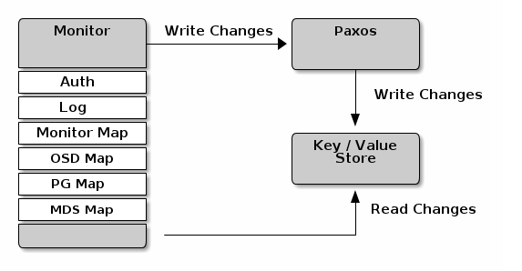
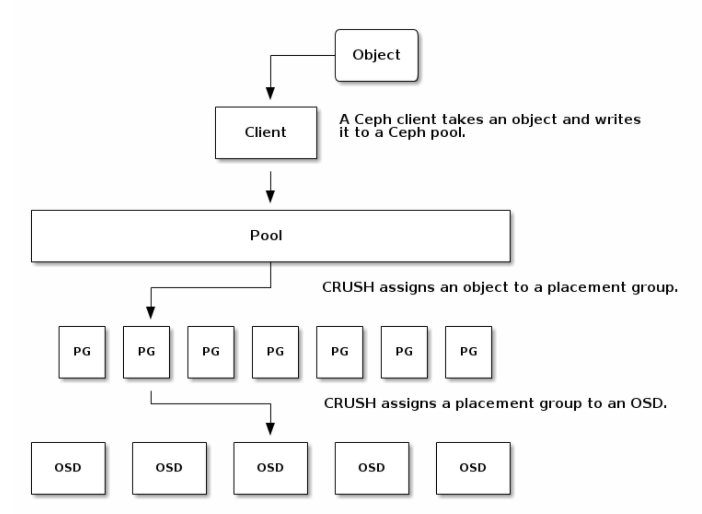
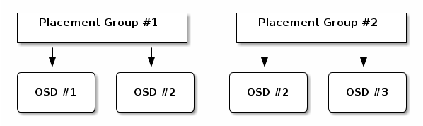
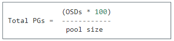
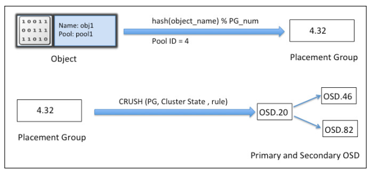
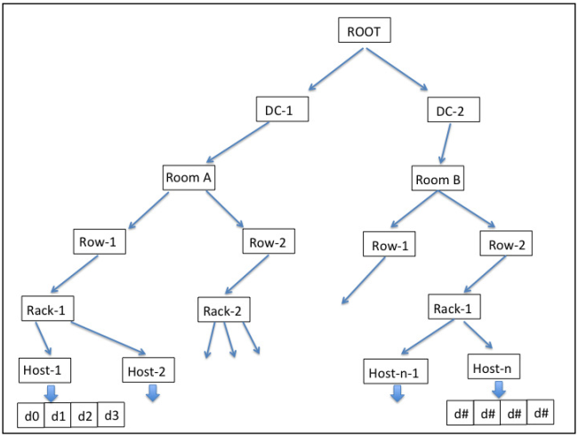
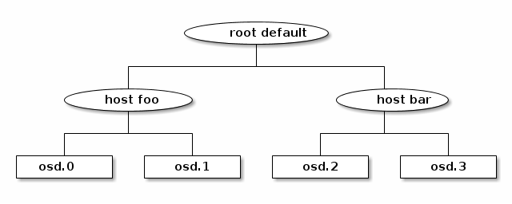

## Ceph monitor.
- Các Ceph monitors lưu một "master copy" của cluster map, có nghĩa là một ceph client có thể xác định vị trí của tất cả Ceph monitors, Ceph OSD Daemons và Ceph metadata servers mà chỉ cần kết nối tới một Ceph monitor và lấy về một bản cluster map. Trước khi ceph client có thể đọc ghi vào Ceph OSD Daemon hoặc Ceph Metadata Servers, nó phải kết nối với Ceph Monitor trước. Với một bản sao cluster map và thuật toán CRUSH, ceph client có thể tính ra vị trí của bất kỳ object nào. Khả năng tính vị trí object này cho phép ceph client nói chuyện trực tiếp với OSD daemon, điều này rất quan trọng cho hiệu năng của ceph.
- Vai trò chính của Ceph Monitor là duy trì một bản copy của cluster map. Ceph Monitor cũng cung cấp dịch vụ xác thực và ghi log. Ceph monitor ghi tất cả những thay đổi trong dịch vụ monitor vào Paxos, Paxos ghi thay đổi này vào `key/store`

	
	
- Các monitors chịu tránh nhiệm giám sát trạng thái của toàn bộ hệ thống. Có các daemons giữ trạng thái của các thành viên trong cluster bằng cách lưu thông tin của cluster, trạng thái của mỗi node, thông tin cấu hình cluster. Ceph monitor giữ một bản sao master của cluster. Cluster map bao gồm monitor, OSD, PG, CRUSH, và MDS maps. Tập hợp các map này được gọi là cluster map. Chức năng cơ bản của mỗi map:
	- Monitor map: Lưu thông tin về các monitor node. Thông tin bao gồm ID cluster, hostname, IP và port. Monitor cũng lưu thông tin như lúc khởi tạo và lần cuối thay đổi.
	- OSD map: Lưu các thông tin như là ID cluster, epoch tạo OSD map và lần cuối cùng thay đổi; và các thông tin liên quan đến pools như là pool name, pool ID, type, số lượng replication, và PG (placement groups). Các thông tin về osd như là count, state, weight, last clean interval, và osd host.
	- PG map: map này lưu giữ các phiên bản của PG (thành phần quản lý các object trong ceph), timestamp, bản OSD map cuối cùng, tỉ lệ đầy và gần đầy dung lượng. Nó cũng lưu các ID của PG, object count, tình trạng hoạt động và srub (hoạt động kiểm tra tính nhất quán của dữ liệu lưu trữ).
	- CRUSH map: lưu các thông tin của các thiết bị lưu trữ trong Cluster, các rule cho từng vùng lưu trữ.
	- MDS map: lưu thông tin về thời gian tạo và chỉnh sửa, dữ liệu và metadata pool ID, cluster MDS count, tình trạng hoạt động của MDS, epoch của MDS map hiện tại.
	

## 1 Monitor map.
- Monitor map cho chúng ta biết thông tin về toàn bộ monitors trên cluster
- Một số lệnh sau để xem monitor map

```sh
root@cephaio:~# ceph mon stat
e1: 1 mons at {cephaio=10.10.10.11:6789/0}, election epoch 6, quorum 0 cephaio

root@cephaio:~# ceph mon dump
dumped monmap epoch 1
epoch 1
fsid fe7cd007-6da4-4ea6-b04b-754b0e3c64de
last_changed 2017-12-22 09:43:45.690505
created 2017-12-22 09:43:45.690505
0: 10.10.10.11:6789/0 mon.cephaio
```

## 2. MDS map
<Cập nhật sau>

## 3. OSD map
-  OSD map: Lưu các thông tin như là ID cluster, epoch tạo OSD map và lần cuối cùng thay đổi; và các thông tin liên quan đến pools như là pool name, pool ID, type, số lượng replication, và PG (placement groups). Các thông tin về osd như là count, state, weight, last clean interval, và osd host.
- Trạng thái của OSD là `in` hoặc `out` và `up` đang running hoặc `down` không running. Nếu OSD là up, nó có thể là in (có thể đọc ghi dữ liệu) hoặc là out. Nếu osd đã in, sau đó out, ceph sẽ chuyển PG tới các osds khác. Nếu osd là out, crush sẽ không gán PG lên osd đó. Nếu osd là down, nó cũng là out.

```sh
root@cephaio:~# ceph osd dump
epoch 46
fsid fe7cd007-6da4-4ea6-b04b-754b0e3c64de
created 2017-12-22 09:43:46.279410
modified 2018-01-11 07:56:09.082962
flags sortbitwise,require_jewel_osds
pool 0 'rbd' replicated size 2 min_size 1 crush_ruleset 0 object_hash rjenkins pg_num 64 pgp_num 64 last_change 1 flags hashpspool stripe_width 0
max_osd 2
osd.0 up   in  weight 1 up_from 42 up_thru 45 down_at 40 last_clean_interval [37,39) 10.10.10.11:6800/2050 10.10.20.11:6800/2050 10.10.20.11:6801/2050 10.10.10.11:6801/2050 exists,up a53c360b-ca92-4a9b-8105-44621a25c90b
osd.1 up   in  weight 1 up_from 44 up_thru 45 down_at 40 last_clean_interval [35,39) 10.10.10.11:6802/2298 10.10.20.11:6802/2298 10.10.20.11:6803/2298 10.10.10.11:6803/2298 exists,up 33b4b1ae-be78-4be6-8abd-fad9126cdb13
```

## 4. PG map
- Lệnh tạo mới một pool

```sh
ceph osd pool create {pool-name} pg_num
```

- Khi tạo pool cần chỉ rõ tham số `pg_num`. Ở đây có một vài giá trị thường dùng:
	- Ít hơn 5 OSDs đặt pg_num = 128
	- Từ 5 đến 10 OSDs đặt pg_num = 512
	- Từ 10 đến 50 OSDs đặt pg_num = 1024
	- Nếu nhiều hơn 50 OSDs thì phải tính toán phù hợp theo yêu cầu.
	
- Khi mà số lượng OSDs tăng lên, việc đặt giá trị pg_num chính xác là rất quan trọng vì nó ảnh hưởng lớn đến việc xử lý của cluster cũng như đảm bảo dữ liệu an toàn khi có lỗi gì đó xảy ra.

### Placement group được sử dụng như thế nào?
- Placement group (PG) tập hợp các objects trong một pool
	
	

- Ceph client sẽ tính PG mà object sẽ thuộc vào. Việc tính toán này được thực hiện bằng cách băm object ID và áp dụng cho một tác vụ dựa trên số lượng PGs được định nghĩa trong pool và Id của pool.
- Nội dung trên trong một PG được lưu trong một bộ OSDs. Ví dụ, một pool có số replicate là 2, mỗi PG sẽ lưu các object trên 2 OSDs.

	
	
- Khi số lượng PG tăng lên, các PG mới sẽ được gán vào các OSDs. CRUSH cũng sẽ thay đổi và một số object từ PGs cũ sẽ được sao chép tới PG mới và xóa từ PG cũ.
- Sau khi một OSD gặp sự cố, nguy cơ mất dữ liệu tăng lên cho đến khi dữ được chứa trong osd đó được khôi phục lại toàn bộ. Một số kịch bản gây ra mất dữ liệu vĩnh viễn trong một PG:
	- OSD hư hỏng và toàn bộ bản sao của object mà osd chứa bị mất. Với tất cả các object có bản sao ở trong osd đều bị giảm từ 3 xuống 2.
	- Ceph bắt đầu khôi phục OSD này bằng cách chọn một osd mới để tạo lại bản copy thứ 3 của tất cả các object đó.
	- Một OSD khác, trong cùng PG đó, hỏng trước khi OSD mới sao chép toàn bộ copy thứ 3. Một số object chỉ còn lại một bản sao.
	- Ceph chọn một OSD khác và giữ các đối tượng sao chép để khôi phục số lượng bản sao mong muốn
	- Một OSD thứ 3, trong cùng PG này, hỏng trước khi khôi phục hoàn thành. Nếu OSD này chứa bản sao duy nhất còn lại của object thì object đó bị mất hoàn toàn.
	
- Trong cluster chứa 10 OSDs với 512 PG và 3 bản sao, CRUSH sẽ cho mỗi PG 3 OSDs. Như vậy mỗi OSD sẽ phải chứa lên đến (512*3)/10 = ~150 PGs. Khi OSD đầu tiên hỏng, ceph sẽ phải khôi phục tất cả 150 PG cùng lúc.
- 150 PGs được phục hồi có thể lan ra 9 OSD còn lại. Mỗi OSD còn lại gửi bản sao của objects tới tất cả OSD khác và cũng nhận các objects mới bởi vì chúng trở thành một phần của PG mới.
- Lượng thời gian để khôi phục hoàn toàn phụ thuộc vào kiến trúc của cluster.

### Cách tính số PG.
- PG là rất quan trọng, ảnh hưởng đến hiệu năng cũng như độ an toàn của dữ liệu.
- Công thức tính số PG cho mỗi pool như sau

	
	
- `pool size` là số lượng replicate cho pool hoặc K + M cho erasure coded pools.

- Link tham khảo: http://docs.ceph.com/docs/master/rados/operations/placement-groups/

## 5. CRUSH map
- Hệ thống lưu trữ sẽ phải lưu phần data và metadata của nó. Metadata, là dữ liệu của dữ liệu, lưu thông tin như nơi data được lưu trong chuỗi các node storage và các disk. Mỗi lần dữ liệu mới được thêm vào, metadata của nó sẽ được cập nhật trước khi dữ liệu được lưu. Việc quản lý metadata rất phức tạp và khó khăn khi dữ liệu lớn.
- Ceph sử dụng thuật toán `Controlled Replication Under Scalable Hashing (CRUSH)` để thực hiện lưu trữ và quản lý dữ liệu.
- Thuật toán CRUSH dùng để tính toán nơi dữ liệu sẽ được lưu hoặc nơi dữ liệu sẽ được đọc. Thay vì lưu trữ metadata, CRUSH tính metadata dự trên yêu cầu.
- CRUSH tính metadata chỉ khi có yêu cầu. Quá trình tính toán này được biết với tên gọi CRUSH lookup.
- Với yêu cầu đọc và ghi, đầu tiên client liên hệ với monitor và tìm một bản copy của cluster map. Cluster map giúp client biết trạng thái và cấu hình của cluster. Data sẽ được biến đổi thành các objects. Sau đó object sẽ được băm với số PG để sinh ra một PG không thay đổi trong ceph pool. Sau khi tính xong PG, CRUSH lookup xác định primary OSD để lưu và tìm kiếm data. ID của OSD primary được gửi cho client, client sẽ làm việc trực tiếp với OSD để lưu dữ liệu. Tất cả các thao tác tính toán đều được thực hiện bởi client, do đó không ảnh hưởng đến hiệu năng của cluster. 
- Một khi data dược ghi lên primary OSD, trên cùng node đó thực hiện một tác vụ CRUSH lookup và tính vị trí secondary PG và các OSD, nơi mà data sẽ được sao chép.

	

### Cấu trúc phân cấp của CRUSH
- CRUSH là cơ sở để hiểu ceph và hoàn toàn có khả năng cấu hình; nó duy trì một phân cấp lồng nhau cho tất cả các thành phần của cơ sở hạ tầng của bạn. Danh sách các thiết bị CRUSH thường gồm có disk, node, rack, row, switch, dòng điện, room, data center, etc. Những thành phần này được gọi là failure zones hoặc CRUSH buckets.
- CRUSH map chứ danh sách các buckets để tập hợp các thiết bị vào trong vị trí vật lý. Và một danh sách các rule để cho CRUSH biết cách sao chép data cho các ceph pool khác nhau. Hình sau sẽ mô tả tổng quan về CRUSH map.

	

- Lấy ra CRUSH  map bằng các lệnh sau

```sh
ceph osd getcrushmap -o crushmap.bin
crushtool -d crushmap.bin -o crushmap.txt
```

- `crushmap.bin` là tên file, file này chứa crush map ở dạng nhị phân. Để đọc được file này, crushtool chuyển từ nhị phân sang dạng file text.
- Ví dụ nội dung một crush map như sau:

```sh
# begin crush map
tunable choose_local_tries 0
tunable choose_local_fallback_tries 0
tunable choose_total_tries 50
tunable chooseleaf_descend_once 1
tunable chooseleaf_vary_r 1
tunable straw_calc_version 1

# devices
device 0 osd.0
device 1 osd.1

# types
type 0 osd
type 1 host
type 2 chassis
type 3 rack
type 4 row
type 5 pdu
type 6 pod
type 7 room
type 8 datacenter
type 9 region
type 10 root

# buckets
host cephaio {
        id -2           # do not change unnecessarily
        # weight 0.039
        alg straw
        hash 0  # rjenkins1
        item osd.0 weight 0.019
        item osd.1 weight 0.019
}
root default {
        id -1           # do not change unnecessarily
        # weight 0.039
        alg straw
        hash 0  # rjenkins1
        item cephaio weight 0.039
}

# rules
rule replicated_ruleset {
        ruleset 0
        type replicated
        min_size 1
        max_size 10
        step take default
        step choose firstn 0 type osd
        step emit
}

# end crush map
```

- CRUSH map có các section như sau:
	- `tunables`: Cấu hình thuật toán CRUSH
	- `Devices`: là các OSD daemon riêng lẻ. Các thiết bị được định danh với ID là số nguyên không âm và tên có định dạng osd.N, N là id của osd. Device cũng có thể chứa một lớp các thiết bị liên quan (ví dụ hdd, ssd) thuận tiện cho đặt các rules.
	- `type và buckets`: buckets là thuật ngữ trong CRUSH để chỉ hệ thống phân cấp trong các node: hosts, racks, rows, etc. CRUSH map định nghĩa một loạt các `types` được sử dụng để miêu tả các node này. Mặc định có các type: osd (or device), host, chassis, rack, row, pdu, pod, room, datacenter, region, root. Đa số các cluster sử dụng các type này. Type có thể được định nghĩa nếu cần thiết. Hình dung bucket như cấu trúc cây. Các device là các osd ở nút lá, bắt đầu bằng root. ví dụ
	
		
		
	Mỗi node (device hoặc bucket) có một trọng số `weight `, chỉ ra tỉ lệ tương đối của tổng dữ liệu mà các device hoặc subtree sẽ lưu. weight được đặt ở lá, chỉ ra kích thước của device, và tự động tổng hợp cây từ đó, sao cho trọng lượng của nút mặc định sẽ là tổng của tất cả các thiết bị chứa bên dưới nó. Thông thường trọng lượng được tính bằng đơn vị terabyte (TB).
	- `rules`: Định nghĩa chính sách mà dữ liệu được phân tán trên các thiết bị. Trong ví dụ trên có một rule là replicated_ruleset. Các rule có thể xem được bằng CLI 
	
```
root@cephaio:~# ceph osd crush rule ls
[
		"replicated_ruleset"
]

root@cephaio:~# ceph osd crush rule dump
[
	{
		"rule_id": 0,
		"rule_name": "replicated_ruleset",
		"ruleset": 0,
		"type": 1,
		"min_size": 1,
		"max_size": 10,
		"steps": [
				{
					"op": "take",
					"item": -1,
						"item_name": "default"
				},
				{
					"op": "choose_firstn",
					"num": 0,
					"type": "osd"
				},
				{
					"op": "emit"
				}
		]
	}
]
```