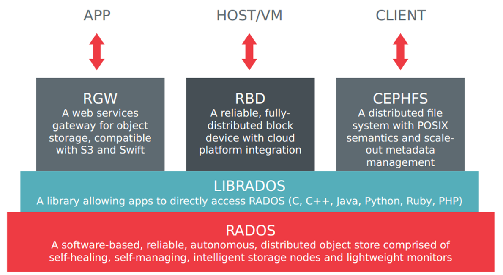
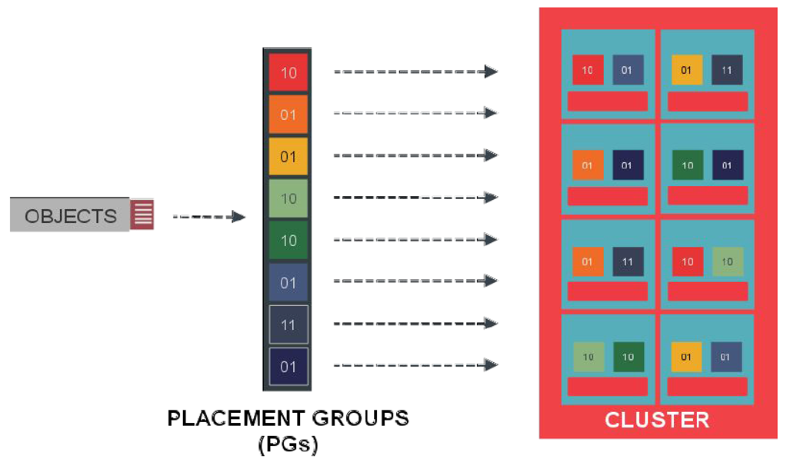
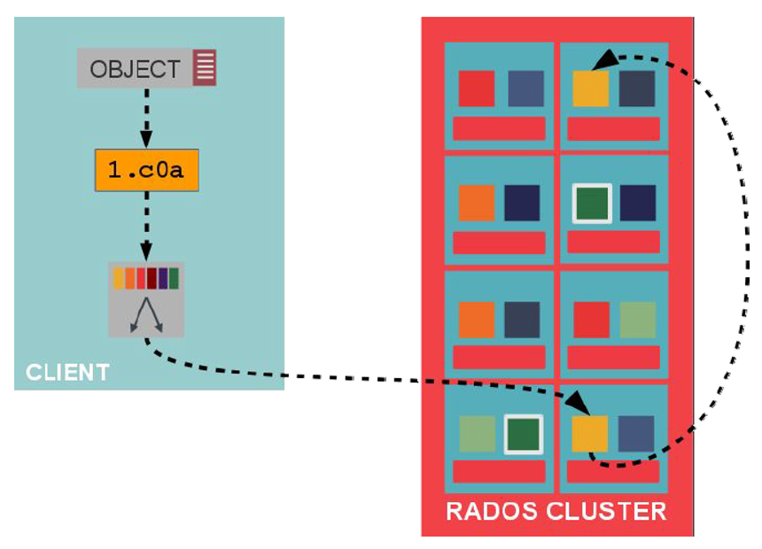
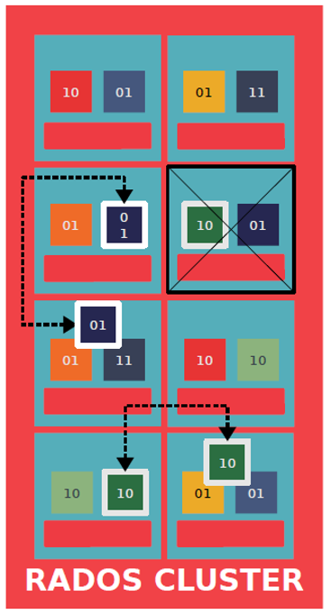

# CEPH - Software Definded Storage
---
## Mục lục
- [1. Ceph architecture](#1)
	- [1.1 Ceph RADOS](#1a)
	- [1.2 Ceph Monitor](#1b)
- [2. Cơ chế phân tán dữ liệu](#2)
- [3. Cơ chế nhân bản dữ liệu](#3)
- [4. Cơ chế phục hồi dữ liệu](#4)
	
---

<a name=1></a>
## 1. Ceph architecture
- Ceph storage cluster được tạo nên từ vài daemons khác nhau. 
- Hình sau đây cho thấy mô hình logical của một hệ thống ceph storage

	
	
- **Reliable Autonomic Distributed Object Store (RADOS)** là nền tảng của cụm lưu trữ ceph. Mọi thức trong Ceph được lưu dưới dạng các objects, và RADOS chịu trách nhiệm lưu trữ các objects này mà không quan tâm kiểu dữ liệu là gì. RADOS đảm bảo dữ liệu luôn được duy trì ở trạng thái nhất quán và tin cậy. Để đảm bảo nhất quán dữ liệu, ceph thực hiện sao chép, phát hiện lỗi, và khôi phục lại dữ liệu, cũng như migration dữ liệu và cân bằng tải các node trên cả cluster.
- Dữ liệu sẽ được lưu trên các **Object Storage Device (OSD)** ở dạng object. Đây là thành phần duy nhất lưu dữ liệu thực sự của người dùng. Mỗi OSD daemon sẽ ràng buộc với một ổ cứng vật lý trong cluster. Như vậy mỗi ổ cứng sẽ cần một OSD daemon.
- Ceph monitors (MONs) theo dõi trạng thái toàn bộ cluster bằng cách trông coi bảng map trạng thái cluster. Bảng map gồm có OSD, MON, PG và CRUSH maps. Tất cả các node trong cluster báo cáo về monitor nodes và chia sẻ thông tin về thay đổi trạng thái của chúng. Monitor duy trì một bảng map riêng biệt cho từng thành phần. Monitor không lưu dữ liệu người dùng.
- **librados** là thư viện cung cấp các cách để có thể truy cập vào RADOS. Thư viện này hỗ trợ các ngôn ngữ lập trình phổ biến như PHP, Ruby, Java, Python, C và C++. Thư viện đã cung cấp sẵn các interface giao tiếp với Ceph cluster (RBD, RGW, POSIX). Thư viện API này hỗ trợ truy cập trực tiếp vào RADOS và cho phép bạn tạo các interface của riêng mình.
- **Ceph Block Device** được biết đến như là **RADOS block device (RBD)** cung cấp lưu trữ block có thể được mapped, formatted, và mounted giống như ổ đĩa thông thường. RBD cung cấp các tính năng nâng cao như *thin provisioning và snapshots*.
- **Ceph Object Gateway** được biết là **RADOS gateway (RGW)**, cung cấp RESTful API interface, thích hợp cho Amazon S3 (Simple Storage Service) và Openstack Object Storage API (Swift). RGW cũng hỗ trợ đa người dùng và dịch vụ xác thực Openstack keystone.
- Ceph **Metadata Server (MDS)** theo dõi cấu trúc file và lưu metadata, chỉ dành cho CephFS. Ceph block device và RADOS gateway không yêu cầu metadata, do đó chúng không cần MDS daemon.
- Ceph File System (CephFS) cung cấp một hệ thống phân tán với POSIX, có kích thước bất kỳ. CephFS dựa vào Ceph MDS để theo dõi hệ thống cấp bậc của nó, đó là metadata.

<a name=1a></a>
### 1.1 Ceph RADOS
- RADOS là **trái tim** của hệ thống ceph. RADOS cung cấp tất cả các tính năng cho ceph, bao gồm lưu trữ phân tán object, sẵn sàng cao (high availability), tin cậy, no single point of failure, tự sửa chữa, tự quản lý, etc. Dữ liệu truy cập các phương thức của ceph như là RBD, CephFS, RADOSGW, và thư việc librados, tất cả được đưa vào tầng trên của RADOS.
- Khi Ceph cluster nhận một yêu cầu ghi từ clients, thuật toán CRUSH tính vị trí và quyết định nơi dữ liệu sẽ được ghi vào. Thông tin này sẽ được chuyển đến RADOS để thực hiện các tiến trình tiếp theo. Dựa trên bộ quy tắc CRUSH (CRUSH ruleset), RADOS phân tán dữ liệu tới tất cả các node ở dạng các object nhỏ. Cuối cùng các object sẽ được lưu trên các OSDs.
- RADOS khi được cấu hình nhiều hơn 1 bản sao tạo nên sự tin cậy cho dữ liệu. Tại cùng thời điểm, nó sao chép các objects, lưu chúng trên các failure zone khác nhau. Các bản sao của cùng object sẽ không lưu trên cùng failure zone. Tuy nhiên, để nhiều tùy biến và độ tin cậy cao hơn, bạn đặt CRUSH ruleset theo nhu cầu của bạn và các yêu cầu của hạ tầng. RADOS đảm bảo rằng sẽ luôn luôn có nhiều hơn 1 bản sao của obejct.
- Ngoài ra, để lưu trữ, sao chép các object trên cluster, RADOS cũng đảm bảo rằng trạng thái object là nhất quán. Trong trường hợp object không nhất quán, recoveries được thực hiện với các bản sao còn lại của object. Việc này được thực hiện tự động và trong suốt với người dùng, do đó cung cấp khả năng tự quản lý, tự sửa chữa cho ceph.
- RADOS lưu dữ liệu ở dạng object bên trong một pool. Sử dụng lệnh `rados lspools` để xem các pool có trong cluster.

```sh
root@cephaio:~# rados lspools
rbd
data
metadata
```

- Kiểm tra danh sách các objects có trong một pool sử dụng lệnh `rados -p rbd ls`
- Kiểm tra sự sử dụng cluster với lệnh

```sh
root@cephaio:~# rados df
pool name                 KB      objects       clones     degraded      unfound           rd        rd KB           wr        wr KB
data                       0            0            0            0            0            0            0            0            0
metadata                   0            0            0            0            0            0            0            0            0
pool                       0            0            0            0            0            0            0            0            0
rbd                    14689           34            0            0            0         1699        17252          613        37892
test                       0            0            0            0            0            0            0            0            0
  total used           95832           34
  total avail       41824640
  total space       41920472
```

- RADOS gồm 2 thành phần chính là OSD và monitor.

<a name=1b></a>
### 1.2 Monitor
- Các monitors chịu tránh nhiệm giám sát trạng thái của toàn bộ hệ thống. Có các daemons giữ trạng thái của các thành viên trong cluster bằng cách lưu thông tin của cluster, trạng thái của mỗi node, thông tin cấu hình cluster. Ceph monitor giữ một bản sao master của cluster. Cluster map bao gồm monitor, OSD, PG, CRUSH, và MDS maps. Tập hợp các map này được gọi là cluster map. Chức năng cơ bản của mỗi map:
	- `Monitor map`: Lưu thông tin về các monitor node. Thông tin bao gồm ID cluster, hostname, IP và port. Monitor cũng lưu thông tin như lúc khởi tạo và lần cuối thay đổi. 
	- `OSD map`: Lưu các thông tin như là ID cluster, epoch tạo OSD map và lần cuối cùng thay đổi; và các thông tin liên quan đến pools như là pool name, pool ID, type, số lượng replication, và PG (placement groups). Các thông tin về osd như là count, state, weight, last clean interval, và osd host. 
	- `PG map`: map này lưu giữ các phiên bản của PG (thành phần quản lý các object trong ceph), timestamp, bản OSD map cuối cùng, tỉ lệ đầy và gần đầy dung lượng. Nó cũng lưu các ID của PG, object count, tình trạng hoạt động và srub (hoạt động kiểm tra tính nhất quán của dữ liệu lưu trữ).
	- `CRUSH map`: lưu các thông tin của các thiết bị lưu trữ trong Cluster, các rule cho từng vùng lưu trữ.
	- `MDS map`: lưu thông tin về thời gian tạo và chỉnh sửa, dữ liệu và metadata pool ID, cluster MDS count, tình trạng hoạt động của MDS, epoch của MDS map hiện tại.

<a name=2></a>
## 2. Cơ chế phân tán dữ liệu
- Khi có một yêu cầu ghi dữ liệu (object), hệ thống xác định object sẽ được lưu trong PG nào. Từ đó biết được vị trí chính xác object sẽ được lưu trên osd nào.
- Object sẽ được chia ra `part`. Các part sẽ được lưu trên các osd khác nhau. 
- Ví dụ có một object cần lưu trữ. Nó sẽ bị cắt ra 8 part và mỗi part sẽ được replicate 2 lần

	
	
<a name=3></a>
## 3. Cơ chế nhân bản dữ liệu
- Các raplica của một object sẽ được chia ra làm 2 loại: primary object và secondary object.
- Object được lưu trên osd đầu sẽ được xem là primary object. 
- Sau khi primary object lưu thành công, osd daemon sẽ tự động replicate object đó sang một osd khác. Bản sao của primary object sẽ được coi là secondary object.
- Việc replicate sẽ sử dụng một mạng chuyên dụng.

	

<a name=4></a>
## 4. Cơ chế phục hồi dữ liệu
- Một OSD được xác nhận là down, dữ liệu được lưu trên osd đó cũng bị mất. 
- CRUSH xác định osd khác để khôi phục dữ liệu.
- Tất cả các OSD chứa bản sao của PG trên OSD lỗi cùng tham gia vào quá trình phục hồi
- Hình sau mô tả một osd bị sự cố. Trên osd đó chứa 2 mảnh dữ liệu là `10` và `01`. 2 osd khác chứa replica của 2 mảnh dữ liệu này cũng sẽ tham gia vào quá trình khôi phục.

	