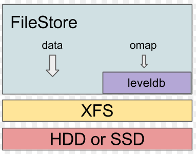
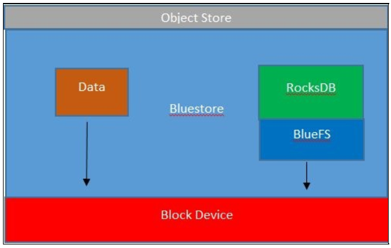

# Ceph storage backend
- Trong ceph osd daemon có một module quan trọng được gọi là ObjectStore, chịu trách nhiệm về cách thức lưu trữ object và quản lý object
- Ceph được thiết kế để hỗ trợ nhiều công cụ lưu trữ bằng cách đăng ký chúng như là các backend khác nhau cho ObjectStore.
- Phiên bản Jewel LTS hỗ trợ 3 loại backend: FileStore, KStore và BlueStore

## FileStore
- Trong FileStore, các object được lưu với một file riêng lẻ.
- Sử dụng FileStore, ceph yêu cầu sử dụng journal bên ngoài để đảm bảo tính nhất quán.
- Ceph đảm bảo tính nhất quán cao giữa các bản sao dữ liệu, tất cả các thao tác ghi được xem như đơn vị transaction.
- Các transactions được ghi vào journal trước. Sau khi được ghi xong vào journal, FileStore daemon thực hiện ghi xuống disk để lưu trữ.

	

## KStore
- KStore đang được dùng để thí nghiệm storage backend trong phiên bản jewel

## BlueStore
- Đang trong giai đoạn thí nghiệm và sẽ được sử dụng mặc định trong phiên bản tiếp theo (Luminous)
- BlueStore ra đời để tránh các hạn chế của FileStore.
- Với FileStore, object phải ghi 2 lần: 1 lần vào journal và 1 lần vào disk. BlueStore ghi trực tiếp object lên disk và quản lý metada bằng RocksDB.
- Vì RocksDB yêu cầu sử dụng file system, BlueStore sử dụng file system với tên là BlueFS

	
	
