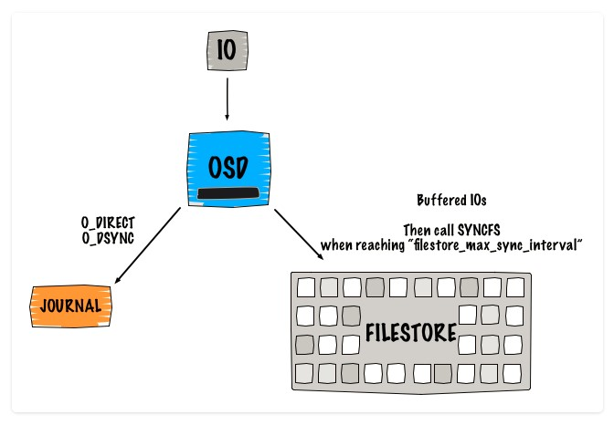
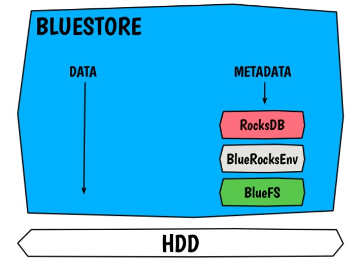

## Giới thiệu về Ceph BlueStore

## Mô hình lưu trữ FileStore 
Mô hình lưu trữ hiện thời của Ceph là FileStore. Để đảm bảo dữ liệu được lưu trữ xuống ổ đĩa, Ceph đối xử với từng request (read/write) như là các transaction, đáp ứng thuộc tính Atomicity trong [ACID!](https://en.wikipedia.org/wiki/ACID). Tuy nhiên, các filesystem không cug cấp cơ chế write/update dạng atomic (bắt buộc phải wrte/update thông qua buffer), điều này làm mất đi tính chất atomicity, đồng thời có khả năng dẫn tới filesystem bị overhead (quá tải). 
Journal ra đời để giải quyết bài toán này. 

Cơ chế hoạt động của hệ thống FileStore sử dụng Journal như sau:

Mô tả:
 - Client gửi request tới Primary OSD
 - IO đầu tiên được ghi vào Ceph Journal
 - Journal dùng libaio và ghi vào ổ đĩa sử dụng O_DIRECT và O_DSYNC
 - IO thứ hai được ghi xuống backend filesystem sử dụng buffered_io
 - Filestore gọi hàm syncfs và trim journal khi đạt tới giá trị của filestore_max_sync_interval và đới syncfs hoàn thành trước khi nhả lock.

 Các ích lợi của journal:
  - Đảm bảo dữ liệu và transaction được nhất quán, dữ liệu được đảm bảo ghi xuống partition của journal mới ACK về cho client.
  - Cung cấp khả năng atomic transaction.
  - Việc ghi vào journal được thực hiện tuần tự
  - FIFO

Tuy nhiên, việc sử dụng journal gây ra tình trạng double write (giảm 1/2 throughput của ổ cứng) khi đặt journal và OSD chung 1 ổ cứng. Nếu đặt journal và OSD trên 2 ổ, khi ổ cứng chứa journal gặp vấn đề sẽ kéo theo toàn bộ các OSD phụ thuộc vào journal đó bị mất.

Phiên bản Ceph Luminous đã sử dụng một phương thức lưu trữ mới là BlueStore làm mặc định. Với cơ chế lưu trữ mới này, data được lưu trữ trực tiếp xuống raw drive, không phải đi qua lớp file system, do đó đảm bảo được thuộc tính atomicity, điều này giúp loại bỏ thành phần journal khỏi thiết kế. 

Kiến trúc của BlueStore

Mô tả cơ chế hoạt động:
 - Client gửi request tới Primary OSD
 - Data được ghi xuống Raw device (block Storage)
 - Cập nhật metadata vào RockDB.WAL
 - Khi đến ngưỡng của RockDB.WAL, metadata được ghi từ RockDB.WAL vào RockDB.DB
 - Request được thông báo đã hoàn thành và tiếp tục đến OSD 2.

RockDB ghi dữ liệu xuống Block Storage thông qua một File system mini là BlueFS (viết bằng C++)

Tài liệu tham khảo:

[1] - https://www.sebastien-han.fr/blog/2016/03/21/ceph-a-new-store-is-coming/

[2] - http://storageconference.us/2017/Presentations/CephObjectStore-slides.pdf

[3] - http://events.linuxfoundation.org/sites/events/files/slides/LinuxCon%20NA%20BlueStore.pdf

[4] - http://ourobengr.com/wp-uploads/2017/07/Understanding-BlueStore-Cephs-New-Storage-Backend.pdf

[5] - http://newdream.net/~sage/drop/20160203%20ceph%20and%20rocksdb.pdf

[6] - https://www.slideshare.net/sageweil1/bluestore-a-new-storage-backend-for-ceph-one-year-in

[7] - http://www.sebastien-han.fr/blog/2013/12/02/ceph-performance-interesting-things-going-on/

