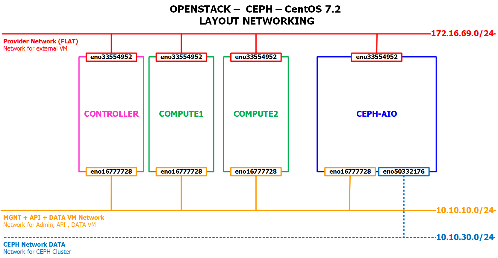
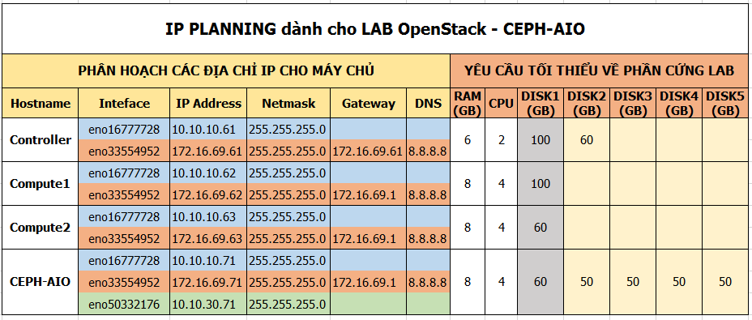

# Hướng dẫn cài đặt CEPH sử dụng `ceph-deploy` trên 1 máy duy nhất (CEPH AIO)

## 1. Mục tiêu LAB
- Mô hình này sẽ cài tất cả các thành phần của CEPH lên một máy duy nhất, bao gồm:
  - ceph-deploy
  - ceph-admin
  - mon
  - OSD
- Máy CEPH AIO được cài đặt để có thể sẵn sàng tích hợp với hệ thống OpenStack
- LAB này chỉ phù hợp với việc nghiên cức các tính năng và demo thử nghiệm, không áp dụng được trong thực tế.

## 2. Mô hình 
- Sử dụng mô hình dưới để cài đặt CEPH AIO, nếu chỉ dựng CEPH AIO thì chỉ cần một máy chủ để cài đặt CEPH. 


## 3. IP Planning
- Phân hoạch IP cho các máy chủ trong mô hình trên, nếu chỉ dựng CEPH-AIO thì chỉ cần quan tâm tới node CEPH-AIO


## 4. Chuẩn bị và môi trường LAB
 
- OS
  - CentOS Server 7.2 64 bit
  - 05: HDD, trong đó:
    - `sda`: sử dụng để cài OS
    - `sdb`: sử dụng làm `journal` (Journal là một lớp cache khi client ghi dữ liệu, thực tế thường dùng ổ SSD để làm cache)
    - `sdc, sdd, sde`: sử dụng làm OSD (nơi chứa dữ liệu của client)
  - 02 NICs: 
    - `eno16777728`: dùng client (các máy trong OpenStack) sử dụng, sử dụng dải 10.10.10.0/24
    - `eno33554952`: dùng để ssh và tải gói cho máy chủ CEPH AIO, sử dụng dải172.16.69.0/24
    - `eno50332176`: dùng để replicate cho CEPH, dải 10.10.30.0/24
  
- CEPH Jewel

## 5. Cài đặt CEPH

- Update các gói cho máy chủ 
  ```sh
  yum update -y
  ```

- Đặt hostname cho máy cài AIO
  ```sh
  hostnamectl set-hostname cephaio  
  ```
- Thiết lập IP cho máy CEPH AIO
  ```sh
  echo "Setup IP  eno16777728"
  nmcli c modify eno16777728 ipv4.addresses 10.10.10.71/24
  nmcli c modify eno16777728 ipv4.method manual

  echo "Setup IP  eno33554952"
  nmcli c modify eno33554952 ipv4.addresses 172.16.69.71/24
  nmcli c modify eno33554952 ipv4.gateway 172.16.69.1
  nmcli c modify eno33554952 ipv4.dns 8.8.8.8
  nmcli c modify eno33554952 ipv4.method manual

  echo "Setup IP  eno50332176"
  nmcli c modify eno50332176 ipv4.addresses 10.10.30.71/24
  nmcli c modify eno50332176 ipv4.method manual
  ```
  
- Cấu hình các thành phần mạng cơ bản
  ```sh
  sudo systemctl disable firewalld
  sudo systemctl stop firewalld
  sudo systemctl disable NetworkManager
  sudo systemctl stop NetworkManager
  sudo systemctl enable network
  sudo systemctl start network
  ```

- Vô hiệu hóa Selinux
  ```sh
  sed -i 's/SELINUX=enforcing/SELINUX=disabled/g' /etc/sysconfig/selinux
  ```

- Sửa file host 
  ```sh
  echo "10.10.10.71 cephaio" >> /etc/hosts
  ```

- Khởi động lại máy chủ sau khi cấu hình cơ bản.
  ```sh
  init 6
  ```
 
- Đăng nhập lại bằng quyền `root` sau khi máy chủ reboot xong.

- Khai báo repos cho CEPH 
  ```sh
  sudo yum install -y yum-utils
  sudo yum-config-manager --add-repo https://dl.fedoraproject.org/pub/epel/7/x86_64/ 
  sudo yum install --nogpgcheck -y epel-release 
  sudo rpm --import /etc/pki/rpm-gpg/RPM-GPG-KEY-EPEL-7 
  sudo rm /etc/yum.repos.d/dl.fedoraproject.org*
  ```
   
  ```sh
  cat << EOF > /etc/yum.repos.d/ceph-deploy.repo
  [Ceph-noarch]
  name=Ceph noarch packages
  baseurl=http://download.ceph.com/rpm-jewel/el7/noarch
  enabled=1
  gpgcheck=1
  type=rpm-md
  gpgkey=https://download.ceph.com/keys/release.asc
  priority=1
  EOF
  ```

- Update sau khi khai báo repo
  ```sh
  sudo yum -y update
  ```
  
- Tạo user `ceph-deploy`
  ```sh
  sudo useradd -d /home/ceph-deploy -m ceph-deploy
  ```  
  
- Đặt mật khẩu cho user `ceph-deploy`
  ```sh
  sudo passwd ceph-deploy
  ```
  
- Phân quyền cho user `ceph`
  ```sh
  echo "ceph-deploy ALL = (root) NOPASSWD:ALL" | sudo tee /etc/sudoers.d/ceph-deploy
  chmod 0440 /etc/sudoers.d/ceph-deploy

  sed -i s'/Defaults requiretty/#Defaults requiretty'/g /etc/sudoers
  ```

- Chuyển sang user `ceph-deploy`
  ```sh
  su - ceph-deploy
  ```

- Tạo ssh key cho user `ceph-deploy`
  ```sh
  ssh-keygen -t rsa
  ```

- Thực hiện copy ssh key, nhập yes và mật khẩu của user `ceph-deploy` ở bước trước.
  ```sh
  ssh-copy-id ceph-deploy@cephaio
  ```

- Cài đặt `ceph-deploy` 
  ```sh
  sudo yum install -y ceph-deploy
  ```

- Tạo thư mục để chứa các file cần thiết cho việc cài đặt CEPH 
  ```sh
  mkdir cluster-ceph
  cd cluster-ceph
  ```

- Thiết lập các file cấu hình cho CEPH.
  ```sh
  ceph-deploy new cephaio
  ```

- Sau khi thực hiện lệnh trên xong, sẽ thu được 03 file ở dưới (sử dụng lệnh `ll -alh` để xem). Trong đó cần cập nhật file `ceph.conf` để cài đặt CEPH được hoàn chỉnh.
  ```sh
  [ceph-deploy@cephaio cluster-ceph]$ ls -alh
  total 16K
  drwxrwxr-x. 2 ceph-deploy ceph-deploy   72 Apr 14 09:36 .
  drwx------. 4 ceph-deploy ceph-deploy 4.0K Apr 14 09:36 ..
  -rw-rw-r--. 1 ceph-deploy ceph-deploy  196 Apr 14 09:36 ceph.conf
  -rw-rw-r--. 1 ceph-deploy ceph-deploy 3.0K Apr 14 09:36 ceph-deploy-ceph.log
  -rw-------. 1 ceph-deploy ceph-deploy   73 Apr 14 09:36 ceph.mon.keyring
  ```

- Thêm các dòng dưới vào file `ceph.conf` vừa được tạo ra ở trên
  ```sh
  echo "osd pool default size = 2" >> ceph.conf
  echo "osd crush chooseleaf type = 0" >> ceph.conf
  echo "osd journal size = 8000" >> ceph.conf
  echo "public network = 10.10.10.0/24" >> ceph.conf
  echo "cluster network = 10.10.30.0/24" >> ceph.conf
  ```
  
- Cài đặt CEPH, thay `cephaio` bằng tên hostname của máy bạn nếu có thay đổi.
  ```sh
  ceph-deploy install cephaio
  ```
  
  - Sau khi cài xong, nếu thành công sẽ có kết quả như sau.
    ```sh
    [cephaio][DEBUG ] Complete!
    [cephaio][INFO  ] Running command: sudo ceph --version
    [cephaio][DEBUG ] ceph version 10.2.7 (50e863e0f4bc8f4b9e31156de690d765af245185
    ```

- Cấu hình `MON` (một thành phần của CEPH)
  ```sh
  ceph-deploy mon create-initial
  ```

- Sau khi thực hiện lệnh để cấu hình `MON` xong, sẽ sinh thêm ra 04 file : 
  - `ceph.bootstrap-mds.keyring`
  - `ceph.bootstrap-osd.keyring` 
  - `ceph.bootstrap-rgw.keyring`
  - `ceph.client.admin.keyring`

- Quan sát bằng lệnh `ll -alh`
  ```sh
  [ceph-deploy@cephaio cluster-ceph]$ ls -lah
  total 160K
  drwxrwxr-x. 2 ceph-deploy ceph-deploy 4.0K Apr 14 10:28 .
  drwx------. 4 ceph-deploy ceph-deploy 4.0K Apr 14 10:18 ..
  -rw-------. 1 ceph-deploy ceph-deploy  113 Apr 14 10:28 ceph.bootstrap-mds.keyring
  -rw-------. 1 ceph-deploy ceph-deploy  113 Apr 14 10:28 ceph.bootstrap-osd.keyring
  -rw-------. 1 ceph-deploy ceph-deploy  113 Apr 14 10:28 ceph.bootstrap-rgw.keyring
  -rw-------. 1 ceph-deploy ceph-deploy  129 Apr 14 10:28 ceph.client.admin.keyring
  -rw-rw-r--. 1 ceph-deploy ceph-deploy  339 Apr 14 10:18 ceph.conf
  -rw-rw-r--. 1 ceph-deploy ceph-deploy  66K Apr 14 10:28 ceph-deploy-ceph.log
  -rw-------. 1 ceph-deploy ceph-deploy   73 Apr 14 10:18 ceph.mon.keyring
  ```

- Tạo các OSD cho CEPH, thay `cephaio` bằng tên hostname của máy bạn 
  ```sh
  ceph-deploy osd prepare cephaio:sdc:/dev/sdb
  ceph-deploy osd prepare cephaio:sdd:/dev/sdb
  ceph-deploy osd prepare cephaio:sde:/dev/sdb
  ```

- Active các OSD vừa tạo ở trên
  ```sh
  ceph-deploy osd activate cephaio:/dev/sdc1:/dev/sdb1
  ceph-deploy osd activate cephaio:/dev/sdd1:/dev/sdb2
  ceph-deploy osd activate cephaio:/dev/sde1:/dev/sdb3
  ```

- Sau khi cấu hình các OSD xong, kiểm tra xem các phân vùng bằng lệnh `sudo lsblk`, nếu thành công, kết quả như sau
  ```sh
  [ceph-deploy@cephaio cluster-ceph]$ lsblk
  NAME            MAJ:MIN RM  SIZE RO TYPE MOUNTPOINT
  sda               8:0    0   60G  0 disk
  ├─sda1            8:1    0  500M  0 part /boot
  └─sda2            8:2    0 59.5G  0 part
    ├─centos-root 253:0    0 35.9G  0 lvm  /
    ├─centos-swap 253:1    0    6G  0 lvm  [SWAP]
    └─centos-home 253:2    0 17.5G  0 lvm  /home
  sdb               8:16   0   50G  0 disk
  ├─sdb1            8:17   0  7.8G  0 part
  ├─sdb2            8:18   0  7.8G  0 part
  └─sdb3            8:19   0  7.8G  0 part
  sdc               8:32   0   50G  0 disk
  └─sdc1            8:33   0   50G  0 part /var/lib/ceph/osd/ceph-0
  sdd               8:48   0   50G  0 disk
  └─sdd1            8:49   0   50G  0 part /var/lib/ceph/osd/ceph-1
  sde               8:64   0   50G  0 disk
  └─sde1            8:65   0   50G  0 part /var/lib/ceph/osd/ceph-2
  sr0              11:0    1  603M  0 rom
  [ceph-deploy@cephaio cluster-ceph]$
  ```

- Tạo file config và key
  ```sh
  ceph-deploy admin cephaio
  ```

- Phân quyền cho file `/etc/ceph/ceph.client.admin.keyring`
  ```sh
  sudo chmod +r /etc/ceph/ceph.client.admin.keyring
  ```
  
- Kiểm tra trạng thái của CEPH sau khi cài
  ```sh
  ceph -s
  ```  
  
  - Kết của lệnh `ceph -s`
    ```sh
    [ceph-deploy@cephaio cluster-ceph]$   ceph -s
      cluster ae46be36-dee3-4bb9-9448-91aa148b301e
       health HEALTH_OK
       monmap e1: 1 mons at {cephaio=10.10.10.71:6789/0}
              election epoch 3, quorum 0 cephaio
       osdmap e15: 3 osds: 3 up, 3 in
              flags sortbitwise,require_jewel_osds
        pgmap v34: 64 pgs, 1 pools, 0 bytes data, 0 objects
              100 MB used, 149 GB / 149 GB avail
                    64 active+clean
  ```
  
- Kiểm tra các OSD bằng lệnh `ceph osd tree`, kết quả như sau:
  ```sh
  [ceph-deploy@cephaio cluster-ceph]$ ceph osd tree
  ID WEIGHT  TYPE NAME        UP/DOWN REWEIGHT PRIMARY-AFFINITY
  -1 0.14639 root default
  -2 0.14639     host cephaio
   0 0.04880         osd.0         up  1.00000          1.00000
   1 0.04880         osd.1         up  1.00000          1.00000
   2 0.04880         osd.2         up  1.00000          1.00000
  ```
  
- Kiểm tra bằng lệnh `ceph health`, kết quả như sau là ok.
  ```sh
  [ceph-deploy@cephaio cluster-ceph]$ ceph health
  HEALTH_OK
  ```
  
  
### Cấu hình client sử dụng CEPH 

- File lỗi khi thực hiện `map` các rbd, nếu chạy xuất hiện lỗi dưới
  ```sh
  ceph-deploy@client:~$ sudo rbd map disk01
  rbd: sysfs write failed
  RBD image feature set mismatch. You can disable features unsupported by the kernel with "rbd feature disable".
  In some cases useful info is found in syslog - try "dmesg | tail" or so.
  rbd: map failed: (6) No such device or address
  ```
  
  - Thì thực hiện
    ```sh
    rbd feature disable rbd/disk01 fast-diff,object-map,exclusive-lock,deep-flatten
    ```
    
- Nếu khi thực hiện format phân vùng RBD trên client`sudo: mkfs.xfs: command not found`, thì cần cài đặt gói để sử dụng lệnh `mkfs.xfs`
  ```sh
  sudo apt-get install xfsprogs
  ```  

