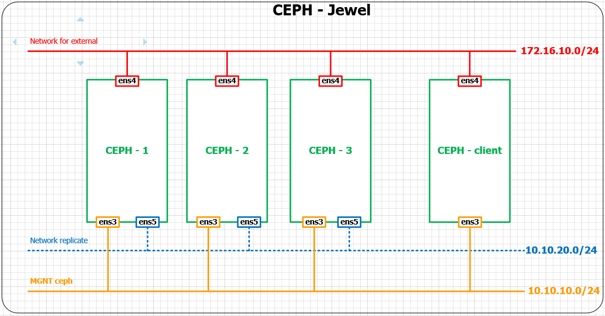
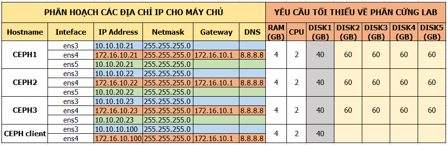

# Ceph-deploy Jewel trên ubuntu 16.04 - 64 bit

## 1. Mô hình cài đặt
- Sử dụng mô hình ceph 3 node được cài đặt trên Ubuntu 16.04

	
	
## 2. Ip Planning 
- Phân hoạch địa chỉ Ip và thông số phần cứng 

	
	
## 3. Cài đặt môi trường cho các server ceph
- OS:
	- Ubuntu Server 16.04 - 64 bit
	- 5: HDD, trong đó:
	- sda: sử dụng để cài OS
	- sdb: sử dụng làm journal (Journal là một lớp cache khi client ghi dữ liệu, thực tế thường dùng ổ SSD để làm cache)
	- sdc, sdd, sde: sử dụng làm OSD (nơi chứa dữ liệu của client)
- 2 NICs:
	- ens3: dùng để client sử dụng, dải 10.10.10.0/24
	- ens4: dùng để ssh và tải gói cài đặt cho máy chủ CEPH và ceph client , sử dụng dải 172.16.10.0/24
	- ens5: dùng để replicate cho CEPH sử dụng, dải 10.10.20.0/24
- CEPH Jewel

- Trên các server ceph đều thực hiện tương tự nhau.

### 3.1 Cấu hình route và ip
- 1. Đặt hostname: dùng vi sửa file `/etc/hostname`
	- ceph - 1 đặt: `ceph1`
	- ceph - 2 đặt: `ceph2`
	- ceph - 3 đặt: `ceph3`
	
- 2. Sửa file `/etc/hosts`

```sh
10.10.10.21	ceph1
10.10.10.22	ceph2
10.10.10.23	ceph3
```

- 3. Cấu hình card mạng. sửa file `/etc/network/interfaces`

```sh
auto ens3
iface ens3 inet static
	address 10.10.10.21
	netmask 255.255.255.0

auto ens4
iface ens4 inet static
	address 172.16.10.21
	netmask 255.255.255.0
	gateway 172.16.10.1
	dns-nameservers 8.8.8.8

auto ens5
iface ens5 inet static
	address 10.10.20.21
	netmask 255.255.255.0
```

	- Trên ceph2 đặt ip là 22, ceph 3 đặt 23

### 3.2 Cài đặt NTP
- 1. Cài gói chrony.

```sh
apt -y install chrony
```

- 2. Mở file `/etc/chrony/chrony.conf` bằng vi và thêm vào các dòng sau:

	- Trên ceph 1 thực hiện như sau:
		- commnet dòng sau:
		
		```sh
		#pool 2.debian.pool.ntp.org offline iburst
		```
		
		- Thêm các dòng sau:

		```sh
		server 1.vn.poo.ntp.org iburst
		server 0.asia.pool.ntp.org iburst 
		server 3.asia.pool.ntp.org iburst
		
		allow 10.10.10.0/24
		```
	
	- Trên ceph 2 và ceph 3:
		- commnet dòng sau:
		
		```sh
		#pool 2.debian.pool.ntp.org offline iburst
		```
		
		- Thêm các dòng sau:

		```sh
		server ceph1 iburst
		```
		
- Restart dịch vụ NTP

```sh 
service chrony restart
```

### 3.3 Cài đặt các gói ceph.
- 1. Khai báo Repo cho CEPH đối với Ubuntu Server 

```sh
wget -q -O- 'https://download.ceph.com/keys/release.asc' | sudo apt-key add -
echo deb https://download.ceph.com/debian-jewel/ $(lsb_release -sc) main | sudo tee /etc/apt/sources.list.d/ceph.list
apt update
apt install -y ceph
```

- 2. Cài đặt công cụ ceph-deploy. chỉ cài trên ceph1

```sh
apt -y install ceph-deploy
```

### 3.3 Tạo user `ceph-deploy` để sử dụng cho việc cài đặt cho CEPH.
- Tạo user

```sh
sudo useradd -m -s /bin/bash ceph-deploy
```

- Đặt mật mẩu cho user ceph-deploy

```sh
sudo passwd ceph-deploy
```

- Phân quyền cho user ceph-deploy

```sh
echo "ceph-deploy ALL = (root) NOPASSWD:ALL" | sudo tee /etc/sudoers.d/ceph-deploy
sudo chmod 0440 /etc/sudoers.d/ceph-deploy
```

- Chuyển sang tài khoản ceph-deploy để thực hiện cài đặt. Thực hiện trên ceph1

```sh
sudo su - ceph-deploy
```

- Tạo ssh key cho user `ceph-deploy`. Nhấn enter đối với các bước được hỏi trên màn hình.

```sh
ssh-keygen
```

- Copy ssh key để sử dụng:

```sh
ssh-copy-id ceph-deploy@ceph1
```

- Nhập Yes và mật khẩu của user ceph-deploy đã tạo ở trước, kết quả như bên dưới

```sh
ceph-deploy@ceph1:~$ ssh-copy-id ceph-deploy@ceph1
The authenticity of host 'ceph1 (172.16.10.21)' can't be established.
ECDSA key fingerprint is f2:38:1e:50:44:94:6f:0a:32:a3:23:63:90:7b:53:27.
Are you sure you want to continue connecting (yes/no)? yes
/usr/bin/ssh-copy-id: INFO: attempting to log in with the new key(s), to filter out any that are already installed
/usr/bin/ssh-copy-id: INFO: 1 key(s) remain to be installed -- if you are prompted now it is to install the new keys
ceph-deploy@ceph1's password:

Number of key(s) added: 1

Now try logging into the machine, with:   "ssh 'ceph-deploy@ceph1'"
and check to make sure that only the key(s) you wanted were added.
```

- Tiếp tục copy ssh key sang ceph 2 và ceph 3 bằng cách thay tên ceph1 ở trên lần lượt bằng ceph2 và ceph3

### 3.4 Tạo các thư mục để công cụ ceph-deploy sử dụng để cài đặt CEPH
- Tạo thư mục

```sh
cd ~
mkdir my-cluster
cd my-cluster
```


