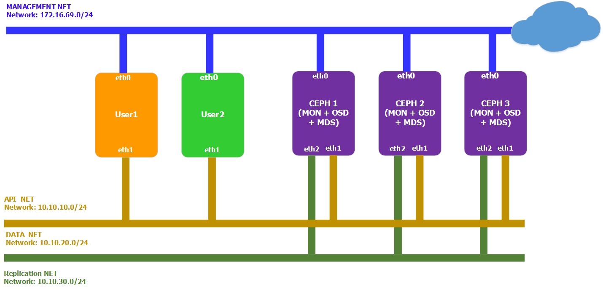

# Hướng dẫn cài đặt Ceph MDS
******

# I. Cài đặt cơ bản
******

## 1. Chuẩn bị môi trường

### 1.1 Mô hình mạng
- Mô hình đầy đủ



 
### Chú ý

Đã cài đặt Ceph theo hướng dẫn ở link [sau](ceph_jewel_install_manual.md)

## 2. Thực hiện trên từng ceph host

### 2.1. Cài đặt gói

```sh
apt-get install ceph ceph-mds -y
```
### 2.2. Cấu hình /etc/ceph/ceph.conf trên từng host
- Thêm các dòng cấu hình mds sau ở cuối file, lưu ý thay đổi tên host tương ứng
	```sh
	[mds]
	mds data = /var/lib/ceph/mds/mds.$host
	keyring = /var/lib/ceph/mds/mds.$host/mds.$host.keyring

	[mds.ceph1]
	host = ceph1
	```

### 2.3. Tạo thư mục ceph-mds daemon để chứa các keyring phục vụ cho việc xác thực bằng cephX
```sh
mkdir /var/lib/ceph/mds/mds.ceph1
ceph auth get-or-create mds.ceph1 mds 'allow ' osd 'allow *' mon 'allow rwx' > /var/lib/ceph/mds/mds.ceph1/mds.ceph1.keyring
```

### 2.4. Khởi động ceph mds
```sh
/etc/init.d/ceph start mds
/etc/init.d/ceph status mds
```
### 2.5. Kiểm tra trạng thái ceph mds
```sh
ceph mds stat
```

Kết quả:
```
e13: 1/1/1 up {0=ceph2=up:active}, 2 up:standby
```
ceph mds chạy theo mô hình active-standby, kết quả trên chỉ ra ceph2 đang là node active, ceph1,3 ở trạng thái standby.

## 3. Thực hiện trên ceph 1

### 3.1. Tạo pool cho cephfs metadata
 - Tạo pool cho cephfs metadata
	```
	ceph osd pool create cephfs_data 128
	```
 - Tạo pool cho cephfs data
 	```
	ceph osd pool create cephfs_metadata  128
	```
 - Tạo filesystem với tên cephfs trên các pool vừa tạo
 	```
	ceph fs new cephfs cephfs_metadata cephfs_data
	```
### 3.2. Tạo user truy cập vào cephfs
 - Tạo user client.user1 có quyền đọc ghi vào pool cephfs_data
	```
	ceph auth get-or-create client.user1 mon 'allow r' mds 'allow r, allow rw path=/user1_folder' osd 'allow rw pool=cephfs_data'
	```
	CephFS cho phép admin phân quyền đọc ghi vào filesystem chu từng user, ở VD trên, client.user1 sau khi mount FS sẽ chỉ được phép đọc ghi vào thư mục /user1_folder và các thư mục con của nó.
 - Xuất file key của client.user1 ra file /etc/ceph/client.user1.keyring
 	```
 	ceph auth get-or-create client.user1 > /etc/ceph/client.user1.keyring
 	```
 - Loại bỏ các thông tin thừa trong file client.user1.keyring 
 	```
 	ceph-authtool -p -n client.user1 /etc/ceph/ceph.client.user1.keyring > /etc/ceph/client.user1
 	```
### 4. Thực hiện trên client (Ubuntu1404)
#### 4.1. Cài đặt
 - Cài đặt repo

	```sh
	wget -q -O- 'https://ceph.com/git/?p=ceph.git;a=blob_plain;f=keys/release.asc' | sudo apt-key add -
	```
	Kết quả: `OK`

	```sh
	echo deb http://download.ceph.com/debian-jewel/ trusty main | sudo tee /etc/apt/sources.list.d/ceph.list
	```
- Cập nhật các gói phần mềm

	```sh
	apt-get -y update
	```
- Cài đặt `ceph-common` package

	```sh
	apt-get install ceph-common -y
	```
#### 4.2. Mount CephFS
Client có 2 cách để mount CephFS
 - Mount bằng kernel driver: hỗ trợ từ Linux kernel 2.6.34
 - Mount bằng Ceph Fuse: với Linux kernel < 2.6.34
#### 4.3. Mount file system sử dụng kernel driver
 - Trên Ceph1, chuyển file /etc/ceph/client.user1 sang client
 	```
 	scp /etc/ceph/client.user1 root@client:/etc/ceph
 	```
 - Mount FS
 	```sh
 	mount -t ceph 10.10.20.77:6789:/ /mnt/cephfs -o name=user,secretfile=/etc/ceph/client.user1
 	```
 - Để mount FS khi reboot client, sửa /etc/fstab, thêm dòng sau ở cuối file
 	```sh
 	10.10.20.77:6789:/     /mnt/cephfs    ceph    name=user1,secretfile=/etc/ceph/client.user1,noatime,_netdev    0       2
 	```
#### 4.4. Mount file system sử dụng Ceph Fuse
 - Trên Ceph1, chuyển file /etc/ceph/client.user1.keyring sang client
 	```
 	scp /etc/ceph/client.user1.keyring root@client:/etc/ceph
 	```
 - Cài đặt Ceph Fuse trên Client
 	```
 	apt-get install ceph-fuse -y
 	```
 - Mount FS sử dụng ceph-fuse
 	```
 	ceph-fuse --keyring=/etc/ceph/client.user1.keyring -n client.user1 -m 10.10.20.77:6789  /mnt/cephfs
 	```

### 4.5. Đối với các client là Windows OS, sử dụng cộng cụ Ceph Dokan để mount cephFS
https://drupal.star.bnl.gov/STAR/blog/mpoat/cephfs-client-windows-based-dokan-060

## Done

Tham khảo:

[1] - https://access.redhat.com/documentation/en-us/red_hat_ceph_storage/2/html/ceph_file_system_guide_technology_preview/what_is_the_ceph_file_system_cephfs

[2] - https://www.sebastien-han.fr/blog/2013/05/13/deploy-a-ceph-mds-server/