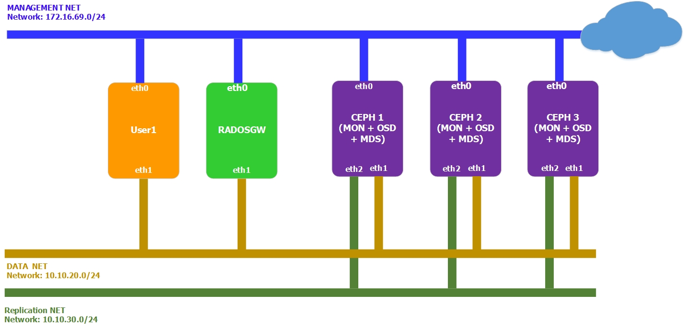

# Hướng dẫn cài đặt Ceph RadosGW
******

# I. Cài đặt cơ bản
******

## 1. Chuẩn bị môi trường

### 1.1 Mô hình mạng
- Mô hình đầy đủ



 
### Chú ý

Đã cài đặt Ceph theo hướng dẫn ở link [sau](ceph_jewel_install_manual.md)


## 2. Thực hiện trên ceph 1

### 2.1. Tạo keyring cho radosgw
```
ceph-authtool --create-keyring /etc/ceph/ceph.client.radosgw.keyring
chmod +r /etc/ceph/ceph.client.radosgw.keyring
```

### 2.2. Tạo user và key cho Radosgw
```
ceph-authtool /etc/ceph/ceph.client.radosgw.keyring -n client.radosgw.gateway --gen-key
```
File /etc/ceph/ceph/ceph.client.radosgw.keyring được tạo ra với nội dung:
```
[client.user1]
	key = AQCVZ6JZuSiZLBAATY1bzjF9y+FyybqiSym3Rg==
```

### 2.3. Tạo các quyền cho user
```
ceph-authtool -n client.radosgw.gateway --cap osd 'allow rwx' --cap mon 'allow rwx' /etc/ceph/ceph.client.radosgw.keyring
```
File /etc/ceph/ceph/ceph.client.radosgw.keyring được update
```
[client.radosgw.gateway]
        key = AQA8E5tZ8vQ0JRAAO/j8HSvgLfsfeHu2dhdx3A==
        caps mon = "allow rwx"
        caps osd = "allow rwx"
```

### 2.4. Đưa key vào ceph cluster
```
ceph auth add client.radosgw.gateway -i /etc/ceph/ceph.client.radosgw.keyring
```

### 2.5. Cấu hình /etc/ceph/ceph.conf trên từng host
- Thêm các dòng cấu hình mds sau ở cuối file, lưu ý thay đổi tên host tương ứng
	```sh
	[client.radosgw.gateway]
	host = radosgw1
	keyring = /etc/ceph/ceph.client.radosgw.keyring
	rgw socket path = /var/run/ceph/ceph.radosgw.gateway.fastcgi.sock
	log file = /var/log/radosgw/client.radosgw.gateway.log
	rgw dns name = radosgw1.longlq.com
	rgw print continue = false
	```

### 2.6. Chuyển ceph.conf từ host ceph1 sang host ceph radosgw
```
scp /etc/ceph/ceph.conf  root@radosgw:/etc/ceph/ceph.conf
```

## 3. Thực hiện trên từng host ceph RadosGW

### 3.1. Update repo
```
wget -q -O- 'https://ceph.com/git/?p=ceph.git;a=blob_plain;f=keys/release.asc' | sudo apt-key add -
```
Nếu cài đặt trên Ubuntu 14.04
```
echo deb http://download.ceph.com/debian-jewel/ trusty main | sudo tee /etc/apt/sources.list.d/ceph.list
```
Update
```
apt-get update
```

### 3.2. Cài đặt gói

```sh
apt-get install radosgw -y
```

### 3.3. Cấu hình để run service radosgw với user root
```
sed -i s"/DEFAULT_USER.*=.*'apache'/DEFAULT_USER='root'"/g /etc/init.d/radosgw
```

### 3.4. Khởi chạy radosgw
```
service radosgw start
```

### 3.5. Kiểm tra webserver civetweb
```
netstat -nlp | grep -i 7480
```
Kết quả:
```
tcp        0      0 0.0.0.0:7480            0.0.0.0:*               LISTEN      32240/radosgw   
```

### 3.6. Kiểm tra user radosgw có thể truy cập vào ceph cluster
```
ceph -s -k /etc/ceph/ceph.client.radosgw.keyring --name client.radosgw.gateway
```
Kết quả:
(../images/ceph_jewel_manual/JewelRGW_1.jpg)

### 3.7. Tạo user longlq cho S3 service
```
radosgw-admin user create --uid="longlq" --display-name="Quang Long" --email=longsube@gmail.com -k /etc/ceph/ceph.client.radosgw.keyring --name client.radosgw.gateway
```
Kết quả:
{
    "user_id": "longlq",
    "display_name": "Quang Long",
    "email": "longsube@gmail.com",
    "suspended": 0,
    "max_buckets": 1000,
    "auid": 0,
    "subusers": [],
    "keys": [
        {
            "user": "longlq",
            "access_key": "9YZ5LRXK4U5RJR8V7DVV",
            "secret_key": "HwEvLMjDx7M5RJZyrC8tnMVBlVR71xBtvxa0Nq7m"
        }
    ],
    "swift_keys": [],
    "caps": [],
    "op_mask": "read, write, delete",
    "default_placement": "",
    "placement_tags": [],
    "bucket_quota": {
        "enabled": false,
        "max_size_kb": -1,
        "max_objects": -1
    },
    "user_quota": {
        "enabled": false,
        "max_size_kb": -1,
        "max_objects": -1
    },
    "temp_url_keys": []
}

### 3.7. Cấu hình Private DNS trên host RadosGW
 - Cài đặt gói bind
 	```
	apt-get install bind9 bind9utils bind9-doc -y
	```

 - Sửa file /etc/default/bind9
    ```
	# Cau hinh DNS dung IPv4
	OPTIONS="-4 -u bind"
	```

 - Sửa file /etc/bind/named.conf.local
	```
	# Thu muc mac dinh chua cac zone file
	directory "/var/cache/bind";
	# Cau hinh dich vụ DNS cua host radosgw (172.16.69.163) su dung port 53
	listen-on port 53 { 127.0.0.1;172.16.69.163; };
	# Cau hinh dai mang cho phep query DNS
    allow-query      { localhost;172.16.69.0/24; };

 - Sửa file /etc/bind/named.conf.local
 	```
 	# Them zone cho domain "demo.com"
 	zone "demo.com" IN {
		type master;
		file "db.demo.com";
		allow-update { none; };
	};
 	```
 - Tạo zone file db.demo.com tại thư mục /var/cache/bind
 	```
 	86400 IN SOA demo.com. root.demo.com. (
        20091028 ; serial yyyy-mm-dd 
        10800 ; refresh every 180 min 
        3600 ; retry every hour
        3600000 ; expire after 1 month + 
        86400 ); min ttl of 1 day
	@ 86400 IN NS demo.com.
	@ 86400 IN A 172.16.69.163
	* 86400 IN CNAME @
 	```
 - Khởi động lại dịch vụ bind
 	```
 	service bind9 start
 	```

## 4. Thực hiện trên host client
### 4.1. Cài đặt s3cmd trên client
```
apt-get install s3cmd -y
```

### 4.2. Cấu hình các thông số của s3cmd, thực hiện theo các bước được hướng dẫn, chú ý thay đổi access key và secret key của user longlq
```
s3cmd --configure
```

### 4.3. Lệnh trên sẽ sinh ra file vim /root/.s3cfg, sửa file đó và thêm vào host_base và host_bucket của S3
```
host_base = radosgw1.demo.com:7480
host_bucket = %(bucket)s.radosgw1.demo.com:7480
```

### 4.4. Sửa /etc/resolv.conf để dùng DNS của Radosgw
```
nameserver 172.16.69.163
nameserver 8.8.8.8
```

### 4.5. Thử S3 API
 - Tạo bucket trên S3
 	```
 	s3cmd mb s3://first-bucket
 	```
 - List bucket
 	```
 	s3cmd ls
 	```
 - Đẩy /etc/hosts lên bucket vừa tạo
 	```
 	s3cmd put /etc/hosts s3://first-bucket
 	```
 - List các file trong bucket
 	```
 	s3cmd ls s3://first-bucket
 	```
 - Set file về chế độ public
 	```
 	s3cmd setacl s3://first/hosts --acl-public --recursive
 	```
 - Download file sử dụng wget
 	```
 	wget http://first.radosgw1.demo.com:7480/hosts
 	```


## Done

Tham khảo:

[1] - 

[2] - 