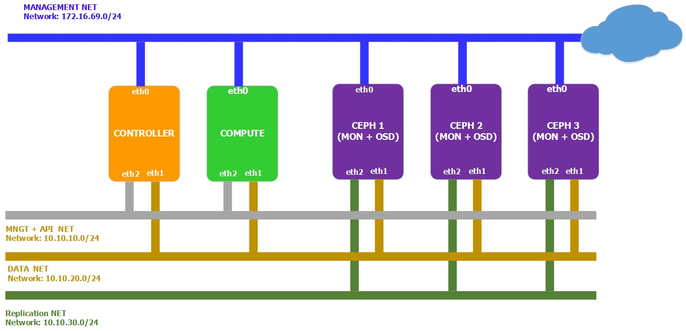
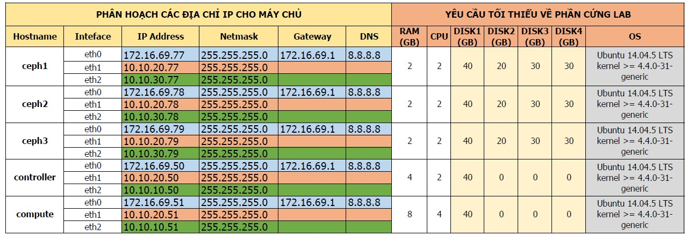

# Hướng dẫn tích hợp OpenStack Mitaka và Ceph Jewel
******

<a name="I."> </a> 
# I. Cài đặt cơ bản
******
<a name="1"> </a> 
## 1. Chuẩn bị môi trường
<a name="1.1"> </a> 
### 1.1 Mô hình mạng
- Mô hình đầy đủ



<a name="1.2"> </a> 
### 1.2 Các tham số phần cứng đối với các node



### Chú ý khi lựa chọn OS và lựa chọn dải mạng

```
- OS: Ubuntu Server 14.04.5 64 bit, kernel >= 4.4.0-31-generic
- Phiên bản OpenStack sử dụng là Mitaka
- Đối với Ubuntu 16.04 đã chuyển sang sử dụng systemd, do vậy các lệnh có chút thay đổi, tên của các NICs sẽ thay đổi
- Các dải mạng: 
	- Management + Provider Network: sử dụng để các máy ảo ra Internet, và quản lý (ssh) các máy chủ.
	- API Network: sử dụng cho giao tiếp API giữa controller và compute node.
	- Data Network: sử dụng để các máy client có thể truy cập và sử dụng tài nguyên lưu trữ trên Ceph.
	- Replication Network: Sử dụng để nhân bản dữ liệu giữa các node Ceph.
- Ổ cứng:
	- Label của các ổ cứng trong hướng dẫn này là sda, sdb,sdc,sdd. Tùy từng môi trường thực hiện label này có thể thay đổi (vda, vdb)
```

<a name="2"> </a> 
## 2. Trên Ceph 1
### 2.1. Tạo ra các pool cho các dịch vụ của OpenStack
- Tạo pool cho Cinder volumes
	
```
ceph osd pool create volumes 128 128
```

- Tạo pool cho Glance images

```
ceph osd pool create images 128 128
```

- Tạo pool cho Cinder backups
	
```
ceph osd pool create backups 128 128
```

- Tạo pool cho Nova vms

```
ceph osd pool create vms 128 128
```


### 2.2. Chuyển file `ceph.conf`  sang các node Controller và Compute, đặt tại `/etc/ceph` (nếu chưa có thì tạo thư mục bằng lệnh `mkdir /etc/ceph`)
```
ssh 172.16.69.50 sudo tee /etc/ceph/ceph.conf < /etc/ceph/ceph.conf
ssh 172.16.69.51 sudo tee /etc/ceph/ceph.conf < /etc/ceph/ceph.conf
```

### 2.3. Tạo các ceph user cho dịch vụ OpenStack

- Tạo user cho glance
```
ceph auth get-or-create client.glance mon 'allow r' osd 'allow class-read object_prefix rbd_children, allow rwx pool=images'
```

- Tạo user cho cinder-backup
```
ceph auth get-or-create client.cinder-backup mon 'allow r' osd 'allow class-read object_prefix rbd_children, allow rwx pool=backups'
```

- Tạo user cho cinder-volume và nova-compute (dùng chung 1 user)
```
ceph auth get-or-create client.cinder mon 'allow r' osd 'allow class-read object_prefix rbd_children, allow rwx pool=volumes, allow rwx pool=vms, allow rwx pool=images'
```

### 2.4. Chuyển các key  sang node Controller

- Chuyển key `client.glance` sang node Controller và phân quyền cho user glance
```
ceph auth get-or-create client.glance | ssh 172.16.69.50 sudo tee /etc/ceph/ceph.client.glance.keyring
ssh 172.16.69.50 sudo chown glance:glance /etc/ceph/ceph.client.glance.keyring
```

- Chuyển key `client.cinder` sang node Controller và phân quyền cho user cinder
```
ceph auth get-or-create client.cinder | ssh 172.16.69.50 sudo tee /etc/ceph/ceph.client.cinder.keyring
ssh 172.16.69.50 sudo chown cinder:cinder /etc/ceph/ceph.client.cinder.keyring
```

- Chuyển key `client.cinder-backup` sang node Controller và phân quyền cho user cinder
```
ceph auth get-or-create client.cinder-backup | ssh 172.16.69.50 sudo tee /etc/ceph/ceph.client.cinder-backup.keyring
ssh 172.16.69.50 sudo chown cinder:cinder /etc/ceph/ceph.client.cinder-backup.keyring
```

### 2.5. Chuyển key `client.cinder` sang node Compute

```
ceph auth get-or-create client.cinder | ssh 172.16.69.51 sudo tee /etc/ceph/ceph.client.cinder.keyring
ceph auth get-key client.cinder | ssh 172.16.69.51 tee /root/client.cinder.key
```

## 3. Trên 2 node Controller và Copute
### 3.1. Cài đặt package cho Ceph Jewel
- Cài đặt repo

```sh
wget -q -O- 'https://ceph.com/git/?p=ceph.git;a=blob_plain;f=keys/release.asc' | sudo apt-key add -
```
Kết quả: `OK`

```sh
echo deb http://download.ceph.com/debian-jewel/ trusty main | sudo tee /etc/apt/sources.list.d/ceph.list
```
- Cập nhật các gói phần mềm

```sh
apt-get -y update
```
- Nếu node Controller có service `glance-api`, cài đặt `python-rbd package

```sh
apt-get install python-rbd -y
```
- Nếu node Controller có service `cinder-backup` và `cinder-volume`, cài đặt `ceph-common` package

```sh
apt-get install ceph-common -y
```

- Kiểm tra các gói sau khi cài

```sh
dpkg -l | egrep -i "ceph|rados|rbd"
```
Kết quả:

```sh
ii  ceph-common                          10.2.6-1trusty                        amd64        common utilities to mount and interact with a ceph storage cluster
ii  libcephfs1                           10.2.6-1trusty                        amd64        Ceph distributed file system client library
ii  librados2                            10.2.6-1trusty                        amd64        RADOS distributed object store client library
ii  libradosstriper1                     10.2.6-1trusty                        amd64        RADOS striping interface
ii  librbd1                              10.2.6-1trusty                        amd64        RADOS block device client library
ii  librgw2                              10.2.6-1trusty                        amd64        RADOS Gateway client library
ii  python-cephfs                        10.2.6-1trusty                        amd64        Python libraries for the Ceph libcephfs library
ii  python-rados                         10.2.6-1trusty                        amd64        Python libraries for the Ceph librados library
ii  python-rbd                           10.2.6-1trusty                        amd64        Python libraries for the Ceph librbd library
```
### 3.1. Cài đặt công cụ để chỉnh sửa file cấu hình:
	`apt-get install crudini -y`

## 4. Trên node Controller

### 4.1. Tạo secret key (Key này sẽ được sử dụng để máy ảo có thể attach volume trên ceph)
```
uuidgen
```
Kết quả:
```
fc6a2ccd-eb9f-4e6e-9bd5-4a0c5feb4d50
```

### 4.1. Cấu hình `glance-api.conf` để lưu image xuống Ceph

- Cấu hình Glance dùng cả api 1 và 2
```		
crudini --set /etc/glance/glance-api.conf DEFAULT enable_v2_api True
crudini --set /etc/glance/glance-api.conf DEFAULT enable_v2_registry True
crudini --set /etc/glance/glance-api.conf DEFAULT enable_v1_api True
crudini --set /etc/glance/glance-api.conf DEFAULT enable_v1_registry True
```


- Option để enable tính năng COW cho RBD image
`crudini --set /etc/glance/glance-api.conf glance_store show_image_direct_url True`

- Khai báo các store để lưu trữ image (mặc định là rbd)
```
crudini --set /etc/glance/glance-api.conf glance_store default_store rbd
crudini --set /etc/glance/glance-api.conf glance_store stores rbd
```

- Khai báo ceph pool và user để lưu trữ image vào ceph
```
crudini --set /etc/glance/glance-api.conf glance_store rbd_store_pool images
crudini --set /etc/glance/glance-api.conf glance_store rbd_store_user glance
crudini --set /etc/glance/glance-api.conf glance_store rbd_store_ceph_conf /etc/ceph/ceph.conf
crudini --set /etc/glance/glance-api.conf glance_store rbd_store_chunk_size 8
```

### 4.2. Cấu hình `cinder.conf` để lưu volume và volume backup xuống Ceph
	
`crudini --set /etc/glance/cinder.conf DEFAULT notification_driver messagingv2`

- Khai báo kết nối tới Glance để lấy image (sử dụng Glance API v2)
```
crudini --set /etc/cinder/cinder.conf DEFAULT glance_api_servers http://171.16.69.50:9292
crudini --set /etc/cinder/cinder.conf DEFAULT glance_api_version 2
```

- Khai báo backend cho Cinder là ceph_hdd, nếu có nhiều backend thì ngăn cách bằng dấu ','
`crudini --set /etc/cinder/cinder.conf DEFAULT enabled_backends ceph_hdd`

- Bỏ dòng khai báo `volume_group = cinder-volumes`
`crudini --del cinder.conf DEFAULT volume_group `

- Khai báo ceph pool và user để lưu các bản volume backup xuống ceph
```
crudini --set /etc/cinder/cinder.conf DEFAULT backup_driver cinder.backup.drivers.ceph
crudini --set /etc/cinder/cinder.conf DEFAULT backup_ceph_conf /etc/ceph/ceph.conf
crudini --set /etc/cinder/cinder.conf DEFAULT backup_ceph_user cinder-backup
crudini --set /etc/cinder/cinder.conf DEFAULT backup_ceph_chunk_size 134217728
```

- Khai báo ceph pool chứa volume backup
```
crudini --set /etc/cinder/cinder.conf DEFAULT backup_ceph_pool backups
crudini --set /etc/cinder/cinder.conf DEFAULT backup_ceph_stripe_unit 0
crudini --set /etc/cinder/cinder.conf DEFAULT backup_ceph_stripe_count 0
crudini --set /etc/cinder/cinder.conf DEFAULT restore_discard_excess_bytes true
```

- Khai báo backend ceph_hdd
```
crudini --set /etc/cinder/cinder.conf ceph_hdd volume_driver cinder.volume.drivers.rbd.RBDDriver
crudini --set /etc/cinder/cinder.conf ceph_hdd volume_backend_name ceph_hdd
```

- Khai báo ceph pool chứa volume
	crudini --set /etc/cinder/cinder.conf ceph_hdd rbd_pool volumes
	crudini --set /etc/cinder/cinder.conf ceph_hdd rbd_ceph_conf /etc/ceph/ceph.conf
	crudini --set /etc/cinder/cinder.conf ceph_hdd rbd_flatten_volume_from_snapshot true
	crudini --set /etc/cinder/cinder.conf ceph_hdd rbd_max_clone_depth 5
	crudini --set /etc/cinder/cinder.conf ceph_hdd rbd_store_chunk_size 4
	crudini --set /etc/cinder/cinder.conf ceph_hdd rrados_connect_timeout -1
	crudini --set /etc/cinder/cinder.conf ceph_hdd rbd_user cinder

- Khai báo secret key đã tạo
	crudini --set /etc/cinder/cinder.conf rbd_secret_uuid fc6a2ccd-eb9f-4e6e-9bd5-4a0c5feb4d50	
	crudini --set /etc/cinder/cinder.conf report_discard_supported true

### 4.3. Tạo các backend cho volume
	cinder type-create hdd
	cinder type-key hdd set volume_backend_name=ceph_hdd


### 4.4. Khởi động lại các dịch vụ
	cd /etc/init/; for i in $(ls cinder-* | cut -d \. -f 1 | xargs); do sudo service $i restart; done
	cd /etc/init/; for i in $(ls glance-* | cut -d \. -f 1 | xargs); do sudo service $i restart; done
	


## 5. Trên node Compute

### 5.1. Cấu hình `nova.conf` để lưu VM xuống Ceph
	
	crudini --set /etc/nova/nova.conf libvirt inject_partition -2	
	crudini --set /etc/nova/nova.conf libvirt inject_password false
	crudini --set /etc/nova/nova.conf libvirt live_migration_flag VIR_MIGRATE_UNDEFINE_SOURCE,VIR_MIGRATE_PEER2PEER,VIR_MIGRATE_LIVE,VIR_MIGRATE_PERSIST_DEST
	crudini --set /etc/nova/nova.conf libvirt inject_key False
	crudini --set /etc/nova/nova.conf libvirt images_type rbd

	- Khai báo ceph pool chứa vm
	crudini --set /etc/nova/nova.conf libvirt images_rbd_pool vms
	crudini --set /etc/nova/nova.conf libvirt images_rbd_ceph_conf /etc/ceph/ceph.conf

	- Khai báo secret key đã tạo
	crudini --set /etc/nova/nova.conf libvirt rbd_secret_uuid fc6a2ccd-eb9f-4e6e-9bd5-4a0c5feb4d50
	crudini --set /etc/nova/nova.conf libvirt disk_cachemodes network=writeback


### 5.2. Add secret key vào libvirt
- Tạo file `secret.xml` đặt tại `/root` chứa secret key

	cat > /root/secret.xml <<EOF
	<secret ephemeral='no' private='no'>
		<uuid>fc6a2ccd-eb9f-4e6e-9bd5-4a0c5feb4d50</uuid>
		<usage type='ceph'>
		<name>client.cinder secret</name>
		</usage>
	</secret>
	EOF

- Định nghĩa secret key
	```
	virsh secret-define --file secret.xml
	```

	Kết quả:

	`Secret fc6a2ccd-eb9f-4e6e-9bd5-4a0c5feb4d50 created`

- Add secret key vào libvirt
	```
	sudo virsh secret-set-value --secret fc6a2ccd-eb9f-4e6e-9bd5-4a0c5feb4d50 --base64 $(cat client.cinder.key)
	```

### 5.3. Khởi động lại các dịch vụ
	```
	cd /etc/init/; for i in $(ls nova-* | cut -d \. -f 1 | xargs); do sudo service $i restart; done
	```

## 6. Kiểm tra
### 6.1. Kiểm tra việc tích hợp Glance và Ceph
	- Trên OpenStack controller, download image cirros và đặt tại root
	wget http://download.cirros-cloud.net/0.3.4/cirros-0.3.4-x86_64-disk.img

	- Convert image vừa download sang định dạng raw
	qemu-img convert -f qcow2 -O raw /root/cirros-0.3.4-x86_64-disk.img /root/cirros-0.3.4-x86_64-disk.raw

	- Upload image lên Glance
	openstack image create cirros-0.3.4-x86_64-disk.raw --disk-format raw --container-format bare --public < /root/cirros-0.3.4-x86_64-disk.raw

 	- Kết quả sau khi upload image thành công
 	+------------------+--------------------------------------+
	| Property         | Value                                |
	+------------------+--------------------------------------+
	| container_format | bare                                 |
	| created_at       | 2016-06-08T02:21:33.000000           |
	| deleted          | False                                |
	| disk_format      | raw                                  |
	| id               |*c1a1a7f3-7dc3-46e7-870c-c2f792945566*|
	| is_public        | False                                |
	| min_disk         | 0                                    |
	| min_ram          | 0                                    |
	| name             | cirros-0.3.4-x86_64-disk.raw         |
	| owner            | e72c7e1e60814fcb93a5afc4b3c66342     |
	| protected        | False                                |
	| size             | 32212254720                          |
	| status           | active                               |
	| updated_at       | 2016-06-08T02:21:35.000000           |
	+------------------+--------------------------------------+


	- Trên ceph1, kiểm tra RBD-image của Image vừa tạo

	rbd -p images ls
	*c1a1a7f3-7dc3-46e7-870c-c2f792945566*

Như vậy id của image được upload và id của RBD image trong pool image là trùng nhau, image đã được tải vào Ceph backend.

### 6.2. Kiểm tra việc tích hợp Cinder và Ceph

	Trên OpenStack, tạo 1 volume thuộc backend volumes-hdd

	```
	cinder list
	+--------------------------------------+-----------+------+------+-------------+----------+-------------+
	|                  ID                  |   Status  | Name | Size | Volume Type | Bootable | Attached to |
	+--------------------------------------+-----------+------+------+-------------+----------+-------------+
	| 3a4dab6c-e5d1-4ec8-b39c-ef70f6045cb5 | available | test |  1   |   ceph_hdd  |  false   |             |
	+--------------------------------------+-----------+------+------+-------------+----------+-------------+
	```


	Trên ceph1, kiểm tra RBD-image của Image vừa tạo

	```
	rbd -p volumes ls
	volume-3a4dab6c-e5d1-4ec8-b39c-ef70f6045cb5
	```


### 6.3. Kiểm tra việc tích hợp Nova và Ceph

	Trên OpenStack, tạo một máy ảo boot từ image

	```
	nova list
	+--------------------------------------+-------+---------+------------+-------------+---------------------------+
	| ID                                   | Name  | Status  | Task State | Power State | Networks                  |
	+--------------------------------------+-------+---------+------------+-------------+---------------------------+
	| 72f300b7-d9e2-4734-828e-d6e99aaad6f0 | CR    | ACTIVE  | -          | Running     | pri_network=192.168.0.13 	|
	+--------------------------------------+-------+---------+------------+-------------+---------------------------+
	```


	Trên ceph1, kiểm tra RBD-image của Image vừa tạo

	```
	rbd -p vms ls
	72f300b7-d9e2-4734-828e-d6e99aaad6f0_disk
	```

## Done