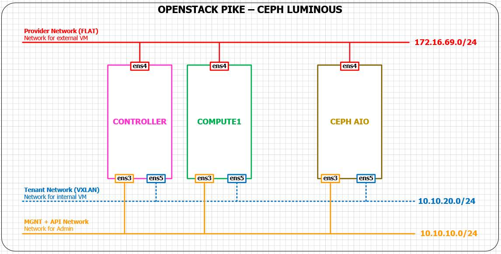

## Tích hợp Openstack Pike với Ceph luminous

## 1. Mô hình
- Mô hình mạng triển khai để tích hợp như sau:

	
	
- IP của các node như sau:
	- Controller: `.190/24`
	- Compute1: `.191/24`
	- Cephaio: `.199/24`
	
## 2. Thực hiện tích hợp glance
#### 2.1 Thực hiện trên ceph
- 1. Tạo pool cho images

```sh
ceph osd pool create images 64 64
```

- 2. Chuyển file `ceph.conf` sang node `Controller` 
- Chú ý: cần tạo thư mục `/etc/ceph/` trên node controller trước

```sh
ssh 172.16.69.190 sudo tee /etc/ceph/ceph.conf < /etc/ceph/ceph.conf
```

- 3. Tạo user cho glance

```sh
ceph auth get-or-create client.glance mon 'allow r' osd 'allow class-read object_prefix rbd_children, allow rwx pool=images'
```

- 4. Chuyển key sang node Controller

```sh
ceph auth get-or-create client.glance | ssh 172.16.69.190 sudo tee /etc/ceph/ceph.client.glance.keyring
ssh 172.16.69.190 sudo chown glance:glance /etc/ceph/ceph.client.glance.keyring
```

#### 2.2 Thực hiện cài đặt các gói trên node controller
- 1. add repository

```sh
wget -q -O- 'https://download.ceph.com/keys/release.asc' | sudo apt-key add -
echo deb https://download.ceph.com/debian-luminous/ $(lsb_release -sc) main | sudo tee /etc/apt/sources.list.d/ceph.list
apt update
```

- 2. install các gói

```sh
apt install -y python-rbd
```

- Kiểm tra các gói sau khi cài đặt

```sh
root@controller:~# dpkg -l | egrep -i "ceph|rados|rbd"
ii  ceph-common                        12.2.4-1xenial                             amd64        common utilities to mount and interact with a ceph storage cluster
ii  libcephfs2                         12.2.4-1xenial                             amd64        Ceph distributed file system client library
ii  librados2                          12.2.4-1xenial                             amd64        RADOS distributed object store client library
ii  libradosstriper1                   12.2.4-1xenial                             amd64        RADOS striping interface
ii  librbd1                            12.2.4-1xenial                             amd64        RADOS block device client library
ii  librgw2                            12.2.4-1xenial                             amd64        RADOS Gateway client library
ii  python-cephfs                      12.2.4-1xenial                             amd64        Python 2 libraries for the Ceph libcephfs library
ii  python-rados                       12.2.4-1xenial                             amd64        Python 2 libraries for the Ceph librados library
ii  python-rbd                         12.2.4-1xenial                             amd64        Python 2 libraries for the Ceph librbd library
ii  python-rgw                         12.2.4-1xenial                             amd64        Python 2 libraries for the Ceph librgw library
```

- 3. Thực hiện cấu hình
- Sửa file `/etc/glance/glance-api.conf`
- Trong section `[DEFAULT]`

```sh
[DEFAULT]
...
enable_v2_api = true
enable_v2_registry = true
enable_v1_api = true
enable_v1_registry = true
```

- Trong section `[glance_store]`

```sh
[glance_store]
show_image_direct_url = True
default_store = rbd
stores = file,http,rbd

rbd_store_pool = images
rbd_store_user = glance
rbd_store_ceph_conf = /etc/ceph/ceph.conf
rbd_store_chunk_size = 8
```

- Restart các service của glance

```sh
service glance-registry restart
service glance-api restart
```

#### 2.3 Kiểm tra lại
- Thực hiện trên node controller
- 1. download image cirros và đặt tại root

```sh
wget http://download.cirros-cloud.net/0.3.4/cirros-0.3.4-x86_64-disk.img
```

- 2. Tạo img mới

```sh
openstack image create "cirros-ceph" \
--file cirros-0.3.5-x86_64-disk.img \
--disk-format qcow2 --container-format bare \
--public
```

- 3. Liệt kê các images

```sh
:~# openstack image list
+--------------------------------------+----------------------+--------+
| ID                                   | Name                 | Status |
+--------------------------------------+----------------------+--------+
| eb87354c-0135-4b9b-8f91-baa01dbb67c5 | cirros-ceph          | active |
+--------------------------------------+----------------------+--------+

~# openstack image show cirros-ceph
+------------------+------------------------------------------------------+
| Field            | Value                                                |
+------------------+------------------------------------------------------+
| checksum         | f8ab98ff5e73ebab884d80c9dc9c7290                     |
| container_format | bare                                                 |
| created_at       | 2018-03-26T01:41:37Z                                 |
| disk_format      | qcow2                                                |
| file             | /v2/images/eb87354c-0135-4b9b-8f91-baa01dbb67c5/file |
| id               | eb87354c-0135-4b9b-8f91-baa01dbb67c5                 |
| min_disk         | 0                                                    |
| min_ram          | 0                                                    |
| name             | cirros-ceph                                          |
| owner            | ca6e13d11f564a90aca3cd13c6eaf8e7                     |
| protected        | False                                                |
| schema           | /v2/schemas/image                                    |
| size             | 13267968                                             |
| status           | active                                               |
| tags             |                                                      |
| updated_at       | 2018-03-26T01:41:44Z                                 |
| virtual_size     | None                                                 |
| visibility       | public                                               |
+------------------+------------------------------------------------------+
```

- image có id: `eb87354c-0135-4b9b-8f91-baa01dbb67c5`
- Kiểm tra lại trên node ceph:

```sh
~# rbd -p images ls
eb87354c-0135-4b9b-8f91-baa01dbb67c5
```

- Ta thấy có object ở trong pool images có tên trùng với Id của image vừa tạo. Như vậy đã tích hợp thành công với glance

## 3. Tích hợp với Cinder
#### 3.1 Thực hiện trên node ceph
- 1. Tạo pool cho cinder

```sh
ceph osd pool create volumes 64 64
```

- 2. Tạo user cinder

```sh
ceph auth get-or-create client.cinder mon 'allow r' osd 'allow class-read object_prefix rbd_children, allow rwx pool=volumes, allow rwx pool=vms, allow rwx pool=images'
```

- 3. Chuyển key cinder sang controller

```sh
ceph auth get-or-create client.cinder | ssh 172.16.69.190 sudo tee /etc/ceph/ceph.client.cinder.keyring
ssh 172.16.69.190 sudo chown cinder:cinder /etc/ceph/ceph.client.cinder.keyring
```

- 4. Chuyển key client.cinder sang node compute1

```sh
ceph auth get-or-create client.cinder | ssh 172.16.69.191 sudo tee /etc/ceph/ceph.client.cinder.keyring
ceph auth get-key client.cinder | ssh 172.16.69.191 tee /root/client.cinder.key
```

#### 3.2 Thực hiện trên node cài Cinder-volume
- service `cinder-volume` được cài trên node controller. Thực hiện các bước sau trên controller
- 1. Cài đặt gói `ceph-common`

```sh
apt install ceph-common -y
```

- 2. Tạo secret key (Key này sẽ được sử dụng để máy ảo có thể attach volume trên ceph)

```sh
~# uuidgen
6f31b1c4-4c12-4ebc-a43d-d91a81cfc0b4
```

- 3. Cấu hình cinder `vi /etc/cinder/cinder.conf`. Thêm các dòng cấu hình sau

```sh
[DEFAULT]
notification_driver = messagingv2

glance_api_version = 2

enabled_backends = ceph_hdd

[ceph_hdd]
volume_driver = cinder.volume.drivers.rbd.RBDDriver
volume_backend_name = ceph_hdd
rbd_pool = volumes
rbd_ceph_conf = /etc/ceph/ceph.conf
rbd_flatten_volume_from_snapshot = true
rbd_max_clone_depth = 5
rbd_store_chunk_size = 4
rrados_connect_timeout = -1
rbd_user = cinder
rbd_secret_uuid = 6f31b1c4-4c12-4ebc-a43d-d91a81cfc0b4
report_discard_supported = true
```

- 4. Tạo các backend cho volume

```sh
cinder type-create hdd
cinder type-key hdd set volume_backend_name=ceph_hdd
```

- 5. Restart các service của cinder

```sh
service cinder-volume restart
service cinder-scheduler restart
```

#### 3.3 Thực hiện trên node compute1
- 1. Tạo file `cinder.xml` có nội dung như sau:

```sh
<secret ephemeral='no' private='no'>
        <uuid>6f31b1c4-4c12-4ebc-a43d-d91a81cfc0b4</uuid>
        <usage type='ceph'>
                <name>client.cinder secret</name>
        </usage>
</secret>
```

- 2. Định nghĩa secret key

```sh
virsh secret-define --file cinder.xml
```

- 3. Add secret key vào libvirt

```sh
virsh secret-set-value --secret 6f31b1c4-4c12-4ebc-a43d-d91a81cfc0b4 --base64 $(cat client.cinder.key)
```

- 4. Restart nova-compute

```sh
service nova-compute restart
```

#### 3.4 Kiểm tra lại cấu hình.
- Tạo volume mới, thực hiện trên node controller

```sh
~# openstack volume create --size 1 --type hdd volume-ceph
+---------------------+--------------------------------------+
| Field               | Value                                |
+---------------------+--------------------------------------+
| attachments         | []                                   |
| availability_zone   | nova                                 |
| bootable            | false                                |
| consistencygroup_id | None                                 |
| created_at          | 2018-04-19T02:47:45.432013           |
| description         | None                                 |
| encrypted           | False                                |
| id                  | f2e01ced-5a93-4cb6-9733-e7fe81f0406e |
| migration_status    | None                                 |
| multiattach         | False                                |
| name                | volume-ceph                          |
| properties          |                                      |
| replication_status  | None                                 |
| size                | 1                                    |
| snapshot_id         | None                                 |
| source_volid        | None                                 |
| status              | creating                             |
| type                | hdd                                  |
| updated_at          | None                                 |
| user_id             | de6faf4fb0484e90a21bd63c4cffa465     |
+---------------------+--------------------------------------+
```

- List volume

```sh
~# openstack volume list
+--------------------------------------+-------------+-----------+------+-------------+
| ID                                   | Name        | Status    | Size | Attached to |
+--------------------------------------+-------------+-----------+------+-------------+
| f2e01ced-5a93-4cb6-9733-e7fe81f0406e | volume-ceph | available |    1 |             |
+--------------------------------------+-------------+-----------+------+-------------+

- Kiểm tra trên node ceph

```sh
~# rbd ls volumes
volume-f2e01ced-5a93-4cb6-9733-e7fe81f0406e
```

- Ta thấy volume vừa mới tạo đã được lưu ở trên ceph

## 4. Tích hợp Nova với ceph
#### 4.1 Thực hiện trên node ceph
- 1. Tạo pool để lưu vm
```sh
ceph osd pool create vms 32 32
```

- 2. Tạo user nova

```sh
ceph auth get-or-create client.nova mon 'allow r' osd 'allow class-read object_prefix rbd_children, allow rwx pool=vms, allow rx pool=images' -o /etc/ceph/ceph.client.nova.keyring
```

- 3. Chuyển file cấu hình ceph sang node compute

```sh
ssh 172.16.69.191 sudo tee /etc/ceph/ceph.conf < /etc/ceph/ceph.conf
```

- 4. Chuyển key client.nova sang node Compute

```sh
ceph auth get-or-create client.nova | ssh 172.16.69.191 sudo tee /etc/ceph/ceph.client.nova.keyring
ssh 172.16.69.191 sudo chown nova:nova /etc/ceph/ceph.client.nova.keyring
ceph auth get-key client.nova | ssh 172.16.69.191 tee /root/client.nova.keyring
```

#### 4.2 Thực hiện trên node compute1
- Tạo uuidgen mới

```sh
~# uuidgen
aea0467d-6484-4b50-a614-a4bee9f5f7ee
```

- Thực hiện cấu hình cho nova `vi /etc/nova/nova.conf`

```sh
[DEFAULT]
force_raw_images = True
disk_cachemodes = writeback

[libvirt]
images_rbd_pool = vms
images_type = rbd
images_rbd_ceph_conf = /etc/ceph/ceph.conf
rbd_secret_uuid = aaf0aa41-45c0-451b-a8f1-1b4226e7d682
rbd_user = nova
```

- Restart nova-compute

```sh
service nova-compute restart
```

- Tạo file `vi nova.xml` có nội dung sau:

```sh
<secret ephemeral="no" private="no">
        <uuid>aaf0aa41-45c0-451b-a8f1-1b4226e7d682</uuid>
        <usage type="ceph">
                <name>client.nova secret</name>
        </usage>
</secret>
```

- Định nghĩa secret key cho vm

```sh
virsh secret-define --file nova.xml
```

- Add vào libvirt

```sh
virsh secret-set-value --secret aaf0aa41-45c0-451b-a8f1-1b4226e7d682 --base64 $(cat client.nova.keyring)
```

#### Kiểm tra lại
- Tạo một vm mới và kiểm tra thông tin của vm

```sh
~# openstack server create --flavor m1.medium --image cirros-ceph --nic net-id=44e66c3b-aac1-45aa-ac22-22d510bf24ae --security-group default vm-ceph

~# openstack server list
+--------------------------------------+---------+---------+----------------------------+-------------+-----------+
| ID                                   | Name    | Status  | Networks                   | Image       | Flavor    |
+--------------------------------------+---------+---------+----------------------------+-------------+-----------+
| 44ecfa5a-1c93-4665-8b6a-52c8e771b6b9 | vm-ceph | ACTIVE  | self-service=192.168.1.112 | cirros-ceph | m1.medium |
+--------------------------------------+---------+---------+----------------------------+-------------+-----------+
```

- Vm có id: `44ecfa5a-1c93-4665-8b6a-52c8e771b6b9`

- Kiểm tra trên ceph

```sh
~# rbd -p vms ls
44ecfa5a-1c93-4665-8b6a-52c8e771b6b9_disk
```

- Như vậy đã thành công