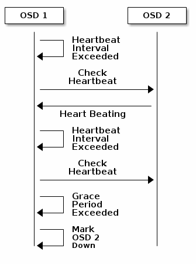
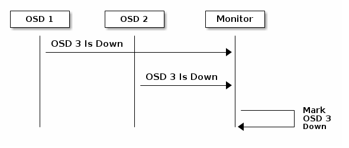
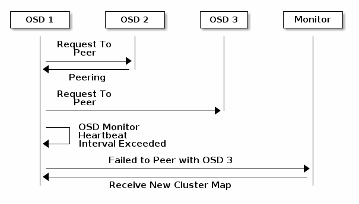
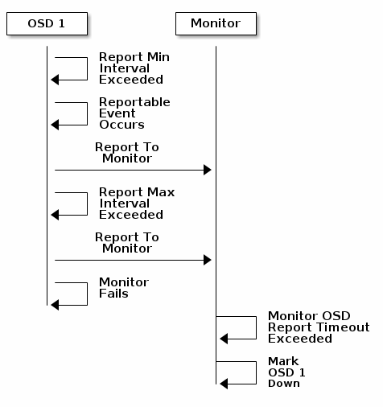

## Monitor xác nhận osd down
- Monitor theo dõi trạng thái của cluster. Khi thực thi lệnh như là `ceph health` hoặc `ceph -s`, monitor sẽ báo cáo trạng thái hiện tại của ceph cluster. Monitor biết các thông tin về cluster bằng cách yêu cầu các báo cáo từ các ceph osd daemon, và nhận các báo cáo từ ceph osd daemon về trạng thái của chúng và của hàng xóm. Nếu monitor không nhận được báo cáo, hoặc nếu nhận được báo cáo thay đổi, nó sẽ cập nhật trạng thái ceph cluster map.
- Ceph cung cấp giá trị cấu hình mặc định hợp lý cho sự tương tác giữa Monitor và OSD. Tuy nhiên bạn có thể cấu hình lại các giá trị mặc định này.

- Mỗi OSD sẽ kiểm tra trạng thái của osd khác 6s một lần. Thông số này có thể thay đổi bằng các thên `osd heartbeat interval` ở trong section `[osd]` trong file cấu hình ceph, hoặc đặt giá trị trong quá trình chạy. 
- Nếu một hàng xóm Ceph OSD daemon không có thông tin sau 20 thì osd đó được coi là down và nó sẽ báo cáo về ceph monitor, monitor sẽ cập nhật vào cluster map. Bạn có thể đặt lại giá trị này bằng cách thêm một `osd hearbeat grace` ở trong section `[mon] và [osd] hoặc [global]`.

	
	
- Mặc định, 2 OSDs khác hosts phải báo cáo về Mon rằng có osd khác (another) down trước khi Mon xác nhận báo cáo OSD là down.

	
	
- Nếu một Ceph OSD Daemon không thể kết nối với bất kỳ Daemon nào của Ceph OSD được định nghĩa trong file cấu hình Ceph (hoặc cluster map), nó sẽ ping một Ceph Monitor xin bản sao của cluster map gần đây nhất mỗi 30 giây. Bạn có thể thay đổi khoảng thời gian của Ceph Monitor bằng cách thêm một khoảng thời gian `osd mon heartbeat interval` dưới phần [osd] của file cấu hình Ceph hoặc bằng cách đặt giá trị trong thời gian chạy.

	
	
- Nếu một Ceph OSD Daemon không báo cáo cho một monitor của Ceph, thì Ceph Monitor sẽ xem Daemon Ceph OSD down sau khi hết thời gian báo cáo mon osd. Một Daemon Ceph OSD gửi một báo cáo tới một monitor của Ceph khi một sự kiện có thể báo cáo như sự thất bại, thay đổi số liệu thống kê của PG, sự thay đổi trong up_thru hoặc khi nó khởi động trong vòng 5 giây. Bạn có thể thay đổi khoảng thời gian báo cáo tối thiểu của trình bảo vệ Ceph OSD Daemon bằng cách thêm `osd mon report interval min` trong phần [osd] của file cấu hình Ceph hoặc bằng cách đặt giá trị trong thời gian chạy. Một Daemon Ceph OSD gửi một báo cáo tới một Ceph Monitor mỗi 120 giây bất kể có những thay đổi đáng chú ý nào xảy ra hay không. Bạn có thể thay đổi khoảng báo cáo của Ceph Monitor bằng cách thêm `osd mon report interval max` trong phần [osd] của tệp cấu hình Ceph của bạn hoặc bằng cách đặt giá trị trong thời gian chạy.

	
	