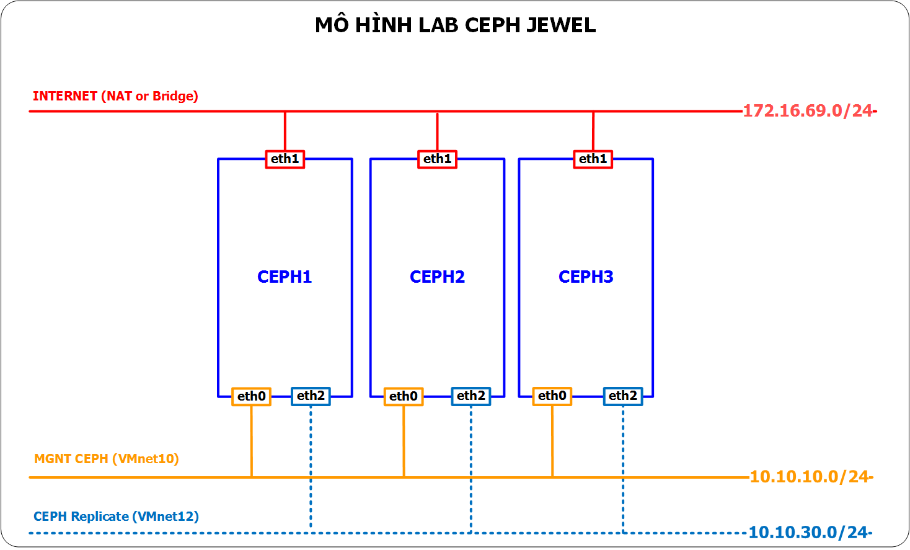
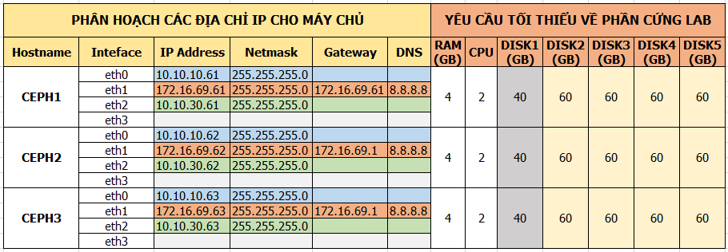

# Hướng dẫn cài đặt CEPH JEWEL trên Ubuntu 14.04
Mục lục:

- [1. Các bước chuẩn bị](#1)
  - [1.1. Mô hình LAB](#1.1)
  - [1.2. Phân hoạch IP và phần cứng yêu cầu đối với mô hình LABs](#1.2)
- [2. Thiết lập ip, hostname cho các máy chủ CEPH](#2)
  - [2.1. Thiết lập ip, hostname cho các máy chủ CEPH1](#2.1)
  - [2.2. Thiết lập ip, hostname cho các máy chủ CEPH2](#2.2)
  - [2.3. Thiết lập ip, hostname cho các máy chủ CEPH3](#2.3)
- [3. Cài đặt CEPH lên các máy chủ.](#3)
  - [3.1. Cài đặt CEPH trên node `ceph1`](#3.1)
  - [3.2. Cài đặt CEPH trên node `ceph2`](#3.2)
  - [3.3. Cài đặt CEPH trên node `ceph2`](#3.3)

========================

<a name="1"></a>
## 1 Các bước chuẩn bị

<a name="1.1"></a>
### 1.1 Mô hình LAB



- Cấu hình các máy

```sh
- Gồm 03 máy chủ là: CEPH1, CEPH2, CEPH3
- OS: Ubuntu Server 14.04 64bit
- RAM: thấp nhất 04 GB
- Máy có 03 NICs: 
-- eth0: sử dụng để quản trị các máy chủ CEPH (dùng chế độ hostonly -vmnet10 của Vmware workstation)
-- eth1: sử dụng để tải gói cài đặt từ internet (dụng NAT hoặc Bridge của Vmware workstation)
-- eth2: sử dụng để cho các máy chủ CEPH Replicate dữ liệu (dùng chế độ hostonly - vmnet12- của Vmware workstation)

- Sử dụng 05 ổ cứng, bao gồm:
-- HDD1: Cài OS Ubuntu Server 14.04 64bit
-- HDD2 đến HDD5: Cung cấp các OSD cho CEPH.
```

Chú ý: Số Node (Mon+Osd) nên cấu hình là 3 node để số lượng Object đc replicate đúng. Có thể cấu hình 1 node, dùng bình thường nhưng check ceph status sẽ báo pgs degrate.

<a name="1.2"></a>
###  1.2 Phân hoạch IP và phần cứng yêu cầu đối với mô hình LABs



<a name="2"></a>
## 2 Thiết lập ip, hostname cho các máy chủ CEPH

<a name="2.1"></a>
### 2.1 Thiết lập IP và hostname cho CEPH1
Các bước này sẽ cấu hình IP và hostname, phân giải tên cho các node cho CEPH1 đúng như mô hình trên

- Sao lưu cấu hình IP trước khi thay đổi

```sh
cp /etc/network/interfaces /etc/network/interfaces.orgi
```

- Khai báo các card mạng theo ip đã phân hoạch

```sh
cat <<EOF> /etc/network/interfaces

# The loopback network interface
auto lo
iface lo inet loopback

# MGNT for CEPH
auto eth0
iface eth0 inet static
address 10.10.10.61
netmask 255.255.255.0 

# INTERNET for CEPH
auto eth1
iface eth1 inet static
address 172.16.69.61
netmask 255.255.255.0
gateway 172.16.69.1
dns-nameservers 8.8.8.8

# CEPH replicate 
auto eth2
iface eth2 inet static
address 10.10.30.61
netmask 255.255.255.0 
EOF
```

- Thiết lập hostname cho `CEPH1`

```sh
echo "ceph1" > /etc/hostname
hostname -F /etc/hostname
```

- Cấu hình phân giải tên cho các node CEPH trên host1

```sh
cp /etc/hosts /etc/hosts.orig
cat << EOF > /etc/hosts
127.0.0.1       localhost ceph1
10.10.10.61     ceph1
10.10.10.62     ceph2
10.10.10.63     ceph3
EOF
```

<a name="2.2"></a>
### 2.2. Thiết lập IP và hostname cho CEPH2
Các bước này sẽ cấu hình IP và hostname, phân giải tên cho các node cho CEPH2 đúng như mô hình trên

- Sao lưu cấu hình IP trước khi thay đổi.

```sh
cp /etc/network/interfaces /etc/network/interfaces.orgi
```

- Khai báo các card mạng theo ip đã phân hoạch

```sh
cat <<EOF> /etc/network/interfaces

# The loopback network interface
auto lo
iface lo inet loopback

# MGNT for CEPH
auto eth0
iface eth0 inet static
address 10.10.10.62
netmask 255.255.255.0 

# INTERNET for CEPH
auto eth1
iface eth1 inet static
address 172.16.69.62
netmask 255.255.255.0
gateway 172.16.69.1
dns-nameservers 8.8.8.8

# CEPH replicate 
auto eth2
iface eth2 inet static
address 10.10.30.62
netmask 255.255.255.0 
EOF
```

- Thiết lập hostname cho `CEPH2`

```sh
echo "ceph2" > /etc/hostname
hostname -F /etc/hostname
```

- Cấu hình phân giải tên của các máy chủ

```sh
cp /etc/hosts /etc/hosts.orig
cat << EOF > /etc/hosts
127.0.0.1       localhost ceph2
10.10.10.61     ceph1
10.10.10.62     ceph2
10.10.10.63     ceph3
EOF
```

<a name="2.3"></a>
### 2.3. Thiết lập IP và hostname cho CEPH3
Các bước này sẽ cấu hình IP và hostname, phân giải tên cho các node cho CEPH3 đúng như mô hình trên

- Sao lưu cấu hình IP trước khi thay đổi
```sh
cp /etc/network/interfaces /etc/network/interfaces.orgi
```

- Khai báo các card mạng theo ip đã phân hoạch
```sh
cat <<EOF> /etc/network/interfaces

# The loopback network interface
auto lo
iface lo inet loopback

# MGNT for CEPH
auto eth0
iface eth0 inet static
address 10.10.10.63
netmask 255.255.255.0 

# INTERNET for CEPH
auto eth1
iface eth1 inet static
address 172.16.69.63
netmask 255.255.255.0
gateway 172.16.69.1
dns-nameservers 8.8.8.8

# CEPH replicate 
auto eth2
iface eth2 inet static
address 10.10.30.63
netmask 255.255.255.0 
EOF
```

- Thiết lập hostname cho `CEPH3`
```sh
echo "ceph3" > /etc/hostname
hostname -F /etc/hostname
```

- Cấu hình phân giải tên cho các node CEPH
```sh
cp /etc/hosts /etc/hosts.orig
cat << EOF > /etc/hosts
127.0.0.1       localhost ceph3
10.10.10.61     ceph1
10.10.10.62     ceph2
10.10.10.63     ceph3
EOF
```


<a name="3"></a>
## 3. Cài đặt CEPH lên các máy chủ.
- Các bước chính cài đặt CEPH 
- Thực hiện cài đặt repos cho CEPH trên cả 03 node

```sh
wget -q -O- 'https://download.ceph.com/keys/release.asc' | sudo apt-key add -
echo deb http://download.ceph.com/debian-jewel/ trusty main | sudo tee /etc/apt/sources.list.d/ceph.list
```

- Cập nhật các gói tin và khởi động lại các node

```sh
apt-get update -y && apt-get upgrade -y && apt-get dist-upgrade -y && init 6
```

- Đăng nhập lại từng máy chủ và cài đặt CEPH

```sh
apt-get install ceph -y
```

- Kiểm tra xem các gói của CEPH đã được cài đặt hay chưa bằng lệnh sau:

```sh
dpkg -l |egrep -i "ceph|rados|rdb"
```

- Kết quả là:
```sh
ii  ceph                                 10.2.6-1trusty                    amd64        distributed storage and file system
ii  ceph-base                            10.2.6-1trusty                    amd64        common ceph daemon libraries and management tools
ii  ceph-common                          10.2.6-1trusty                    amd64        common utilities to mount and interact with a ceph storage cluster
ii  ceph-fs-common                       10.2.6-1trusty                    amd64        common utilities to mount and interact with a ceph file system
ii  ceph-fuse                            10.2.6-1trusty                    amd64        FUSE-based client for the Ceph distributed file system
ii  ceph-mds                             10.2.6-1trusty                    amd64        metadata server for the ceph distributed file system
ii  ceph-mon                             10.2.6-1trusty                    amd64        monitor server for the ceph storage system
ii  ceph-osd                             10.2.6-1trusty                    amd64        OSD server for the ceph storage system
ii  libcephfs1                           10.2.6-1trusty                    amd64        Ceph distributed file system client library
ii  librados2                            10.2.6-1trusty                    amd64        RADOS distributed object store client library
ii  libradosstriper1                     10.2.6-1trusty                    amd64        RADOS striping interface
ii  librbd1                              10.2.6-1trusty                    amd64        RADOS block device client library
ii  librgw2                              10.2.6-1trusty                    amd64        RADOS Gateway client library
ii  python-cephfs                        10.2.6-1trusty                    amd64        Python libraries for the Ceph libcephfs library
ii  python-rados                         10.2.6-1trusty                    amd64        Python libraries for the Ceph librados library
ii  python-rbd                           10.2.6-1trusty                    amd64        Python libraries for the Ceph librbd library
```

- Khi cài xong CEPH trên các node, ta sẽ có thư mục dưới và file rbdmap. Dưới là kết quả trên node `ceph1`
```sh
root@ceph1:~# ls /etc/ceph/
rbdmap
root@ceph1:~# cat /etc/ceph/rbdmap
# RbdDevice             Parameters
#poolname/imagename     id=client,keyring=/etc/ceph/ceph.client.keyring
root@ceph1:~#
```

<a name="3.1"></a>
### 3.1. Cài đặt CEPH trên node `ceph1`
- Các thành phần được cài trên node `ceph1` như sau:

- Tạo fSID cho cụm CEPH, output của lệnh này sẽ sử dụng cho file cấu hình của CEPH `/etc/ceph/ceph.conf`
  ```sh
  uuidgen
  ```
	- Kết quả của lệnh trên
    ```sh
    071aae0e-f9c5-44e0-8c3b-445d171cc496
    ```
	
- Tạo file cấu hình cho CEPH `/etc/ceph/ceph.conf`
- Sử dụng kết quả ở lệnh `uuidgen` để đưa vào file cấu hình ở dưới (lưu ý với hệ thống của bạn thì kết quả này sẽ khác nhau)
  ```sh 
  cat << EOF > /etc/ceph/ceph.conf
  [global]
  public network = 172.16.69.0/24
  cluster network = 10.10.30.0/24
  fsid = 071aae0e-f9c5-44e0-8c3b-445d171cc496

  osd pool default min size = 1
  osd pool default pg num = 128
  osd pool default pgp num = 128
  osd journal size = 5000

  [mon]
  mon host = ceph1
  mon addr = 172.16.69.61
  mon initial members = ceph1

  [mon.ceph1]
  host = ceph1
  mon addr = 172.16.69.61

  [mds]
  mds data = /var/lib/ceph/mds/mds.ceph1
  keyring = /var/lib/ceph/mds/mds.ceph1/mds.ceph1.keyring

  [mds.ceph1]
  host = ceph1
  EOF
  ```

- Tạo keyring cho cụm CEPH và sinh ra một monitor key.
  ```sh
  ceph-authtool --create-keyring /tmp/ceph.mon.keyring --gen-key -n mon. --cap mon 'allow *'
  ```

- Generate an administrator keyring, generate a `client.admin` user and add the user to the keyring.
  ```sh
  sudo ceph-authtool --create-keyring /etc/ceph/ceph.client.admin.keyring --gen-key -n client.admin --set-uid=0 --cap mon 'allow *' --cap osd 'allow *' --cap mds 'allow'
  ```

- Add the client.admin key to the ceph.mon.keyring
  ```sh
  ceph-authtool /tmp/ceph.mon.keyring --import-keyring /etc/ceph/ceph.client.admin.keyring
  ```

- Tạo Generate a monitor map using the `hostname(s)`, `host IP address(es)` and the `FSID`. Save it as `/tmp/monmap`
  ```sh
  monmaptool --create --add ceph1 172.16.69.61 --fsid 071aae0e-f9c5-44e0-8c3b-445d171cc496 /tmp/monmap
  ```

- Create a default data directory (or directories) on the monitor host(s).
  ```sh
  sudo mkdir /var/lib/ceph/mon/ceph-ceph1
  ```

- Populate the monitor daemon(s) with the monitor map and keyring.
  ```sh
  ceph-mon --mkfs -i ceph1 --monmap /tmp/monmap --keyring /tmp/ceph.mon.keyring
  ```

- Khởi động CEPH trên `ceph1` và phân quyền.
  ```sh
  service ceph start 

  chown -R ceph:ceph /var/run/ceph
  chown -R ceph:ceph /var/lib/ceph/mon/ceph-ceph1

  service ceph restart
  ```

<a name="3.2"></a>
### 3.2. Cài đặt CEPH trên node `ceph2`
- Các thành phần được cài trên CEPH2

<a name="3.3"></a>
### 3.3. Cài đặt CEPH trên node `ceph3`
- Các thành phần được cài trên CEPH3