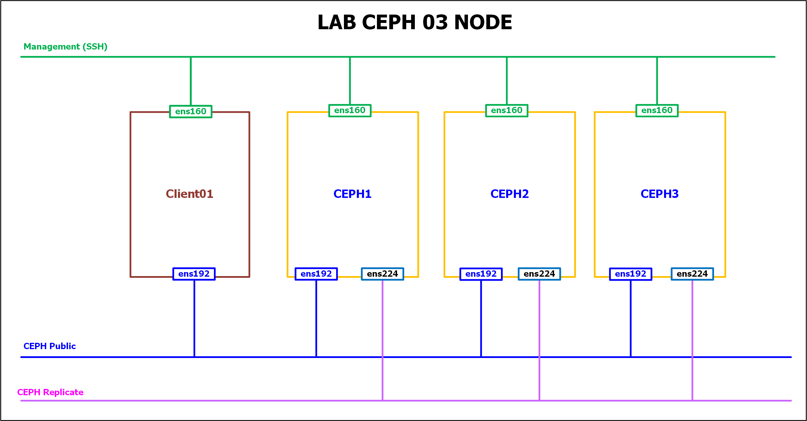
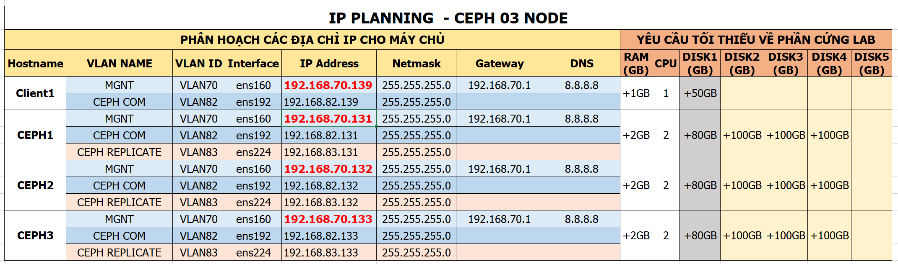

# Hướng dẫn cài đặt CEPH Luminous trên mô hình 03 node

## 1. Môi trường cài đặt

- CentOS 7.4 64bit
- CEPH Luminous 
- Phương thức sử dụng để triển khai ceph `ceph-deploy`

## 2. Mô Hình




## 3. IP Planning



## 4. Các bước cài đặt

### 4.1. Thiết lập IP, hostname

#### 4.1.1. Thiết lập IP, hostname cho ceph1

-  Đăng nhập với tài khoản root

	```
	su -
	```

- Khai báo repos nếu có

	```sh
	echo "proxy=http://192.168.70.111:3142;" >> /etc/yum.conf
	```

- Update OS

	```sh
	yum update -y
	```

- Đặt hostname

	```sh
	hostnamectl set-hostname ceph1
	```

- Đặt IP cho node `ceph1`

	```sh
	echo "Setup IP  ens160"
	nmcli c modify ens160 ipv4.addresses 192.168.70.131/24
	nmcli c modify ens160 ipv4.gateway 192.168.70.1
	nmcli c modify ens160 ipv4.dns 8.8.8.8
	nmcli c modify ens160 ipv4.method manual
	nmcli con mod ens160 connection.autoconnect yes

	echo "Setup IP  ens192"
	nmcli c modify ens192 ipv4.addresses 192.168.82.131/24
	nmcli c modify ens192 ipv4.method manual
	nmcli con mod ens192 connection.autoconnect yes

	echo "Setup IP  ens224"
	nmcli c modify ens224 ipv4.addresses 192.168.83.131/24
	nmcli c modify ens224 ipv4.method manual
	nmcli con mod ens224 connection.autoconnect yes
	```

-  Cấu hình các thành phần cơ bản

	```sh
	sudo systemctl disable firewalld
	sudo systemctl stop firewalld
	sudo systemctl disable NetworkManager
	sudo systemctl stop NetworkManager
	sudo systemctl enable network
	sudo systemctl start network

	sed -i 's/SELINUX=enforcing/SELINUX=disabled/g' /etc/sysconfig/selinux
	sed -i 's/SELINUX=enforcing/SELINUX=disabled/g' /etc/selinux/config
	```

- Khai báo file  /etc/hosts

	```sh
	echo "192.168.82.131 ceph1" >> /etc/hosts
	echo "192.168.82.132 ceph2" >> /etc/hosts
	echo "192.168.82.133 ceph3" >> /etc/hosts

	echo "192.168.70.131 ceph1" >> /etc/hosts
	echo "192.168.70.132 ceph2" >> /etc/hosts
	echo "192.168.70.133 ceph3" >> /etc/hosts
	```

- Khởi động lại

	```
	init 6
	```

#### 4.1.2  Thiết lập IP, hostname cho `ceph2`

- Đăng nhập với tài khoản root

	```
	su -
	```

- Khai báo repos nếu có

	```sh
	echo "proxy=http://192.168.70.111:3142;" >> /etc/yum.conf
	```

- Update OS

	```sh 
	yum update -y
	````

- Đặt hostname

	```sh
	hostnamectl set-hostname ceph2
	```

- Đặt IP cho node `ceph2`

	```sh
	echo "Setup IP  ens160"
	nmcli c modify ens160 ipv4.addresses 192.168.70.132/24
	nmcli c modify ens160 ipv4.gateway 192.168.70.1
	nmcli c modify ens160 ipv4.dns 8.8.8.8
	nmcli c modify ens160 ipv4.method manual
	nmcli con mod ens160 connection.autoconnect yes

	echo "Setup IP  ens192"
	nmcli c modify ens192 ipv4.addresses 192.168.82.132/24
	nmcli c modify ens192 ipv4.method manual
	nmcli con mod ens192 connection.autoconnect yes

	echo "Setup IP  ens224"
	nmcli c modify ens224 ipv4.addresses 192.168.83.132/24
	nmcli c modify ens224 ipv4.method manual
	nmcli con mod ens224 connection.autoconnect yes
	```

- Cấu hình các thành phần cơ bản

	```sh
	sudo systemctl disable firewalld
	sudo systemctl stop firewalld
	sudo systemctl disable NetworkManager
	sudo systemctl stop NetworkManager
	sudo systemctl enable network
	sudo systemctl start network

	sed -i 's/SELINUX=enforcing/SELINUX=disabled/g' /etc/sysconfig/selinux
	sed -i 's/SELINUX=enforcing/SELINUX=disabled/g' /etc/selinux/config
	```

- Khai báo file `/etc/hosts`

	```sh
	echo "192.168.82.131 ceph1" >> /etc/hosts
	echo "192.168.82.132 ceph2" >> /etc/hosts
	echo "192.168.82.133 ceph3" >> /etc/hosts

	echo "192.168.70.131 ceph1" >> /etc/hosts
	echo "192.168.70.132 ceph2" >> /etc/hosts
	echo "192.168.70.133 ceph3" >> /etc/hosts
	```

- Khởi động lại

	```sh
	init 6
	```

#### 4.1.3  Thiết lập IP, hostname cho `ceph3`

-  Đăng nhập với tài khoản `root`

	```sh
	su -
	```

-  Khai báo repos nếu có

	```sh
	echo "proxy=http://192.168.70.111:3142;" >> /etc/yum.conf
	```

- Update OS

	```sh
	yum update -y
	```

- Đặt hostname

	```sh
	hostnamectl set-hostname ceph3
	```

- Đặt IP cho node `ceph3`

	```sh
	echo "Setup IP  ens160"
	nmcli c modify ens160 ipv4.addresses 192.168.70.133/24
	nmcli c modify ens160 ipv4.gateway 192.168.70.1
	nmcli c modify ens160 ipv4.dns 8.8.8.8
	nmcli c modify ens160 ipv4.method manual
	nmcli con mod ens160 connection.autoconnect yes

	echo "Setup IP  ens192"
	nmcli c modify ens192 ipv4.addresses 192.168.82.133/24
	nmcli c modify ens192 ipv4.method manual
	nmcli con mod ens192 connection.autoconnect yes

	echo "Setup IP  ens224"
	nmcli c modify ens224 ipv4.addresses 192.168.83.133/24
	nmcli c modify ens224 ipv4.method manual
	nmcli con mod ens224 connection.autoconnect yes
	```

- Cấu hình các thành phần cơ bản

	```sh
	sudo systemctl disable firewalld
	sudo systemctl stop firewalld
	sudo systemctl disable NetworkManager
	sudo systemctl stop NetworkManager
	sudo systemctl enable network
	sudo systemctl start network

	sed -i 's/SELINUX=enforcing/SELINUX=disabled/g' /etc/sysconfig/selinux
	sed -i 's/SELINUX=enforcing/SELINUX=disabled/g' /etc/selinux/config
	```

-  Khai báo file `/etc/hosts`

	```sh
	echo "192.168.82.131 ceph1" >> /etc/hosts
	echo "192.168.82.132 ceph2" >> /etc/hosts
	echo "192.168.82.133 ceph3" >> /etc/hosts

	echo "192.168.70.131 ceph1" >> /etc/hosts
	echo "192.168.70.132 ceph2" >> /etc/hosts
	echo "192.168.70.133 ceph3" >> /etc/hosts
	```

-  Khởi động lại

	```sh
	init 6
	```

### 4.2. Cài gói bổ trợ và tạo tài khoản để cài đặt CEPH

#### Lưu ý: Cài đặt gói cơ bản trên cả 03 node CEPH1, CEPH2 và CEPH3

- Thực hiện update OS và cài các gói bổ trợ

	```sh
	yum update -y

	yum install epel-release -y

	yum install wget bybo curl git -y

	yum install python-setuptools -y

	yum install python-virtualenv -y

	yum update -y
	```

- Cấu hình NTP

	```sh
	yum install -y ntp ntpdate ntp-doc

	ntpdate 0.us.pool.ntp.org

	hwclock --systohc

	systemctl enable ntpd.service
	systemctl start ntpd.service
	```

- `Lưu ý:` trường hợp máy chủ tại Nhân Hòa thì cần khai báo IP về NTP server, liên hệ đội RD để được hướng dẫn.

- Tạo user `cephuser` trên node `ceph1, ceph2, ceph3`

	```sh
	useradd -d /home/cephuser -m cephuser
	```

- Đặt password cho user `cephuser`

	```sh
	passwd cephuser
	```

- Cấp quyền sudo cho tài khoản `cephuser`

	```sh
	echo "cephuser ALL = (root) NOPASSWD:ALL" | sudo tee /etc/sudoers.d/cephuser
	chmod 0440 /etc/sudoers.d/cephuser
	# sed -i s'/Defaults requiretty/#Defaults requiretty'/g /etc/sudoers
	```

### 4.3 Tạo repos để cài đặt CEPH bằng cách tạo file

- `Lưu ý:` Thực hiện trên tất cả 03 node `ceph1, ceph2 và ceph3`

- Tạo repos
```sh
cat << EOF > /etc/yum.repos.d/ceph.repo
[Ceph]
name=Ceph packages for \$basearch
baseurl=http://download.ceph.com/rpm-luminous/el7/\$basearch
enabled=1
gpgcheck=1
type=rpm-md
gpgkey=https://download.ceph.com/keys/release.asc
priority=1


[Ceph-noarch]
name=Ceph noarch packages
baseurl=http://download.ceph.com/rpm-luminous/el7/noarch
enabled=1
gpgcheck=1
type=rpm-md
gpgkey=https://download.ceph.com/keys/release.asc
priority=1

[ceph-source]
name=Ceph source packages
baseurl=http://download.ceph.com/rpm-luminous/el7/SRPMS
enabled=1
gpgcheck=1
type=rpm-md
gpgkey=https://download.ceph.com/keys/release.asc
priority=1
EOF
```

-  Thực hiện update sau khi khai báo repos 

	```sh
	yum update -y
	```

### 4.3 Cài đặt CEPH

#### 4.3.1 Cài đặt ceph-deploy trên `ceph1`

- `Lưu ý:` Bước này thực hiện trên node `ceph1`

- Cài đặt ceph-deploy

	```sh
	yum install -y ceph-deploy
	```

- Kiểm tra lại phiên bản của ceph-deploy, chính xác là phiên bản 2.0.1

	```sh
	ceph-deploy --version
	```

	- Kết quả: 

		```sh
		[cephuser@ceph1 ~]$ ceph-deploy --version
		2.0.1
		```

- Chuyển sang tài khoản `cephuser`

	```sh
	su - cephuser
	```

- Tạo keypair trên node ceph1

	```sh
	ssh-keygen
	```

-  Copy keypair sang các node để ceph-deploy sử dụng. Nhập yes và mật khẩu của từng node khi được hỏi.

	```sh
	ssh-copy-id cephuser@ceph1

	ssh-copy-id cephuser@ceph2

	ssh-copy-id cephuser@ceph3
	```

#### 4.3.2 Thực hiện cài đặt CEPH

- `Lưu ý:` Bước này thực hiện trên node `ceph1`
-  Tạo thư mục để chứa file cài đặt ceph

	```sh
	cd ~
	mkdir my-cluster
	cd my-cluster
	```

- Thiết lập cấu hình MON cho CEPH

	```sh
	ceph-deploy new ceph1 ceph2 ceph3
	```

-  Chỉ định các dải mạng cho CEPH

	```sh
	echo "public network = 192.168.82.0/24" >> ceph.conf
	echo "cluster network = 192.168.83.0/24" >> ceph.conf
	```

-  Cài đặt các gói của CEPH

	```sh
	ceph-deploy install --release luminous ceph1 ceph2 ceph3
	```

-  Cấu hình MON 

	```sh
	ceph-deploy mon create-initial
	```

-  Phân quyền cho  các node có thể quản trị được Cụm CEPH

- Đứng trên node CEPH 1 thực hiện lệnh dưới.

	```sh
	ceph-deploy admin ceph1 ceph2 ceph3
	sudo chmod +r /etc/ceph/ceph.client.admin.keyring
	```

Lệnh trên sẽ sinh ra file `/etc/ceph/ceph.client.admin.keyring` trên cả 03 node. Tiếp tục ssh vào các node ceph2 và ceph3 còn lại để thực hiện lệnh phân quyền thực thi cho file `/etc/ceph/ceph.client.admin.keyring`

	```sh
	sudo chmod +r /etc/ceph/ceph.client.admin.keyring
	```

Việc trên có ý nghĩa là để có thể thực hiện lệnh quản trị của CEPH trên các 03 node trong cụm Cluster.

#### 4.3.3 Add các OSD cho cụm CEPH

- Add các OSD cho cụm ceph cluser
 

	```sh
	ceph-deploy osd create --data /dev/sdb ceph1

	ceph-deploy osd create --data /dev/sdc ceph1

	ceph-deploy osd create --data /dev/sdd ceph1


	ceph-deploy osd create --data /dev/sdb ceph2

	ceph-deploy osd create --data /dev/sdc ceph2

	ceph-deploy osd create --data /dev/sdd ceph2


	ceph-deploy osd create --data /dev/sdb ceph3

	ceph-deploy osd create --data /dev/sdc ceph3

	ceph-deploy osd create --data /dev/sdd ceph3
	```


#### 4.3.4 Cấu hình dashboad cho CEPH

- Thực hiện trên node ceph1

	```
	ceph-deploy mgr create ceph1:ceph-mgr-1
	```

- Kích hoạt dashboad
	
	```sh
	ceph mgr module enable dashboard
	```

- Kiểm tra trạng thái của ceph dashboad và port để truy cập.

	```sh
	ceph mgr dump
	```

- Kết quả: http://prntscr.com/l58wm7

Truy cập vào địa chỉ IP với port mặc định là 7000 như ảnh: `http://ip_address_ceph1:7000`. Ta sẽ có giao diện như link: http://prntscr.com/l5k7xj

#### 4.3.5 Kiểm tra lại hoạt động của CEPH

- Thực hiện lệnh dưới để kiểm tra trạng thái hoạt động của ceph

	```sh
	ceph -s 
	```

- Kết quả: 

	```sh
	[root@ceph1 ~]# ceph -s
	  cluster:
		id:     cc9656a3-96f2-4f3b-a7f1-441bfffdb7ce
		health: HEALTH_OK

	  services:
		mon: 3 daemons, quorum ceph1,ceph2,ceph3
		mgr: ceph-mgr-1(active)
		osd: 9 osds: 9 up, 9 in

	  data:
		pools:   0 pools, 0 pgs
		objects: 0 objects, 0B
		usage:   9.04GiB used, 1.75TiB / 1.76TiB avail
		pgs:
	```

