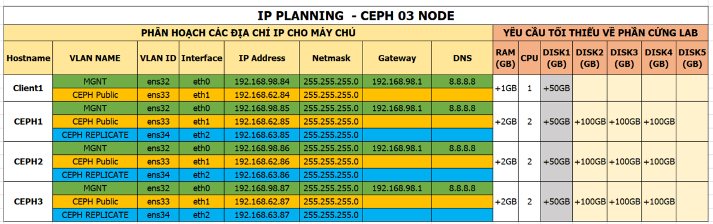

# Hướng dẫn cài đặt ceph nautilus trên mô hình 03 node

## 1. Môi trường cài đặt

- CentOS 7.x 64bit
- CEPH Nautilus 
- Phương thức sử dụng để triển khai ceph `ceph-deploy`
- Vai trò các node như sau:
  - CEPH Admin nodes: `ceph1`
	- CEPH MON nodes: `ceph1, ceph2, ceph3`
	- CEPH OSD nodes: `ceph1, ceph2, ceph3`
	- Client: `cephclient1`
	
- Lưu ý: 	
  - Tùy vào kiến trúc mà ta có thể khai báo các nodes MON hoặc OSD là các node tách biệt nhau hoặc node MON chỉ cần 01 node duy nhất. 
  - Số node MON thường là 03 hoặc 05 hoặc số lẻ để đảm bảo cụm cluser theo nguyên tắc mà CEPH khuyến cáo. Chi tiết nguyên tắc này đọc thêm các tài liệu từ docs.ceph.com nhé.
  - Trong phạm vi bài viết này chúng ta sẽ setup các node có cả vai trò MON và OSD để biết các tham số cấu hình ở phần dưới. ` NÊN TUÂN THỦ ĐÚNG CÁC BƯỚC VÀ CẤU HÌNH KHUYẾN CÁO ĐỂ ĐẢM BẢO CÀI ĐẶT THÀNH CÔNG - SAU ĐÓ HÃY SÁNG TẠO.`  


## 2. Mô Hình


## 3. IP Planning



## 4. Các bước cài đặt

### 4.1. Thiết lập IP, hostname

#### 4.1.1. Thiết lập IP, hostname cho ceph1

-  Đăng nhập với tài khoản root

```
su -
```

- Cài đặt các gói phần mềm bổ trợ

```sh
yum install epel-release -y
yum update -y
yum install wget byobu curl git byobu python-setuptools python-virtualenv -y
```

- Đặt hostname

```sh
hostnamectl set-hostname ceph1
```

- Đặt IP cho node `ceph1`

```sh
echo "Setup IP  eth0"
nmcli con modify eth0 ipv4.addresses 192.168.98.85/24
nmcli con modify eth0 ipv4.gateway 192.168.98.1
nmcli con modify eth0 ipv4.dns 8.8.8.8
nmcli con modify eth0 ipv4.method manual
nmcli con modify eth0 connection.autoconnect yes

echo "Setup IP  eth1"
nmcli con modify eth1 ipv4.addresses 192.168.62.85/24
nmcli con modify eth1 ipv4.method manual
nmcli con modify eth1 connection.autoconnect yes

echo "Setup IP  eth2"
nmcli con modify eth2 ipv4.addresses 192.168.63.85/24
nmcli con modify eth2 ipv4.method manual
nmcli con modify eth2 connection.autoconnect yes
```

-  Cấu hình các thành phần cơ bản

```sh
sudo systemctl disable firewalld
sudo systemctl stop firewalld
sudo systemctl disable NetworkManager
sudo systemctl stop NetworkManager
sudo systemctl enable network
sudo systemctl start network

sed -i 's/SELINUX=enforcing/SELINUX=disabled/g' /etc/sysconfig/selinux
sed -i 's/SELINUX=enforcing/SELINUX=disabled/g' /etc/selinux/config

# echo "net.ipv6.conf.all.disable_ipv6 = 1" >> /etc/sysctl.conf
```

- Có thể cần disable IPv6

```
echo "net.ipv6.conf.all.disable_ipv6 = 1" >> /etc/sysctl.conf
```

- Khai báo file  /etc/hosts

```sh
cat << EOF > /etc/hosts
127.0.0.1 `hostname` localhost
192.168.62.84 client1
192.168.62.85 ceph1
192.168.62.86 ceph2
192.168.62.87 ceph3

192.168.98.84 client1
192.168.98.85 ceph1
192.168.98.86 ceph2
192.168.98.87 ceph3
EOF
```

- Cài đặt NTP

```
yum install -y chrony

systemctl enable chronyd.service
systemctl start chronyd.service
systemctl restart chronyd.service
chronyc sources
```

- Khởi động lại

```
init 6
```


#### 4.1.2  Thiết lập IP, hostname cho `ceph2`

- Đăng nhập với tài khoản root

```
su -
```

- Update OS

```sh 
yum install epel-release -y
yum update -y
yum install wget byobu curl git byobu python-setuptools python-virtualenv -y
````

- Đặt hostname

```sh
hostnamectl set-hostname ceph2
```

- Đặt IP cho node `ceph2`

```sh
echo "Setup IP  eth0"
nmcli con modify eth0 ipv4.addresses 192.168.98.86/24
nmcli con modify eth0 ipv4.gateway 192.168.98.1
nmcli con modify eth0 ipv4.dns 8.8.8.8
nmcli con modify eth0 ipv4.method manual
nmcli con modify eth0 connection.autoconnect yes

echo "Setup IP  eth1"
nmcli con modify eth1 ipv4.addresses 192.168.62.86/24
nmcli con modify eth1 ipv4.method manual
nmcli con modify eth1 connection.autoconnect yes

echo "Setup IP  eth2"
nmcli con modify eth2 ipv4.addresses 192.168.63.86/24
nmcli con modify eth2 ipv4.method manual
nmcli con modify eth2 connection.autoconnect yes
```

- Cấu hình các thành phần cơ bản

```sh
sudo systemctl disable firewalld
sudo systemctl stop firewalld
sudo systemctl disable NetworkManager
sudo systemctl stop NetworkManager
sudo systemctl enable network
sudo systemctl start network

sed -i 's/SELINUX=enforcing/SELINUX=disabled/g' /etc/sysconfig/selinux
sed -i 's/SELINUX=enforcing/SELINUX=disabled/g' /etc/selinux/config
```

- Có thể cần disable IPv6

```
echo "net.ipv6.conf.all.disable_ipv6 = 1" >> /etc/sysctl.conf
```

- Khai báo file `/etc/hosts`

```sh
cat << EOF > /etc/hosts
127.0.0.1 `hostname` localhost
192.168.62.84 client1
192.168.62.85 ceph1
192.168.62.86 ceph2
192.168.62.87 ceph3

192.168.98.84 client1
192.168.98.85 ceph1
192.168.98.86 ceph2
192.168.98.87 ceph3
EOF
```

- Cài đặt NTP

```
yum install -y chronyd

systemctl enable chronyd.service
systemctl start chronyd.service
systemctl restart chronyd.service
chronyc sources
```

- Khởi động lại

```sh
init 6
```

#### 4.1.3  Thiết lập IP, hostname cho `ceph3`

-  Đăng nhập với tài khoản `root`

```sh
su -
```

-  Khai báo repos nếu có

- Update OS

```sh
yum install epel-release -y
yum update -y
yum install wget byobu curl git byobu python-setuptools python-virtualenv -y
```

- Đặt hostname

```sh
hostnamectl set-hostname ceph3
```

- Đặt IP cho node `ceph3`

```sh
echo "Setup IP  eth0"
nmcli con modify eth0 ipv4.addresses 192.168.98.87/24
nmcli con modify eth0 ipv4.gateway 192.168.98.1
nmcli con modify eth0 ipv4.dns 8.8.8.8
nmcli con modify eth0 ipv4.method manual
nmcli con modify eth0 connection.autoconnect yes

echo "Setup IP  eth1"
nmcli con modify eth1 ipv4.addresses 192.168.62.87/24
nmcli con modify eth1 ipv4.method manual
nmcli con mod eth1 connection.autoconnect yes

echo "Setup IP  eth2"
nmcli con modify eth2 ipv4.addresses 192.168.63.87/24
nmcli con modify eth2 ipv4.method manual
nmcli con modify eth2 connection.autoconnect yes
```

- Cấu hình các thành phần cơ bản

```sh
sudo systemctl disable firewalld
sudo systemctl stop firewalld
sudo systemctl disable NetworkManager
sudo systemctl stop NetworkManager
sudo systemctl enable network
sudo systemctl start network

sed -i 's/SELINUX=enforcing/SELINUX=disabled/g' /etc/sysconfig/selinux
sed -i 's/SELINUX=enforcing/SELINUX=disabled/g' /etc/selinux/config
```

- Có thể cần disable IPv6

```
echo "net.ipv6.conf.all.disable_ipv6 = 1" >> /etc/sysctl.conf
```

-  Khai báo file `/etc/hosts`

```sh
cat << EOF > /etc/hosts
127.0.0.1 `hostname` localhost
192.168.62.84 client1
192.168.62.85 ceph1
192.168.62.86 ceph2
192.168.62.87 ceph3

192.168.98.84 client1
192.168.98.85 ceph1
192.168.98.86 ceph2
192.168.98.87 ceph3
EOF
```

- Cài đặt NTP

```
yum install -y chronyd

systemctl enable chronyd.service
systemctl start chronyd.service
systemctl restart chronyd.service
chronyc sources
```

-  Khởi động lại

```sh
init 6
```

### 4.2. Cài gói bổ trợ và tạo tài khoản để cài đặt CEPH

#### Lưu ý: Cài đặt gói cơ bản trên cả 03 node `ceph1, ceph2, ceph3`

- Tạo user `cephuser` trên node `ceph1, ceph2, ceph3`. Mật khẩu của `cephuser` là `matkhau2019@`

```
useradd cephuser; echo 'matkhau2019@' | passwd cephuser --stdin
```

- Cấp quyền sudo cho tài khoản `cephuser`

```sh
echo "cephuser ALL = (root) NOPASSWD:ALL" | sudo tee /etc/sudoers.d/cephuser
chmod 0440 /etc/sudoers.d/cephuser
# sed -i s'/Defaults requiretty/#Defaults requiretty'/g /etc/sudoers
```

### 4.3 Tạo repos để cài đặt CEPH bằng cách tạo file

- `Lưu ý:` Thực hiện trên tất cả 03 node `ceph1, ceph2 và ceph3`

- Khai báo repos cho CEPH 

```sh
cat <<EOF> /etc/yum.repos.d/ceph.repo
[ceph]
name=Ceph packages for $basearch
baseurl=https://download.ceph.com/rpm-nautilus/el7/x86_64/
enabled=1
priority=2
gpgcheck=1
gpgkey=https://download.ceph.com/keys/release.asc

[ceph-noarch]
name=Ceph noarch packages
baseurl=https://download.ceph.com/rpm-nautilus/el7/noarch
enabled=1
priority=2
gpgcheck=1
gpgkey=https://download.ceph.com/keys/release.asc

[ceph-source]
name=Ceph source packages
baseurl=https://download.ceph.com/rpm-nautilus/el7/SRPMS
enabled=0
priority=2
gpgcheck=1
gpgkey=https://download.ceph.com/keys/release.asc
EOF
```

-  Thực hiện update sau khi khai báo repos 

```sh
yum update -y
```

### 4.3 Cài đặt CEPH

#### 4.3.1 Cài đặt ceph-deploy trên `ceph1`

- `Lưu ý:` Bước này thực hiện trên node `ceph1`

- Cài đặt ceph-deploy

```sh
yum install -y ceph-deploy
```

- Kiểm tra lại phiên bản của ceph-deploy, chính xác là phiên bản 2.0.1

```sh
ceph-deploy --version
```

- Kết quả: 

```sh
[cephuser@ceph1 ~]$ ceph-deploy --version
2.0.1
```

- Chuyển sang tài khoản `cephuser`

```sh
su - cephuser
```

- Tạo keypair trên node ceph1

```sh
ssh-keygen
```

-  Copy keypair sang các node để ceph-deploy sử dụng. Nhập yes và mật khẩu của từng node khi được hỏi.

```sh
ssh-copy-id cephuser@ceph1

ssh-copy-id cephuser@ceph2

ssh-copy-id cephuser@ceph3
```

#### 4.3.2 Thực hiện cài đặt CEPH

- `Lưu ý:` Bước này thực hiện trên node `ceph1`
-  Tạo thư mục để chứa file cài đặt ceph

```sh
cd ~
mkdir my-cluster
cd my-cluster
```

- Thiết lập cluster cho CEPH. Cú pháp của lệnh sẽ là `ceph-deploy new ten_mon_nodes`. 
- Do trong cấu hình này ta dùng 03 node `ceph1, ceph2, ceph3` làm node MON nên ta sẽ thực hiện lệnh bên dưới. Nếu bản chỉ có 01 node thì chỉ cần hostname của node đó.

```sh
ceph-deploy new ceph1 ceph2 ceph3
```

- Kết quả của lệnh trên sẽ sinh ra các file dưới, kiểm tra bằng lệnh `ls -alh`

```sh
[cephuser@ceph1 my-cluster]$ ls -alh
total 172K
drwxrwxr-x 2 cephuser cephuser   75 Oct 16 23:16 .
drwx------ 4 cephuser cephuser  116 Oct 16 23:16 ..
-rw-rw-r-- 1 cephuser cephuser  421 Oct 16 23:31 ceph.conf
-rw-rw-r-- 1 cephuser cephuser 163K Oct 16 23:36 ceph-deploy-ceph.log
-rw------- 1 cephuser cephuser   73 Oct 16 23:16 ceph.mon.keyring
```
	
- File `ceph.conf` sinh ra ở trên chứa các cấu hình cho cụm ceph cluster. Ta thực hiện thêm các khai báo dưới cho file `ceph.conf` này trước khi cài đặt các gói cần thiết cho ceph trên các node.
	
```sh
echo "public network = 192.168.62.0/24" >> ceph.conf
echo "cluster network = 192.168.63.0/24" >> ceph.conf
echo "osd objectstore = bluestore"  >> ceph.conf
echo "mon_allow_pool_delete = true"  >> ceph.conf
echo "osd pool default size = 3"  >> ceph.conf
echo "osd pool default min size = 1"  >> ceph.conf
```

-  Cài đặt các gói của CEPH trên các node, trong hướng dẫn này chỉ rõ bản `ceph luminous`. Lệnh dưới sẽ cài các gói lên tất cả các node ceph. Lệnh được thực hiện trên node `ceph1`.

```sh
ceph-deploy install --release luminous ceph1 ceph2 ceph3
```
	
- Kết quả của lệnh trên sẽ hiển thị như bên dưới, trong đó có phiên bản của ceph được cài trên các node.

```sh
[ceph3][DEBUG ]
[ceph3][DEBUG ] Complete!
[ceph3][INFO  ] Running command: sudo ceph --version
[ceph3][DEBUG ] ceph version 14.2.7 (3d58626ebeec02d8385a4cefb92c6cbc3a45bfe8) nautilus (stable)
```

-  Cấu hình MON 

```sh
ceph-deploy mon create-initial
```

- Kết quả của lệnh trên sẽ sinh ra các file dưới, kiểm tra bằng lệnh `ls -alh`

```sh
cephuser@ceph1:~/my-cluster$ ls -alh
total 348K
drwxrwxr-x 2 cephuser cephuser  244 Sep  6 23:26 .
drwx------ 5 cephuser cephuser  151 Sep  6 23:14 ..
-rw------- 1 cephuser cephuser  113 Sep  6 23:26 ceph.bootstrap-mds.keyring
-rw------- 1 cephuser cephuser  113 Sep  6 23:26 ceph.bootstrap-mgr.keyring
-rw------- 1 cephuser cephuser  113 Sep  6 23:26 ceph.bootstrap-osd.keyring
-rw------- 1 cephuser cephuser  113 Sep  6 23:26 ceph.bootstrap-rgw.keyring
-rw------- 1 cephuser cephuser  151 Sep  6 23:26 ceph.client.admin.keyring
-rw-rw-r-- 1 cephuser cephuser  418 Sep  6 23:15 ceph.conf
-rw-rw-r-- 1 cephuser cephuser 214K Sep  6 23:26 ceph-deploy-ceph.log
-rw------- 1 cephuser cephuser   73 Sep  6 23:14 ceph.mon.keyring
````
	
- Thực hiện copy file `ceph.client.admin.keyring` sang các node trong cụm ceph cluster. File này sẽ được copy vào thư mục `/etc/ceph/`

```sh
ceph-deploy admin ceph1 ceph2 ceph3
```

- Đứng trên node `ceph1` phân quyền cho file 	`/etc/ceph/ceph.client.admin.keyring`

```sh
sudo chmod +r /etc/ceph/ceph.client.admin.keyring
```

- Tiếp tục ssh vào các node ceph2 và ceph3 còn lại để thực hiện lệnh phân quyền thực thi cho file `/etc/ceph/ceph.client.admin.keyring`

```sh
sudo chmod +r /etc/ceph/ceph.client.admin.keyring
```

Việc trên có ý nghĩa là để có thể thực hiện lệnh quản trị của CEPH trên các 03 node trong cụm Cluster.

#### 4.3.3 Add các OSD cho cụm CEPH

- Đứng trên `ceph1` thực hiện add các OSD cho cụm ceph cluser
 

```sh
ceph-deploy osd create --data /dev/sdb ceph1

ceph-deploy osd create --data /dev/sdc ceph1

ceph-deploy osd create --data /dev/sdd ceph1


ceph-deploy osd create --data /dev/sdb ceph2

ceph-deploy osd create --data /dev/sdc ceph2

ceph-deploy osd create --data /dev/sdd ceph2


ceph-deploy osd create --data /dev/sdb ceph3

ceph-deploy osd create --data /dev/sdc ceph3

ceph-deploy osd create --data /dev/sdd ceph3
```


#### 4.3.4 Cấu hình manager và dashboad cho ceph cluster


- Thực hiện trên node ceph1 để khai báo các node có vai trò manager, phục vụ việc quản trị ceph sau này.
- Cài gói bổ trợ trước khi kích hoạt ceph dashboad

```
sudo yum install -y python-jwt python-routes
```

- Tải đúng bộ cài của ceph dashboard sao cho tương ứng với verison ceph (trong ví dụ này là Ceph nautilus 14.2.7)

```
sudo rpm -Uvh http://download.ceph.com/rpm-nautilus/el7/noarch/ceph-grafana-dashboards-14.2.7-0.el7.noarch.rpm

sudo rpm -Uvh http://download.ceph.com/rpm-nautilus/el7/noarch/ceph-mgr-dashboard-14.2.7-0.el7.noarch.rpm
```

- Thực hiện kích hoạt ceph dashboard

```
ceph-deploy mgr create ceph1 ceph2 ceph3

ceph mgr module enable dashboard --force

ceph mgr module ls 
```

- Kết quả ta sẽ thu được đoạn thông báo về các module được enable, trong đó có ceph dashboard

```
{
    "enabled_modules": [
        "dashboard",
        "iostat",
        "restful"
    ],
    "disabled_modules": []
}
```

- Tạo cert cho ceph-dashboad

```
sudo ceph dashboard create-self-signed-cert 
```

Kết quả trả về dòng Self-signed certificate created là thành công.

- Tạo tài khoản cho ceph-dashboard, trong hướng dẫn này tạo tài khoản tên là cephadmin và mật khẩu là `matkhau2019@`

```
ceph dashboard ac-user-create cephadmin matkhau2019@ administrator 
```

- Kết quả trả về là

```
{"username": "cephadmin", "lastUpdate": 1567415960, "name": null, "roles": ["administrator"], "password": "$2b$12$QhFs2Yo9KTICIqT8v5xLC.kRCjzuLyXqyzBQVQ4MwQhDbSLKni6pC", "email": null}
```

- Kiểm tra xem ceph-dashboard đã được cài đặt thành công hay chưa

```
ceph mgr services 
```

- Kết quả trả về sẽ là dòng bên dưới.

```
{
    "dashboard": "https://0.0.0.0:8443/"
}
```

Trước khi tiến hành đăng nhập vào web, có thể kiểm tra trạng thái cluser bằng lệnh ceph -s . Ta sẽ có kết quả trạng thái là OK.

Kết quả sẽ là địa chỉ truy cập ceph-dashboad, ta có thể vào bằng địa chỉ IP thay vì hostname, https://Dia_Chi_IP_CEPH1:8443

Ta có một số màn hình đăng nhập


#### 4.3.5 Kiểm tra lại hoạt động của CEPH

- Thực hiện lệnh dưới để kiểm tra trạng thái hoạt động của ceph

```sh
ceph -s 
```

- Kết quả: 

```sh
[cephuser@ceph1 my-cluster]$ ceph -s
	cluster:
		id:     0789974d-1ebb-43bd-8084-c51dd08d7888
		health: HEALTH_OK

	services:
		mon: 3 daemons, quorum ceph1,ceph2,ceph3
		mgr: ceph1(active), standbys: ceph2, ceph3
		osd: 9 osds: 9 up, 9 in

	data:
		pools:   0 pools, 0 pgs
		objects: 0 objects, 0B
		usage:   9.04GiB used, 1.75TiB / 1.76TiB avail
		pgs:
```

### 5. Cài đặt RBD cho client sử dụng

#### 5.1. Cài đặt trên node client 

- Thiết lập ip trên node `cephclient1`

-  Đăng nhập với tài khoản root

	```
	su -
	```

- Khai báo repos nếu có

	```sh
	echo "proxy=http://192.168.80.111:3142;" >> /etc/yum.conf
	```

- Update OS

	```sh
	yum update -y
	```

- Đặt hostname

	```sh
	hostnamectl set-hostname cephclient1
	```

- Đặt IP cho node `cephclient1`

	```sh
	echo "Setup IP  eth0"
	nmcli con modify eth0 ipv4.addresses 192.168.80.139/24
	nmcli con modify eth0 ipv4.gateway 192.168.80.1
	nmcli con modify eth0 ipv4.dns 8.8.8.8
	nmcli con modify eth0 ipv4.method manual
	nmcli con mod eth0 connection.autoconnect yes

	echo "Setup IP  eth1"
	nmcli con modify eth1 ipv4.addresses 192.168.82.139/24
	nmcli con modify eth1 ipv4.method manual
	nmcli con mod eth1 connection.autoconnect yes
	```

-  Cấu hình các thành phần cơ bản

	```sh
	sudo systemctl disable firewalld
	sudo systemctl stop firewalld
	sudo systemctl disable NetworkManager
	sudo systemctl stop NetworkManager
	sudo systemctl enable network
	sudo systemctl start network

	sed -i 's/SELINUX=enforcing/SELINUX=disabled/g' /etc/sysconfig/selinux
	sed -i 's/SELINUX=enforcing/SELINUX=disabled/g' /etc/selinux/config
	```

- Khai báo file `/etc/hosts`

	```sh
	echo "192.168.82.131 ceph1" >> /etc/hosts
	echo "192.168.82.132 ceph2" >> /etc/hosts
	echo "192.168.82.133 ceph3" >> /etc/hosts
	echo "192.168.82.139 cephclient1" >> /etc/hosts	


	echo "192.168.80.131 ceph1" >> /etc/hosts
	echo "192.168.80.132 ceph2" >> /etc/hosts
	echo "192.168.80.133 ceph3" >> /etc/hosts
	echo "192.168.80.139 cephclient1" >> /etc/hosts
	```
	
- Khởi động lại node client 

	```sh
	init 6
	```

##### Tạo user `cephuser`, khai báo repos cài đặt CEPH cho node `cephclient1`
	
-  Đăng nhập lai node `cephclient1` với IP mới `192.168.80.139`

- Thực hiện update OS và cài các gói bổ trợ

	```sh
	yum update -y

	yum install epel-release -y

	yum install wget bybo curl git -y

	yum install python-setuptools -y

	yum install python-virtualenv -y

	yum update -y
	```

- Cấu hình NTP

	```sh
	yum install -y ntp ntpdate ntp-doc

	ntpdate 0.us.pool.ntp.org

	hwclock --systohc

	systemctl enable ntpd.service
	systemctl start ntpd.service
	```

- `Lưu ý:` trường hợp máy chủ tại Nhân Hòa thì cần khai báo IP về NTP server, liên hệ đội RD để được hướng dẫn.

- Tạo user `cephuser` trên node `cephclient1`

	```sh
	useradd -d /home/cephuser -m cephuser
	```

- Đặt password cho user `cephuser`. Lưu ý dùng password này ở bước dưới.

	```sh
	passwd cephuser
	```

- Cấp quyền sudo cho tài khoản `cephuser`

	```sh
	echo "cephuser ALL = (root) NOPASSWD:ALL" | sudo tee /etc/sudoers.d/cephuser
	chmod 0440 /etc/sudoers.d/cephuser
	# sed -i s'/Defaults requiretty/#Defaults requiretty'/g /etc/sudoers
	```

#### 5.2. Cài đặt các gói cho `cephclient1`

###### Thực hiện trên node `ceph1`

- Chuyển sang user `cephuser`

	```sh
	su - cephuser
	```

- Copy sshkey từ node `ceph1` sang node `cephclient`. Nhập password của user `cephuser` vừa tạo trên node `cephclient1` ở bước trên.

	```sh
	ssh-copy-id cephuser@cephclient1
	```
	
- Di chuyển vào thư mục chứa các file cấu hình của ceph hoặc chuyển sang user `cephuser` để thực hiện các bước tiếp theo

	```sh
	cd /home/cephuser/my-cluster/
	```

- Đứng trên node `ceph1` thực hiện cài đặt các gói cần thiết cho client.

	```sh
	ceph-deploy install --release luminous cephclient1
	```
	
- Thực hiện deploy ceph cho node `cephclient1`, bước này sẽ copy file `ceph.client.admin.keyring` từ node `ceph1` sang node `cephclient1`.
	
	```sh
	ceph-deploy admin cephclient1 
	```

#### 5.3. Cài đặt ceph client cho node `cephclient1`

Thực hiện trên node `cephclient1`

- Phân quyền cho file `/etc/ceph/ceph.client.admin.keyring`

	```sh
	sudo chmod +r /etc/ceph/ceph.client.admin.keyring
	```

	#### 5.4. Cấu hình RDB cho client sử dụng.

##### Thực hiện trên node `ceph1`

- Khai báo pool tên là `rbd` để client sử dụng. Theo tài liệu gốc thì khuyến cáo nên đặt tên là `rbd` vì mặc định khi ta tạo các `images` trong CEPH thì nó sẽ nằm ở pool có tên là `rdb`. Còn nếu muốn các images nằm ở các pools khác thì trong lệnh tạo RBD images cần có thêm tùy chọn  `-p`.

	```sh
	ceph osd pool create rbd 128
	```

- Khai báo pool có tên là `rdb` vừa tạo ở trên được sử dụng bởi RDB của CEPH.

	```sh
	rbd pool init rbd
	```

- Kiểm tra pool vừa tạo xem đã có hay chưa bằng lệnh `ceph osd pool ls`

	```sh
	ceph osd pool ls
	```
		
##### Thực hiện trên node `cephclient1`

- Đứng trên node `cephclient1` thực hiện tạo một image có tên là `disk01` với dung lượng là 10GB, image này sẽ nằm trong pool có tên là `rdb` vừa tạo ở trên. Nếu bạn muốn images này nằm ở pool có tên khác thì cần thêm tùy chọn `-p ten_pools` trong lệnh dưới.

	```sh
	rbd create disk01 --size 10G --image-feature layering
	```
	
- Hoặc lệnh với tùy chọn chỉ định pools như sau
	
	```sh
	rbd create disk01 --size 10G -p ten_pool --image-feature layering
	```

- Dùng lệnh liệt kê các images để kiểm tra lại xem các images RDB đã được tạo hay chưa

	```sh
	rbd ls -l
	```
	
	- Kết quả
	
		```sh
		[root@cephclient1 ~]#  rbd ls -l
		NAME    SIZE PARENT FMT PROT LOCK
		disk01 10GiB          2
		[root@cephclient1 ~]#
		```
		
- Thực hiện map images đã được tạo tới một disk của máy client

	```sh
	rbd map disk01 
	```
	
	- Kết quả của lệnh trên
	
		```sh
		[root@cephclient1 ~]# rbd map disk01
		/dev/rbd0
		```
	
	- Lệnh trên sẽ thực hiện map images có tên là `disk01` tới một thiết bị trên client, thiết bị này sẽ được đặt tên là `/dev/rdbX`. Trong đó `X` sẽ bắt đầu từ 0 và tăng dần lên. Nếu muốn biết về việc quản lý thiết bị trong linux thì đọc thêm các tài liệu của Linux nhé bạn đọc ơi.
	
- Thực hiện kiểm tra xem images RDB có tên là `disk01` đã được map hay chưa.

	```sh
	rbd showmapped
	```
	
	- Kết quả: 
	
		```sh
		[root@cephclient1 ~]# rbd showmapped
		id pool image  snap device
		0  rbd  disk01 -    /dev/rbd0
		```

	- Hoặc bằng các lệnh khác để kiểm tra ổ đĩa trong linux như: `lsblk`
	
	- Kết quả:
			
		```sh
		[root@cephclient1 ~]# lsblk
		NAME                    MAJ:MIN RM  SIZE RO TYPE MOUNTPOINT
		fd0                       2:0    1    4K  0 disk
		sda                       8:0    0   80G  0 disk
		├─sda1                    8:1    0    4G  0 part /boot
		├─sda2                    8:2    0   68G  0 part
		│ └─VolGroup00-LogVol01 253:0    0   68G  0 lvm  /
		└─sda3                    8:3    0    8G  0 part [SWAP]
		sr0                      11:0    1 1024M  0 rom
		rbd0                    252:0    0   10G  0 disk
		```
		
- Tới đây máy client chưa	thể sử dụng ổ được map vì chưa được phân vùng, tiếp tục thực hiện bước phân vùng và mount vào một thư mục nào đó để sử dụng. Thời gian thực hiện lệnh dưới sẽ cần chờ từ 10-30 giây.

	```sh
	sudo mkfs.xfs /dev/rbd0
	```
	
	- Kết quả: 
	
		```sh
		[root@cephclient1 ~]# sudo mkfs.xfs /dev/rbd0
		meta-data=/dev/rbd0              isize=512    agcount=16, agsize=163840 blks
						 =                       sectsz=512   attr=2, projid32bit=1
						 =                       crc=1        finobt=0, sparse=0
		data     =                       bsize=4096   blocks=2621440, imaxpct=25
						 =                       sunit=1024   swidth=1024 blks
		naming   =version 2              bsize=4096   ascii-ci=0 ftype=1
		log      =internal log           bsize=4096   blocks=2560, version=2
						 =                       sectsz=512   sunit=8 blks, lazy-count=1
		realtime =none                   extsz=4096   blocks=0, rtextents=0
		[root@cephclient1 ~]#
		```

- Thực hiện mount vào thư mục `/mtn`

	```sh
	sudo mount /dev/rbd0 /mnt
	```

- Kiểm tra lại xem đã mount được hay chưa

	```sh
	df -hT 
	```	
	
	- Kết quả:
	
		```sh
		[root@cephclient1 ~]# df -hT
		Filesystem                      Type      Size  Used Avail Use% Mounted on
		/dev/mapper/VolGroup00-LogVol01 xfs        68G  1.6G   67G   3% /
		devtmpfs                        devtmpfs  989M     0  989M   0% /dev
		tmpfs                           tmpfs    1000M     0 1000M   0% /dev/shm
		tmpfs                           tmpfs    1000M  8.9M  992M   1% /run
		tmpfs                           tmpfs    1000M     0 1000M   0% /sys/fs/cgroup
		/dev/sda1                       ext4      3.9G  174M  3.5G   5% /boot
		tmpfs                           tmpfs     200M     0  200M   0% /run/user/0
		/dev/rbd0                       xfs        10G   33M   10G   1% /mnt
		```

- Hoặc kiểm tra bằng lệnh `lsblk`, ta sẽ có kết quả như bên dưới. Lúc này ta có thể ghi dữ liệu vào ổ `/mnt` để sử dụng.

	```sh
	[root@cephclient1 ~]# lsblk
	NAME                    MAJ:MIN RM  SIZE RO TYPE MOUNTPOINT
	fd0                       2:0    1    4K  0 disk
	sda                       8:0    0   80G  0 disk
	├─sda1                    8:1    0    4G  0 part /boot
	├─sda2                    8:2    0   68G  0 part
	│ └─VolGroup00-LogVol01 253:0    0   68G  0 lvm  /
	└─sda3                    8:3    0    8G  0 part [SWAP]
	sr0                      11:0    1 1024M  0 rom
	rbd0                    252:0    0   10G  0 disk /mnt
	[root@cephclient1 ~]#
	```

- Lưu ý: Vì mount  chưa được khai báo trong `fstab` nên khi khởi động lại máy client thì thao tác mount này sẽ bị mất, nếu muốn không bị mất thì cần phải khai báo thêm trong `fstab` nhé. Google thêm để biết cách nha.

## HẾT

	


